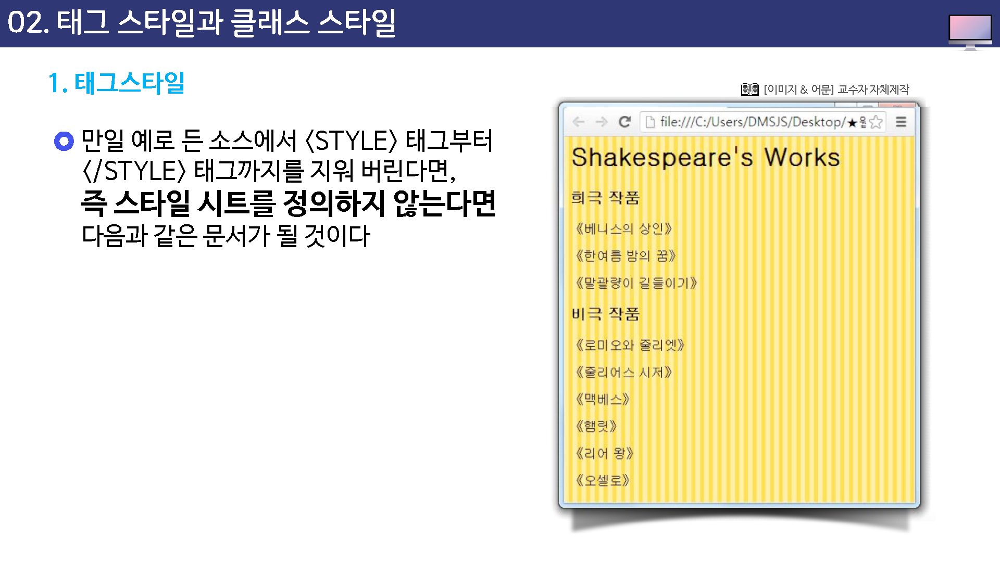
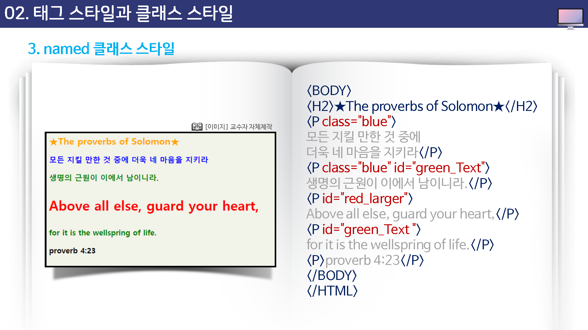
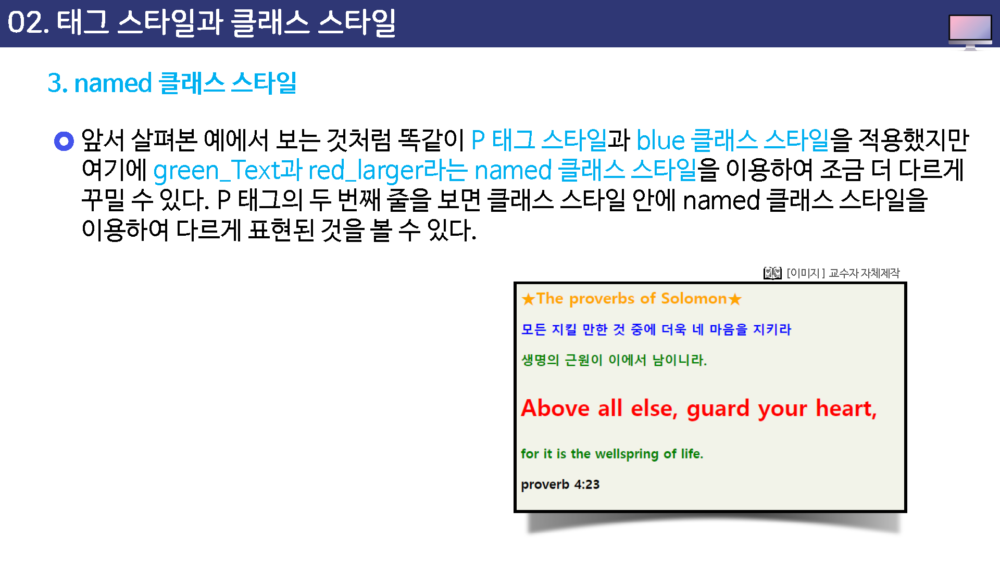
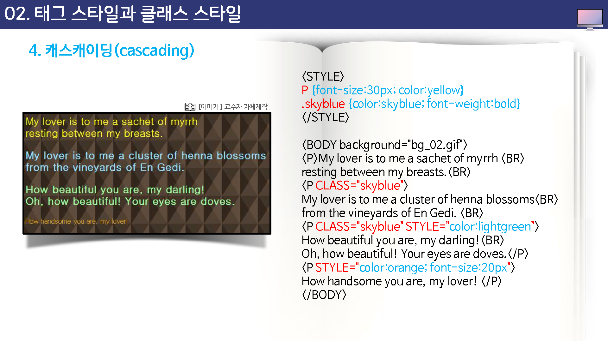

# 태그 스타일과 클래스 스타일


## 태그스타일

셀렉터는 특정한 태그일 수도 있고 사용자가 직접 만든 이름일 수도 있다.


#### 태그 스타일(tag style)

셀렉터가 시존의 태그일 경우 그 태그를 사용하는 모든 요소에 같은 스타일이 적용


#### 클래스 스타일(class style)

상용자가 만든 이름이 셀렉터가 된다면 그 스타일은 문서 안의 특정한 부분에만 적용


---


태그 스타일

`같은 태그`를 사용하는 텍스트마다 `같은 스타일`을 사용하도록 하는 것

 

* 스타일 시스트에서 `<h1>`태그 스타일을 정의한다면 그 문서에 있는 `<h1>`태그 요소에는 모두 똑같은 스타일이 사용된다. 태그 스타일의 기본 형식은 다음과 같다.


```css
태그 {
	속성:속성값;
	속성:속성값;
}
```


* 예글 들어, 아래 스타일 시트는 세가지 스타일을 정의하고 있다. 모든 `<h1>`태그 적용 요소의 색상을 파란색으로 하여 영문자를 모두 대문자로 변경한다. 그리고 `<h3>`태그 적용 요소의 색상을 녹색으로 하며, 서체 크기는 20 픽셀 크기로 표시한다. <p>태그 적용 요소는 12픽셀 크기로 표시하며, 왼쪽 여백을 20 픽셀로 정의하고 있다.





## 클래스 스타일


`<p>`태그 스타일은 웹 문서에서 p태그를 사용하는 모든 부분, 즉 문서의 모든 텍스트 단락에 적용되는 스타일 이다.

하지만 같은 `<p>`태그를 사용하는 단락이라도 문서의 일부 단락에만 붉은 색으로 지정 하려고 하고 싶다면 문제가 생긴다.

`이러한 문제 때문에 사용하는 스타일`이 클래식 스타일이다.


* 클래스 스타일의 기본 형식은 다음과 같다.


```
.스타일이름 {
	속성:속성값;
	속성:속성값;
}
```


앞서 살펴본 태그 스타일에서 '태그'부분이 '.스타일'으로 바뀐 점만 빼면 스타일을 정의하는 방법은 같다.

스타일 이름 앞에 마침표(.)가 있다는 점에 주의한다.

이렇게 정의된 클래스 스타일을 적용할 때는 CLASS 속성을 이용해서 클래스 이름을 알려주게 된다.

그리고 클래스 스타일은 꼭 한 태그에서만 사용하는 것은 아니다.


예를들어

```
.redtext {
	color:red;
	font-size:12px;
}
```

처럼 redtext라는 클래스 스타일을 정의 했다면 이 스타일은 `<p class='redtext'>`처럼 사용할 수 있고 `<h1 class='redtext'>`처럼 다른 태그에서도 사용할 수 있다.


하지만 이 경우에도 한 단락 전체에 redtext 스타일이 적용된다.

만일 텍스트 중 일부에만 클래스 스타일을 적용해야 할 경우에는 `<span>`태그를 사용한다.


## named 클래스 스타일

같은 클래스 스타일을 사용하더라도 조금씩 다르게 변형하고 싶을 때 사용


예를 들어 blue 라는 클래스 스타일을 사용하는데 특정 부분에서 글자 크기를 조금 더 크게 하고 싶다면 named 클래스 스타일을 사용한다.


named 클래스 스타일을 만들려면 `#`를 맨 앞에 적고 그 다음에 스타일 이름을 넣는다. 그리고 이렇게 정의된 named 클래스는 id 속성을 사용해서 적용한다.






## 캐스캐이딩

스타일 시트를 줄여서 말할 때 CSS(cascading style sheet)라고 한다. 즉, 스타일들이 단계별로 적용 된다는 의미이다.





