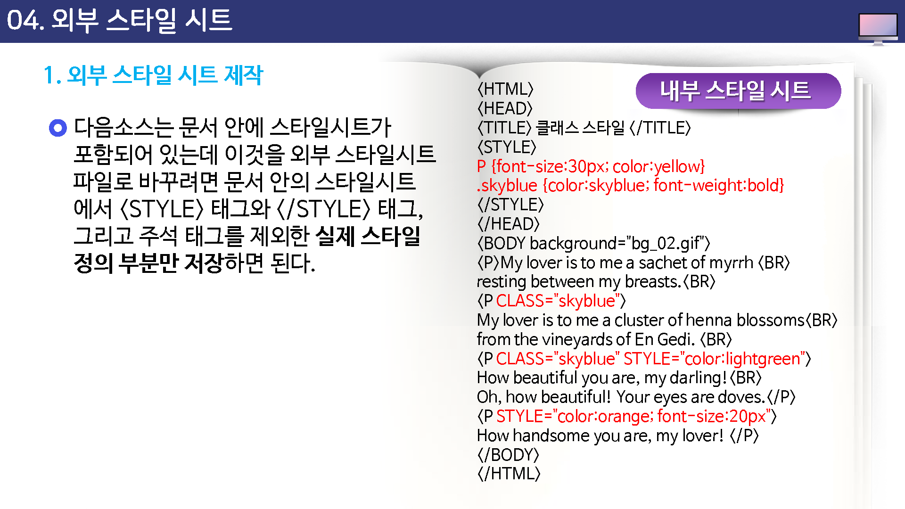
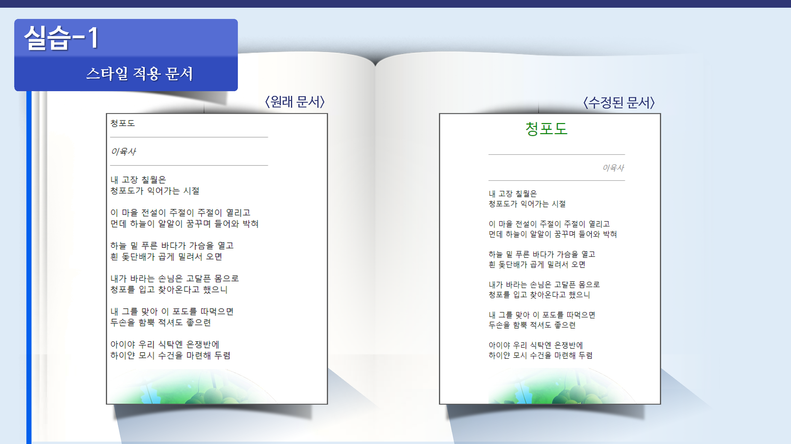

# 외부 스타일 시트

앞서 살펴본 스타일 시트는 한 문서 안에서 스타일을 정의하고, 그 문서 안에서 스타일을 사용했다.

하지만 한 사이트 안에는 수십 개에서부터 수백 개에 이르는 웹 문서들이 있고 이 문서들에서 똑같이 사용되는 스타일이 이을 것이다.

이렇게 여러 문서에 똑같은 스타일을 사용한다면 스타일 시스만 따로 저장한 후 가져다가 사용하면 편리하다.

이렇게 별도로 저장되는 스타일 시트를 파일 `외부 스타일 시트`라고 하는데 이 파일의 확장자는 .css이다.

이렇게 따로 만든 외부 스타일 시트 파일은 link라는 태그를 사용해서 연결 하기만 하면 마치 문서 안에 스타일 시트를 가지고 있는 것처럼 사용할 수 있다.

---

