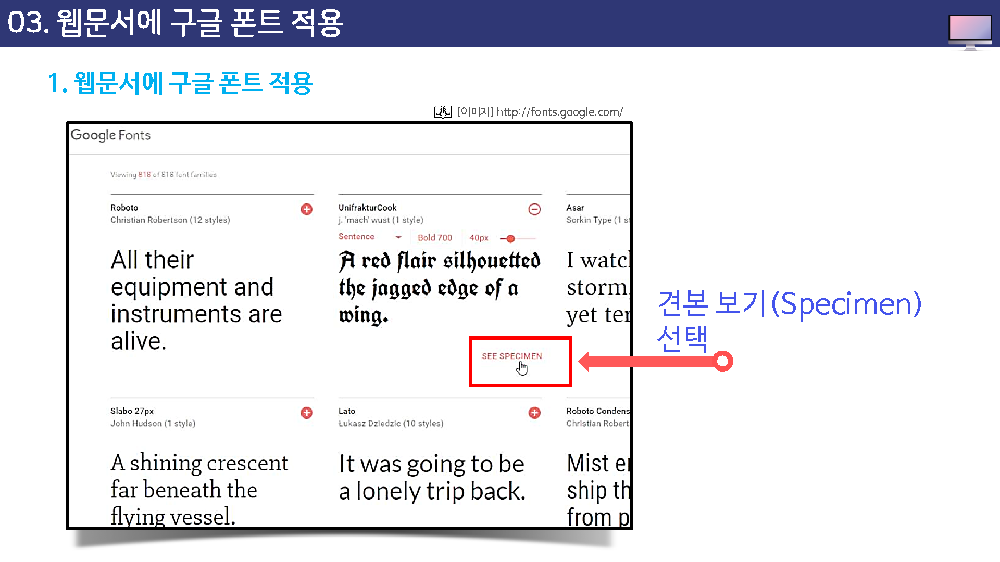

# 웹문서에 구글 폰트 적용

## 웹문서에서 구글 폰트 적용

웹 문서의 다양한 폰트를 사용하고자 원한다면 웹 폰트를 제공해주는 사이트를 이용하면 쉽게 적용이 가능하다.

아래의 구글 사이트에 가면 다양한 폰트를 자산의 문서에 이용할 수 있다.

http://fonts.goole.com

다양한 폰트 중에서 원하는 폰트의 우측 하단부에 견본보기(specimen)를 선택한다.

---

