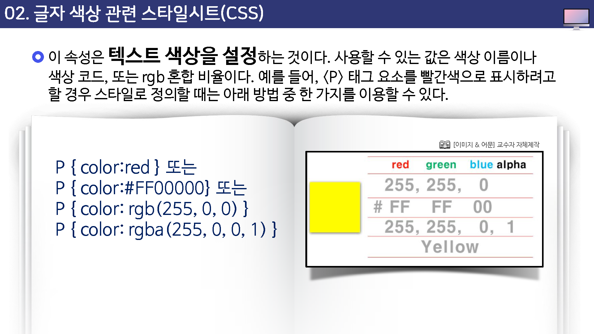

# 글자 색상 관련 스타일시트

이 속성은 텍스트 색상을 설정하는 것이다. 사용할 수 있는 값은 색상 이름이나 색상코드, 또는 rgb 혼합 비율이다.

예를 들어, `
`태그 요소를 빨간색으로 표시하려고 할 경우 스타일로 정의할 대는 아래 방법 중 한 가지를 이용할 수 있다.

---

## 색상코드

`#FF0000`은 빨간색, 초록색, 파란색를 얼마씩 썩을 것인지 말해 주는 것이다.

FF는 빨간색이 가득 들어가고, 00은 초로핵이 하나도 안썩이고 마지막 00은 파란색이 하나도 안 섞였다는 뜻이다.

이런 식으로 파란색을 나타낸다면 `#0000ff`가 될 것이다.

* 백색 :  #FFFFFF
* 검정색 : #000000

또한 rgb(255,0,0) 역시 빨간색(red)과 초록색(green), 파란색(blue)를 얼마씩 썪을 것인 지 말해주는 것이다.

reg(255,0,0)은 r(red)은 가득, g(green)와 b(blue)는 하나도 썩지 않는다는 뜻이다.

* 백색 :  (255,255,255)
* 검정색 : (0,0,0)

마지막으로 rgba(255,0,0,1)에서 rega의 'a'는 alpha값을 의미하는 것이다.

(맨 뒤의 1은 알파값 100%를 뜻하며 1이 아닌 0.5를 설정하면 투명도는 50%가 된다.)

ㄴ

