# 테두리 스타일

## 테두리 속성

테두리 스타일은 텍스트 못지않게 많이 사용되는 스타일이다.

테두리 형태, 즉 `박스 스타일`이라고도 한다. 이미지나 택스트, 표 등의 테두리를 조절할 때 여기에서 소개하는 border 관련 스타일을 사용하면 된다.

스타일 시트 중 여러 가지 효과에서 자주 사용되는 스타일 속성들이다..

테두리 스타일이란 텍스트나 이미지 등이 나타나는 실제 콘덴츠 영역, 상자와 콘덴츠 영역 사이의 안 여백(padding), 상자의 테두리선(border), 그리고 상자 주변의 여백(margin)등과 관련된 스타일이다.

콘덴츠 영역을 기준으로 해서 안 여백과 테두리선, 그리고 여백의 관계를 간단히 그림으로 표현하면 다음과 같다.

그림에서 보는 것처럼 padding과 border, margin 은 각각 왼쪽, 오른쪽, 위와 아래, 이렇게 네 가지로 세분되어 있으며 네 방향의 스타일을 따로 설정할 수 있다.

---

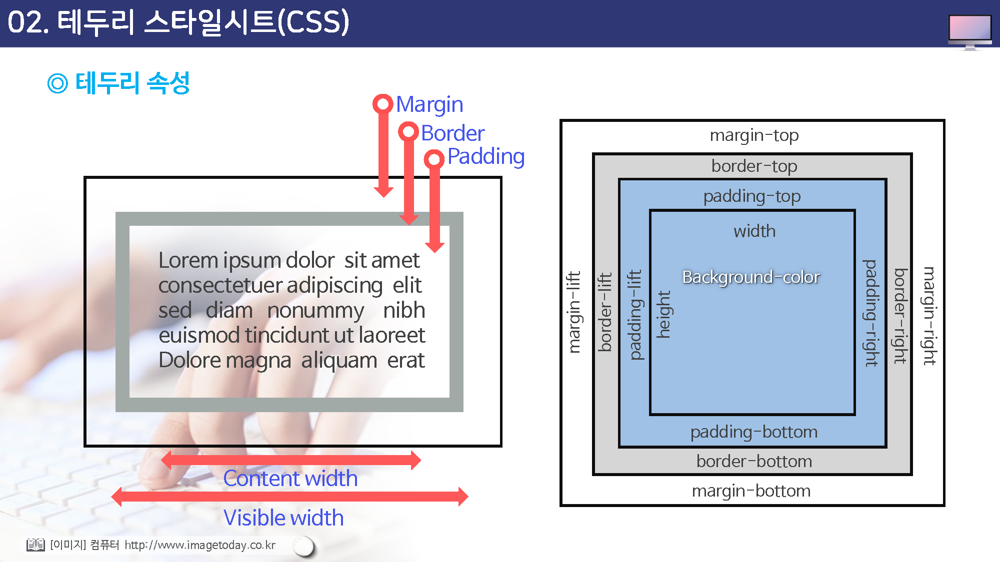

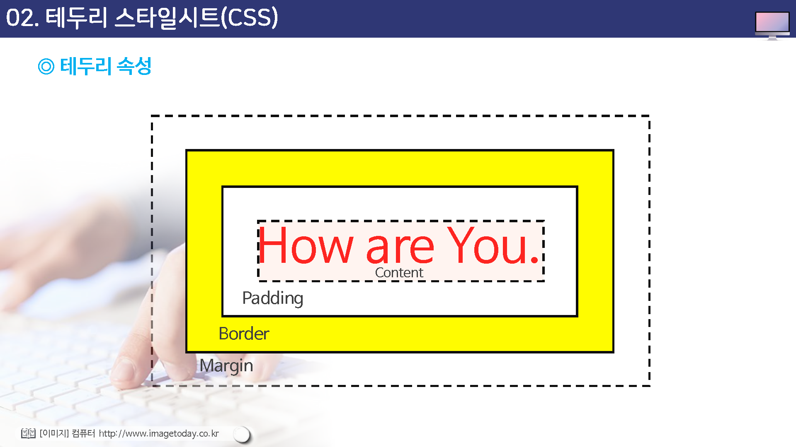

## Margin (margin-top, rightm bottom, left)

이 속성은 나열한 순서대로 요소의 상단 여백, 오른쪽 여백, 하단 여백, 왼쪽 여백을 설정하고, margin 속성은 앞의 네가지 속성을 한데 묶어 놓은 것이다.

margin 속성에 값이 하나만 지정되면 그 값이 네 군데 여백 모두에 지정되고 값이 두개나 세개 뿐이라면 빠진 값은 반대편 여백 값을 사용한다.

## padding (padding-top,right,bottom,left)

이 속성들은 순서대로 요소의 상단 안 여백과 오른쪽 안 여백과 , 하단 안 여백, 그리고 왼쪽 안 여백을 지정하고 padding 속성은 네 가지 안 여백 값을 한꺼번에 설정한다.

안 여백 들의 값은 음수를 사용할 수 없다.

padding 속성의 값이 네 개일 경우 하례대로 상단, 오른쪽, 하단, 왼쪽의 안 여백을 지정하고 값이 하나뿐이라면 네 군데 안 여백을 똑같은 값으로 설정한다.

값이 두 개나 세개 뿐이라면 빠진  값은 반대편 안 여백 값을 사용한다.

안 여백 공간의 배경색은 background 속석을 사용해서 지정할 수 있다.

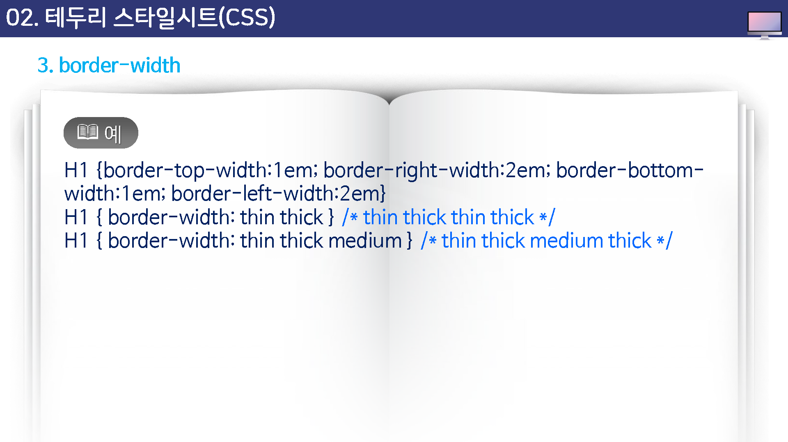

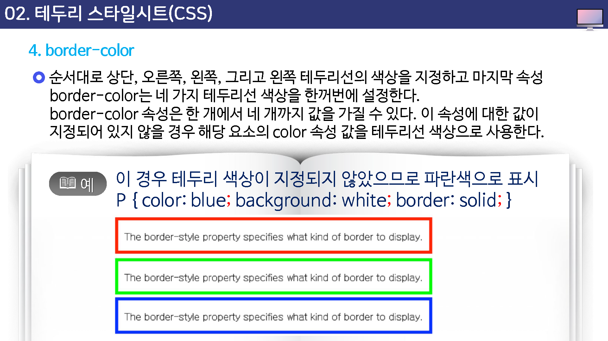

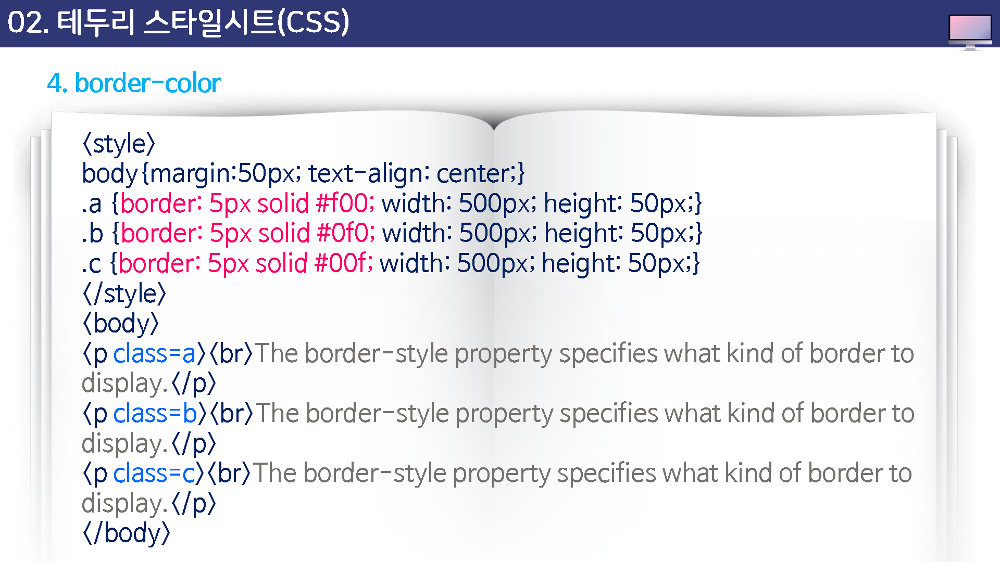

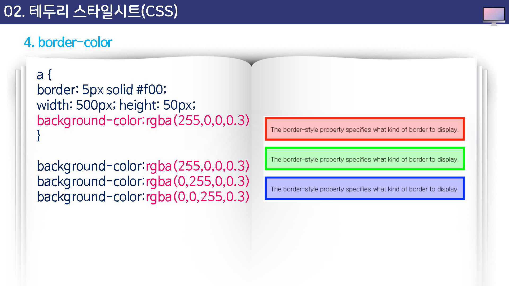

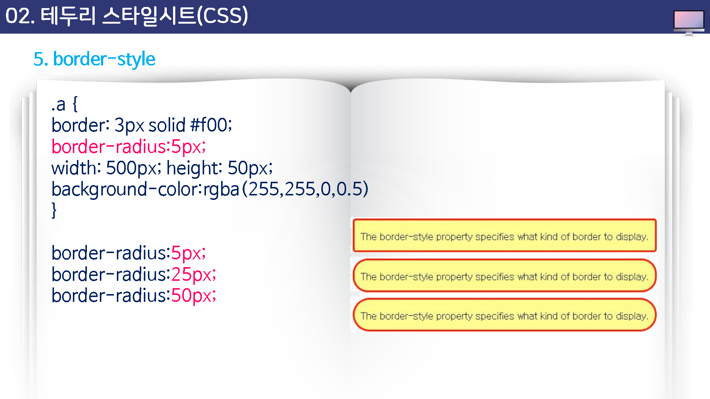

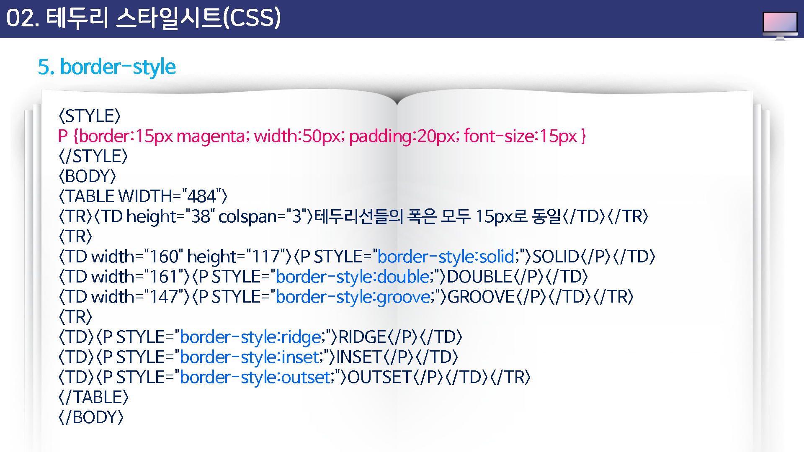

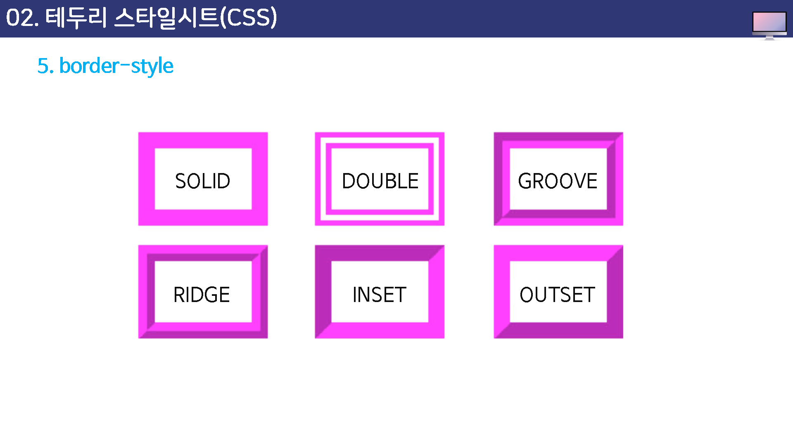

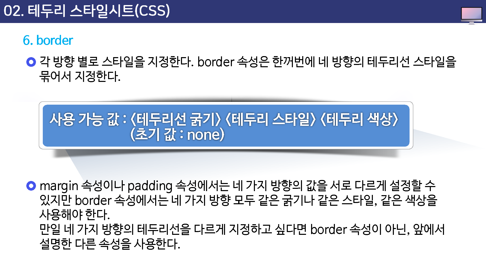

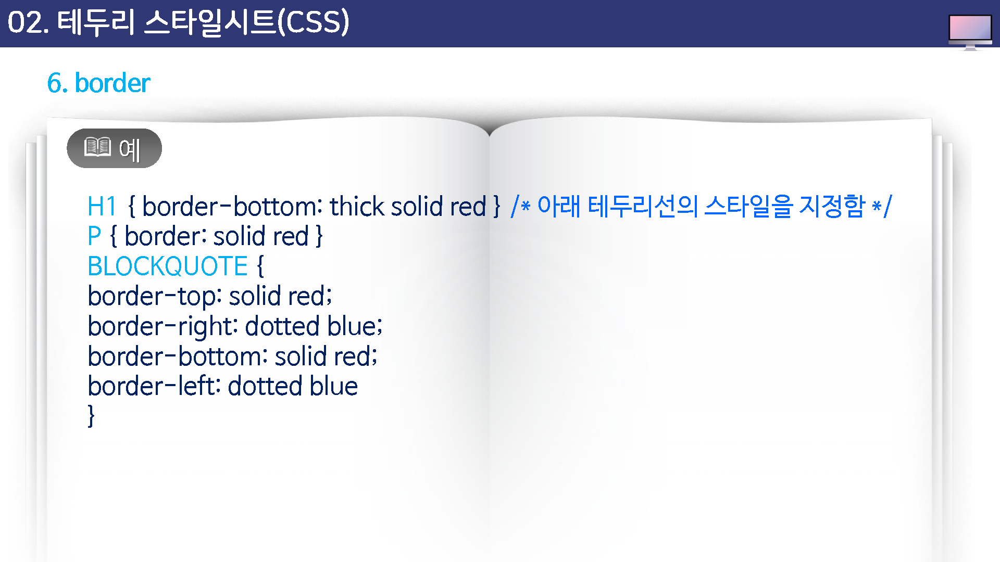

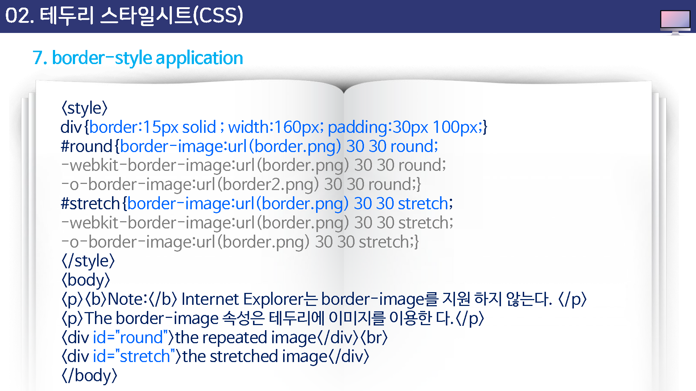

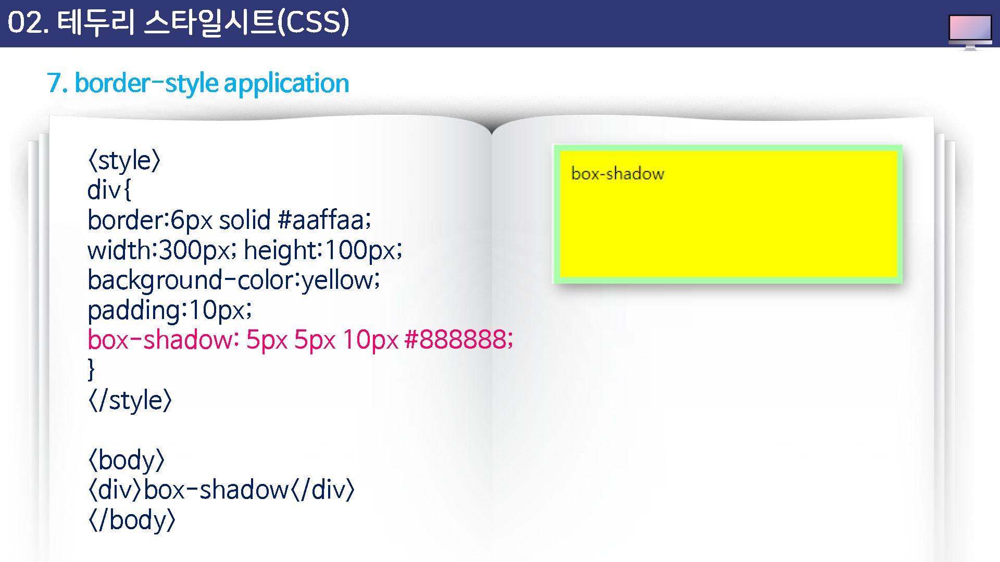

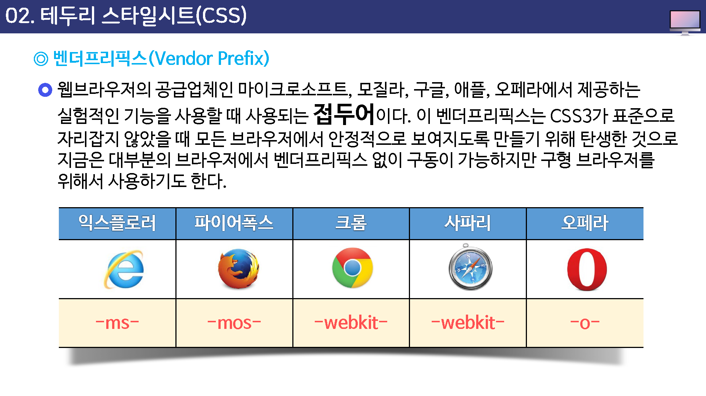

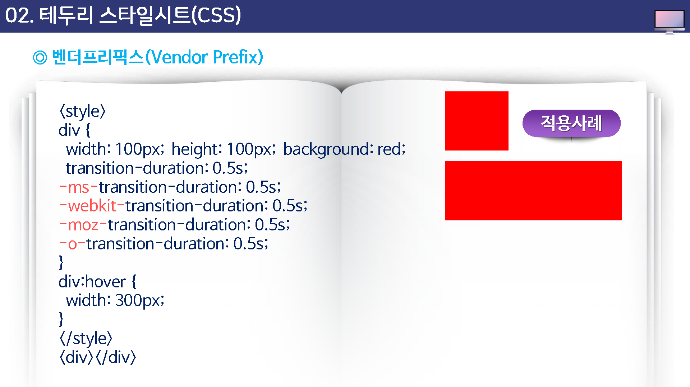