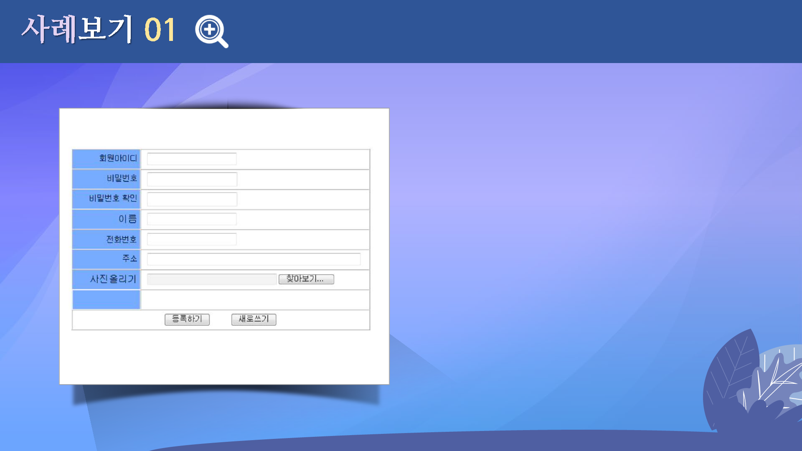

# 스타일시트3
---

 

## 학습목표
---
* 배경 관련 스타일에 대해 살펴볼 수 있다.
* 벤더 프리픽스에 대해 살펴볼 수 있다.
* 테두리 관련 스타일에 대해 살펴볼 수 있다.
* 사진 인화지의 효과를 표현할 수 있다.

 

## 학습안내
---
* [배경 스타일](배경)
* [테두리 스타일](border)
* [사진 인화지 효과 나타내기](사진인화지)

