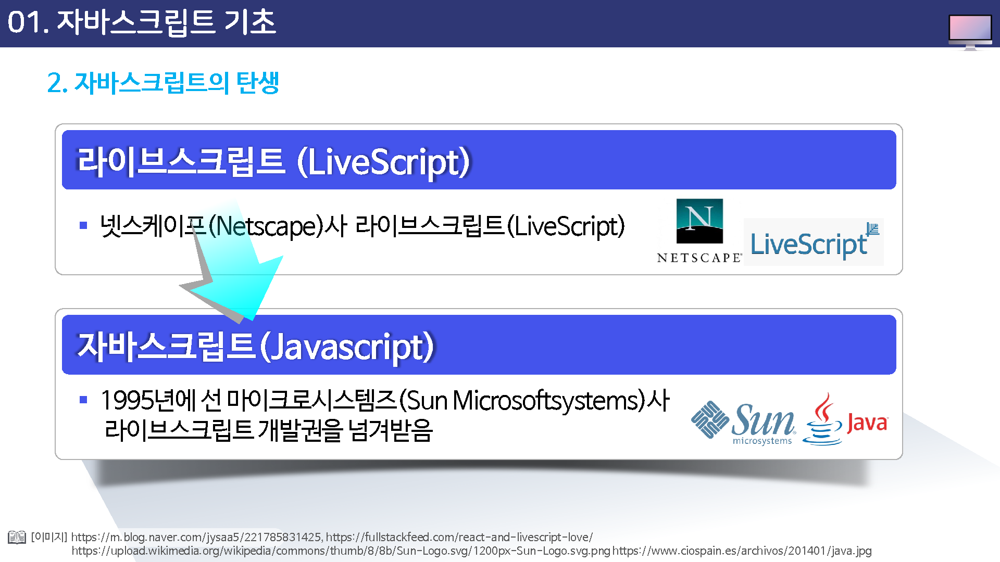
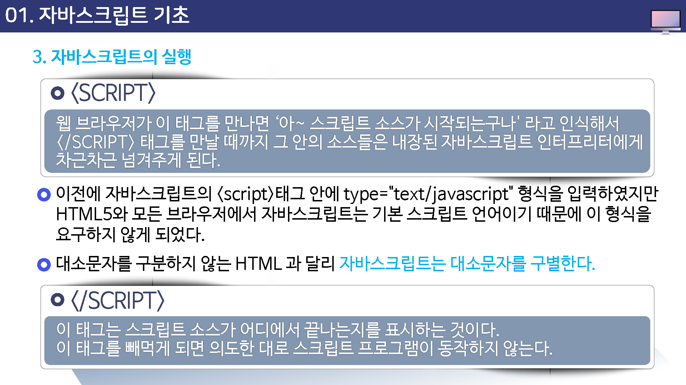
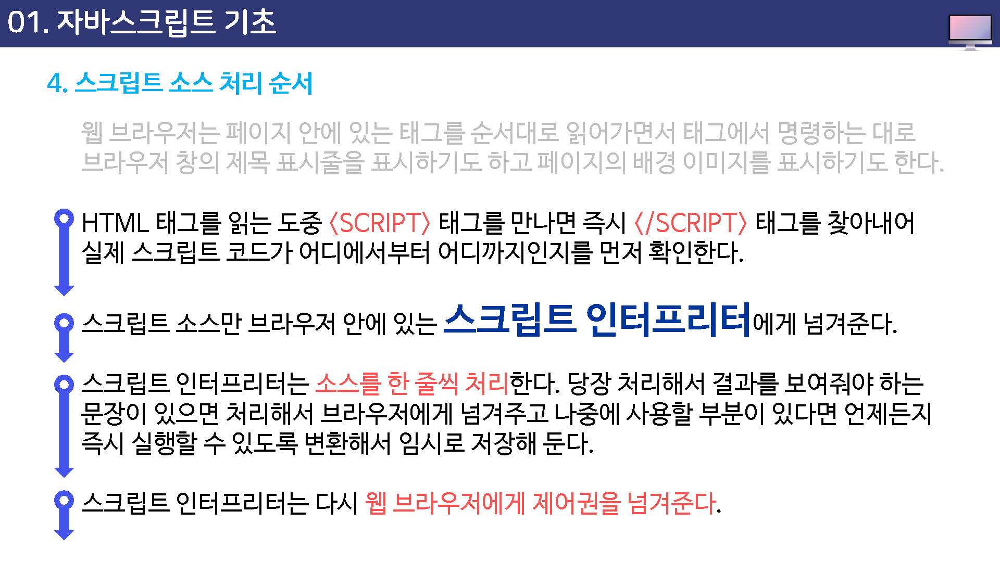
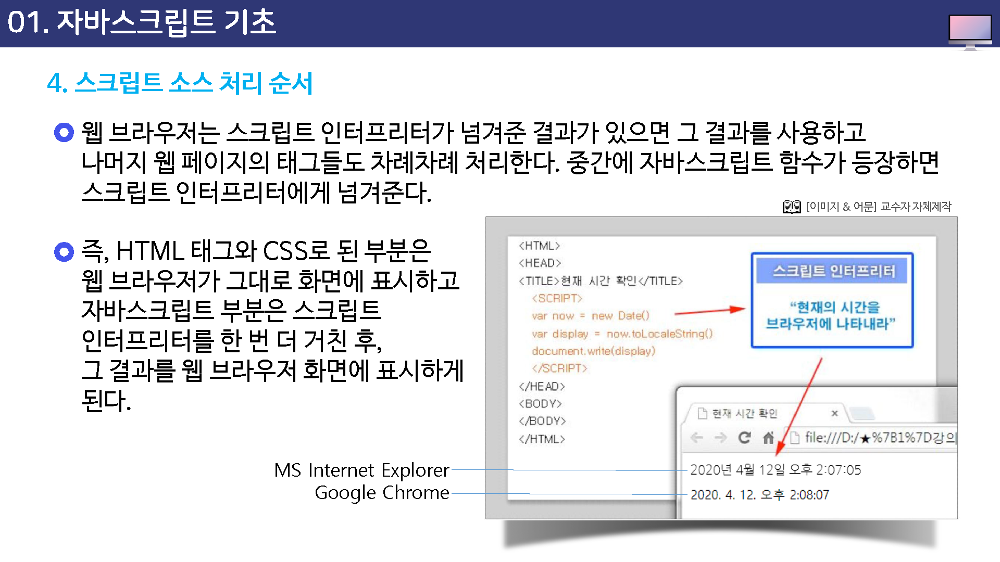

# 자바스크립트 기초

웹 페이지에 좀 더 동적인 효과를 추가하기 위해 사용하는 프로그래밍 언어

---

## 자바스크립트 실행

자바스크립트를 사용하면 웹 브라우저 창 뿐만 아니라 `웹 문서에 삽입한 이미지나 표, 텍스트 등을 원하는 대로 조절`이 가능하다.

예를 들어, 메인 메뉴 위로 마우스 커서를 가져갈 때 보이지 않던 서브 메뉴가 나타난다든지, 이미지 위로 마우스 커서를 올려 놓으면 다른 이미지로 바뀌는 효과를 많이 사용한다.

또한, 이미지나 텍스트, 링크 등의 동작을 제어하는 모든 작업들이 자바스크립트를 통해 이루어진다.

이외에도 자바스크립트를 사용하면 사용자 컴퓨터에 있는 자료를 보여줄 수도 있고, 서버 상에서 돌아가는 자바스크립트를 작성하면 서버 데이터베이스(회원 정보나 게시판 등)에 있는 자료를 가져와 브라우저 화면에 보여줄 수도 있다.

### 서버(server)

항상 인터넷에 연결되어 있어 다른 컴퓨터에서 이 컴퓨터에 저장된 인터넷 정보를 이용할 수 있도록 해 주는 컴퓨터

### 클라이언트(client)

서버 컴퓨터에 접속하여 웹 문서를 열어보는 컴퓨터 or 웹 브라우저

> 웹 페이지에서 동적인 효과를 잘 살린 사이트들을 볼 수 있는데, 이런 사이트들은 HTML과 CSS, 그리고 자바스크립트를 함께 이용한 것이다.

## 자바스크립트의 탄생

라이브 스크립트(LiceScript)

네스케이스(netscape)사 라이브스크립트(livescript)

자바스크립트(javascript)

1995년 선 마이크로시스템즈(sun microsoftsystems)사 라이브스크립트 개발권을 넘겨받음

## 자바스크립트의 실행

HTML이나 CSS는 웹 브라우저가 한 줄씩 읽으면서 그대로 화면에 표시하지만,

자바스크립트 코드는 웹 브라우저가 직접 이해할 수 없다.

대신 브라우저 안에 포함된 `스크립트 인터프리터`라는 곳에서 자바스크립트 소스를 해석한 후에 웹 브라우저에게 그 결과를 보여주라고 명한다.

그러므로 브라우저에서 자바스크립트를 지원하느냐 안 하느냐 하는 것은 '브라우저 안에 스크립트 인터프리터가 있느냐 없느냐'와 같은 뜻이 된다.

