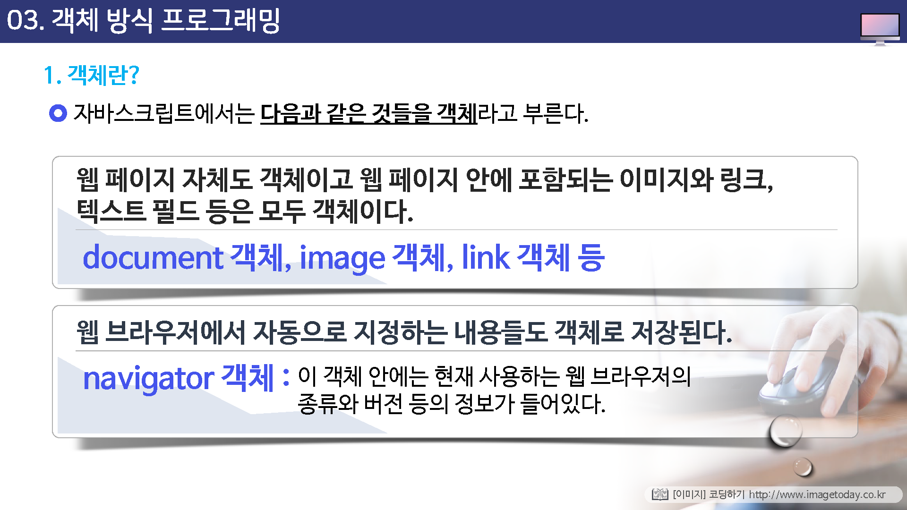
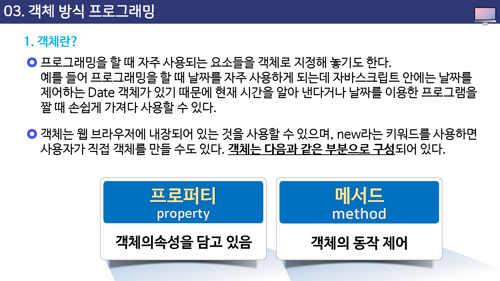
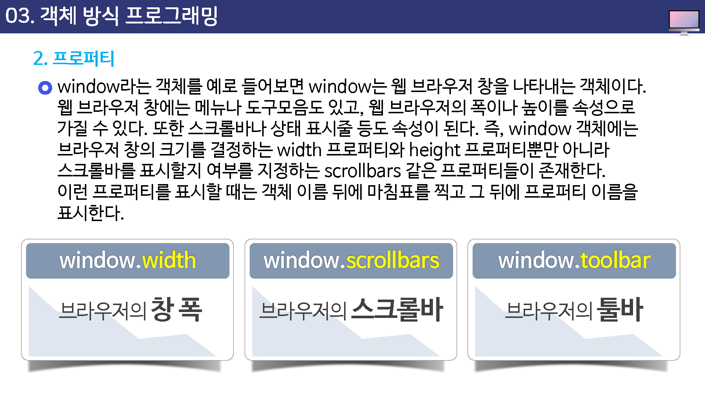
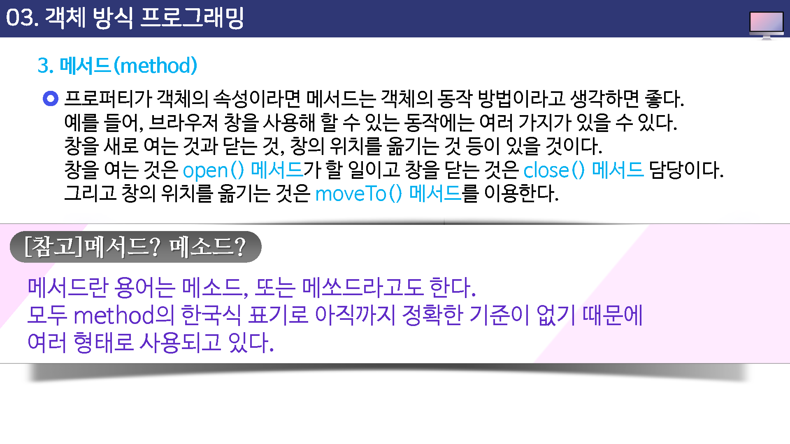
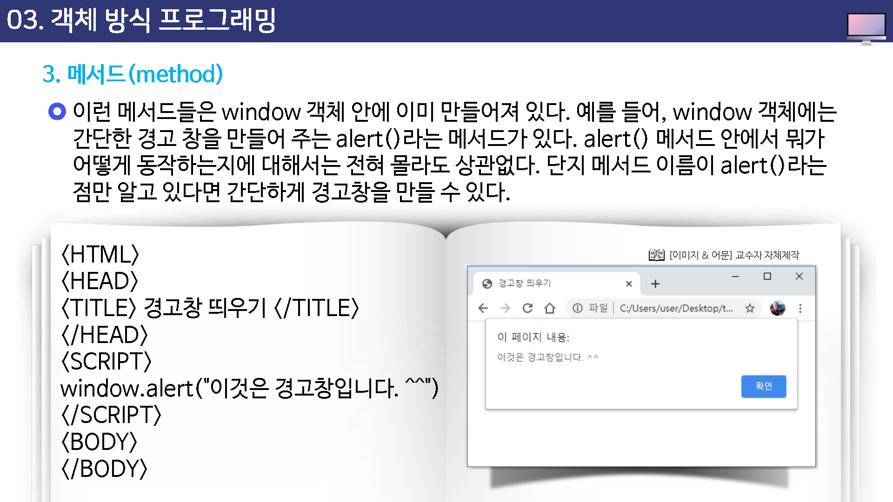
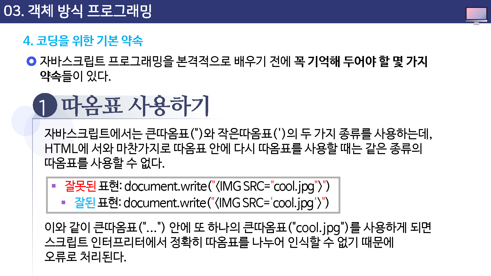
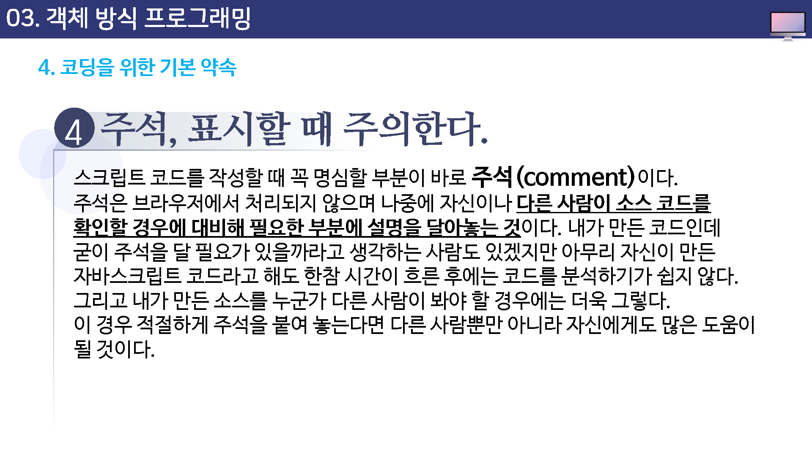
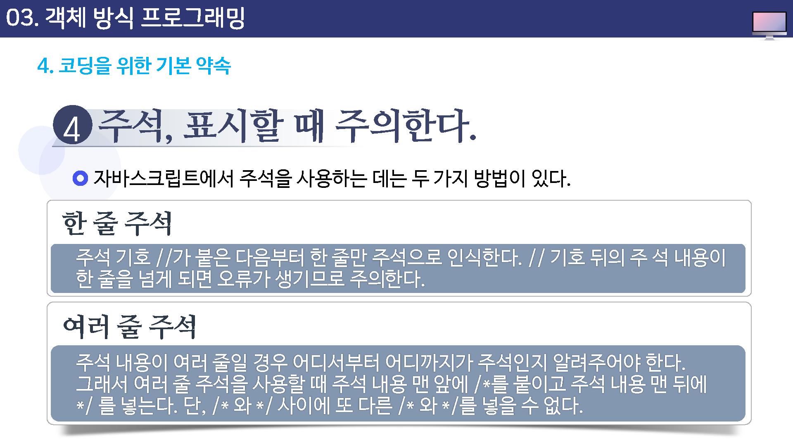
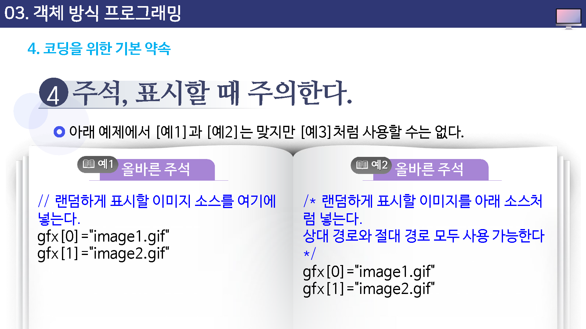
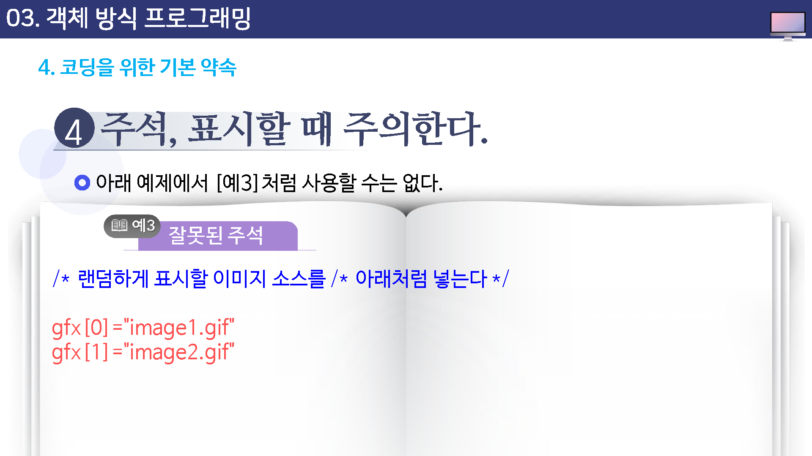

# 객체 방식 프로그래밍

## 객체란?

자바스크립트는 흔히 객체 방식 프로그래밍 언어라고 한다.

객체를 중심으로 프로그래밍 한다는 뜻이다.

객체(object)라는 생소한 용어 때문에 그 내용도 어려울 것이라고 생각하는 데 객체는 생각하는 것보다 어렵지 않다.

객체(object)란 사실 컴퓨터에서 인식할 수 있는 모든 대상을 가리키는 말이다.

실세계에서 만날 수 있는 대상을 컴퓨터에서 인식할 수 있는 형태로 바꾼다면 이것 역시 객체가 된다.

하지만 자바스크립트에서의 객체는 웹을 대상으로 하기 때문에 좀 더 좁은 의미를 가지고 있다.

---

