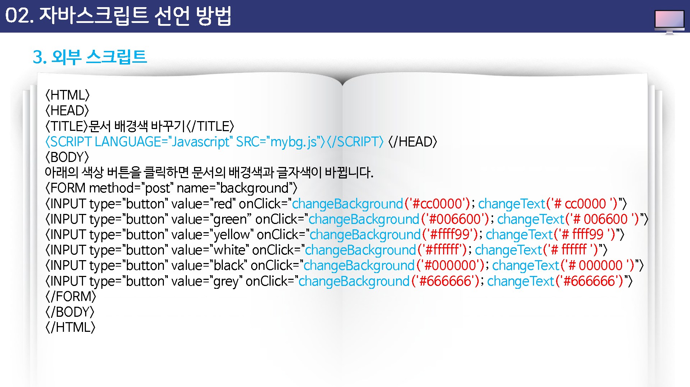
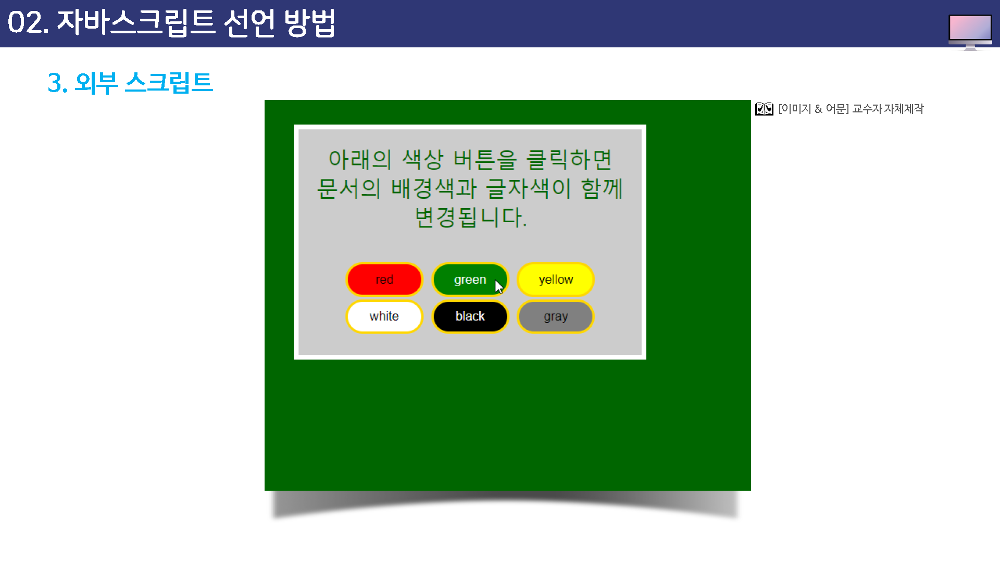
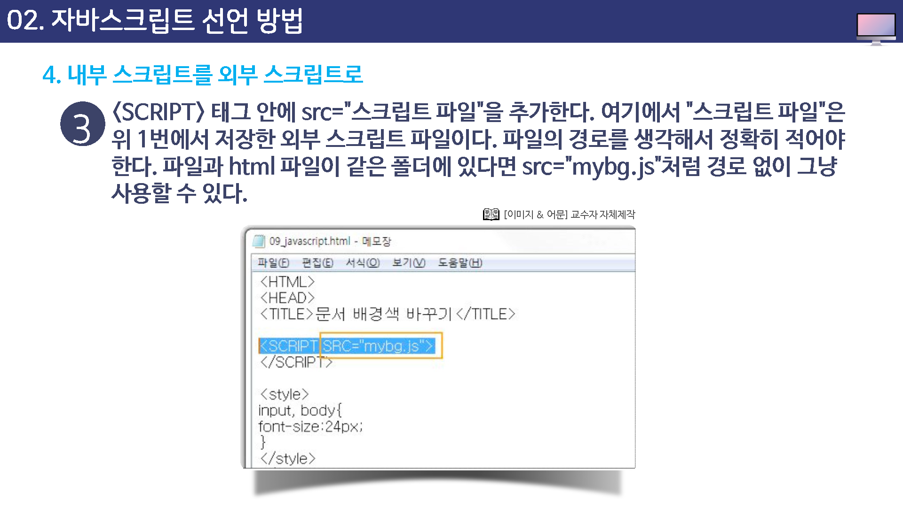
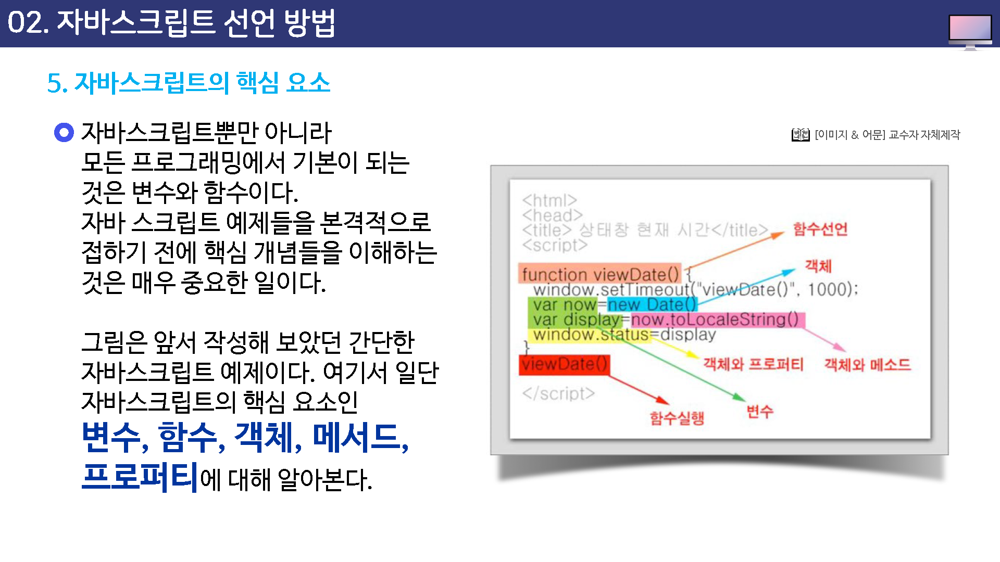
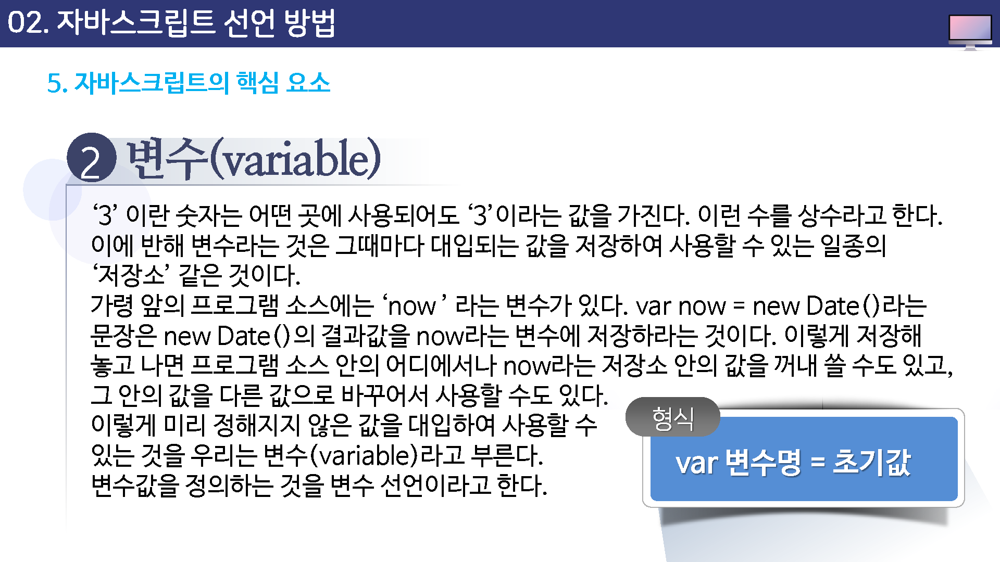

# 자바스크립트 선언 방법

## Script 태그

자바스크립트는 보통 HTML문서 안에 스크립트 소스를 입력하여 사용한다.

그렇다고 스크립트 소스를 그냥 HTML 태그 안에 넣으면 웹 브라우저가 HTML 태그인지 스크립트 소스인지 구별할 수 없다.

그래서 스크립트 소스 부분은 `<script>`태그와 `</script>`태그로 감싸서 다른 HTML태그와 구분해 주게 된다.


자바스크립트는 HTML 문서 내에 삽입하지 않고 자바스크립트 파일을 따로 작성하여 사용하기도 한다. 두 가지 방법을 구분하면 다음과 같다.

* 내부스크립트 : 스크립트 소스를 HTML 문서 안에 모두 넣는 경우
* 외부 스크립트 : 스크립트 소스만 따로 파일로 저장하고, HTML 문서에 연결해서 사용하는 경우


## 내부 스크립트

앞에서 우리가 만들었던 소스는 HTML 문서 안에 필요한 자바스크립트 소스를 모두 입력했기 때문에 이것은 내부 스크립트 이다.

```
<script>
	자바스크립트 소소
</script>
```


---


## 외부 스크립트


* 소스를 감출 수 있다.

외부 스크립트를 사용하면 브라우저에서 소스 보기를 하더라도 자바스크립트 소스는 보이지 않기 때문에 일차적으로 스트립트 소스를 감출 수 있다.


* 유지/관리가 쉽가

스크립트 소스를 따로 저장하게 되면 HTML 태그와 뒤썩이지 않기 때문에 스크립트 소스만 수정하면 된다.


* 라이브러리를 지원한다.

외부 스크립트를 사용하면 C나 C++로 프로그래밍할 때처럼 자바 스크립트 라이브러리를 사용할 수 있다.

따라서 중복해서 함수를 정의하지 않고 내장된 여러 자바스크립트 함수를 불러와 사용할 수 있게 된다.


## 외부 스크립트


* HTML 요소를 참조하기 어렵다

자바스크립트는 보통 사용자 반응에 대해 동작하는 것이다.

그런데, 이런 스크립트 함수를 모두 외부 스크립트 파일로 저장할 경우 HTML 문서 안의 버튼이나 목록 등의 요소를 참조하기가 여려워진다.

따라서 HTML 요소에 좌우되지 않는 일반적인 함수들만 외부 스크립트 함수로 저장하고 HTML 요소에 따라 실행되는 함수들은 웹 문서 안에 직접 넣는 것이 일반적이다.


* 불필요한 부분까지 처리될 수 있다.

자바스크립트 인터프리터는 스크립트 해더 뿐만 아니라 외부 스크립트 파일에 있는 모든 함수들을 처리해서 메모리에 저장해 둔다.

따라서 외부 스크립트 파일 안의 불필요한 함수들까지 모두 가져오기 때문에 스크립트 성능이 떨어지게 된다.


`<script>`태그를 사용해서 외부 스크립트 파일을 HTML 문서에 가져오는 방법은 다음과 같다.

```
<script language="javascript" src="스크립트파일"></script>
```













