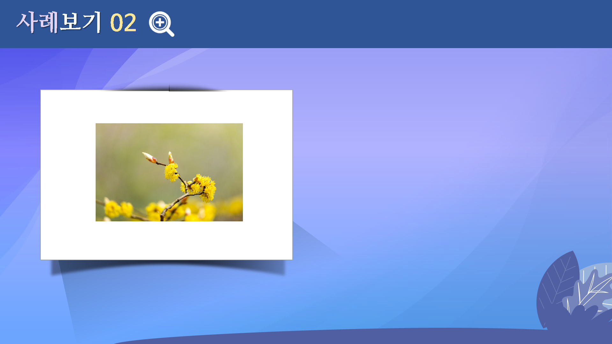

# HTML과 CSS, 자바스크립트 팁
---

 

## 학습목표
---
* 마우스 커서에 대해 살펴볼 수 있다.
* 이미지의 롤오버 기능을 살펴볼 수 있다.
* 홈페이지 제작 과정에 대해 살펴볼 수 있다.

 

## 학습 안내
---
* [마우스 커서 관련 팁](mouse)
* [스타일시트로 이미지 폴오버](rollover)
* [간단한 홈페이지 만들기](homepage)

