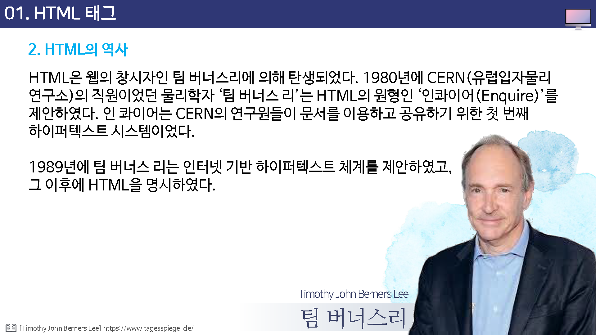

# HTML 태그

## 01. HTML의 정의

* 월드와이드웹(world wide web)

인터넷에 연결된 개별 컴퓨터들은 통해 쌍방 간에 정보를 공유할 수 있는 전 세계적인 정보공간을 의미한다.

>  웹(web) 복잡하게 연결된 망. 거미줄과 유사하게 복잡하게 그물망처럼 연결된 컴퓨터들을 정보를 접근

* 하이퍼텍스트(Hyper Text)

하이퍼링크(참조)를 통해 독자가 한 문서에서 다른 문서로 즉시 접근할 수 있는 텍스트 형태를 말한다.

> 하이퍼택스트의 반대말 palin text 라고 한다. plain text는 암호화 되지 않은, 평범한이라는 뜻을 가지고 있다.

* 마크업(Markup)

마크업이라는 표현은 출판업자들이 원고에 교정기호를 써넣는 것을 mark up 이라 부른 것에서 나온 용어이다.

* 마크업 언어(Markup Language)

태그 등을 이용해서 문서의 논리구조 작성, 문서 서식지정등의 문서처리를 지원하기 위해 문서에 추가되는 마크업을 표현하는 언어이다.

## 02. HTML의 역사

HTML은 웹의 창시자인 팀 버너스리에 의해 탄생되었다. 1980년에 CERN(유럽입자물리연구소)의 직원이었던 물리학자 '팀 버너스 리'는 html의 원형인 '인콰이어(enquire)'를 제안하였다. 인 콰이어는 CERN의 연구원들이 문서를 이용하고 공유하기 위한 첫 번째 하이퍼텍스트 시스템이었다.

1989년에 팀 버너스리는 인터넷 기반 하이퍼텍스트 체계를 제안하였고, 그 이후에 HTML을 명시하였다. 

* HTML 1.0 (1991)
* HTML 2.0 (1994)
* HTML 3.0 (1997)
* HTML 4.01 (1998)
* XHTML 1.0 (2000)
* HTML5 (2007)

## 03.HTML5의 특징

* 동영상이나 음악을 재생시 플러그인 불필요
* 자바스크립트, CSS, HTML이 하나로 통합
* HTML5는 SVG태그를 이용한 2차원 벡터 그래픽과 자바스크립트 캔버스를 사용한 2차원 래스터 그래픽, CSS3과 자바스크립트 WebGL을 사용한 3차원 그래픽의 구현이 가능
* 스마트폰의 배터리 잔량을 확인시켜준다든지 GPS의 확인 및 장치접근이 가능함
* HTML5는 오프라인 상태에서도 작업가능 

## 04. 웹 브라우저의 종류

웹 브라우저

간단히 말해서 인터넷 여행을 할때 사용하는 프로그램이다. 

웹 브라우저 하면 대부분 이터넷 익스플로러를 연상하지만, 인터넷 익스플로러 외에도 웹 브라이저는 아주 만다.

* 익스플로러
* 크롬
* 파이어폭스
* 오페라
* 웨일

#### 익스플로러 (Internet Explorer)

윈도우 제작사인 마이크로소프트사의 웹 브라우저이다. 윈도우와 함께 설치되기 때문에 국내에서는 대부분 익스플로러를 많이 사용한다.

#### 파이어폭스(Firefox)

인터넷 익스플로러 이전에 많이 사용되었던 '넷스케이프 커뮤니케이터'의 소스가 공개된 후 아메리카온라인(AOL)사와 넷스케이프사에서 개발한 웹 브라우저이다.

ActiveX를 지원하지 않기 때문에 브라우저가 가볍고 다양한 부가 기능을 지원하기 때문에 외국에서는 많은 사용자를 확보하고 있다.

하지만 대부분 사이트에서  ActiveX를 사용하고 있는 국내에서는 사이트 접속에 불편한 점도 있다.

#### 오페라(Opera)

오페라 소프트웨어(opera software)사에서 제작한 웹 브라우저로, 인터넷 익스플로러나 넷스케이프 내비게이터가 다양한 기능이 많은 많큼 설치할 때 하드디스크의 공간을 많이 차지하는데 반해 오페라는 용량은 작으면서도 인터넷 익스플로러 많큼의 기능을 가지고 있다.

#### 구글 크롬(Google Chrome)

구글(Google)사에서 개발한 웹브라아저로 브라우저의 윈도우 탭들을 각각 별도의 프로세스로 괸리하여 안정성을 도모 하였다.

#### 사파리(Safari)

애플(Apple)사에서 개발한 웹브라우저로 사파리는 아이튠즈와 유사한 북 마크를 관리 체계를 가지고 있고, 애플의 쿽타임 멀티미디어 기술과 통합되어 있으며, 탭 브라우징 인터페이스를 사용한다.

## 웹 브라우저의 종류

* 익스플로러 브라우저에서 HTML언어를 확인하기\
  * 브라우저 메뉴 > 보기메뉴 > 소브보기

  * 브라우저 메뉴 > 마우스 우측 버튼 > 소스보기

* 구글 크롬 브라우저에서 html언어 확인하이
  * 브라우저 맞춤설정 및 제어 > 도구 > 소스보기
  * 브라우저 화면 > 마우스 우측 버튼 ? 페이지 소스보기

* 메모장으로 HTML 언어 사용해 웹페이지 저장하고 확인하기
  * 메모장 프로그램을 이용하여 아래와 같이 입력한 후, 파일메뉴 > 저장 

## HTML 공부를 위한 필기 도구

HTML을 배우기 위해 특별한 프로그램이 필요한 것은 아니다. 컴퓨터에 기본으로 갖추어져 있는 메모장과 웹 브라우저만 있으면 언제든지 시작할 수 있다.

이렇게 작성함 html 파일을 브라우저에서 열어서 확인할 수 있다.

* 첫번째 줄 : 입력한 내용 그대로 브라우저 창에 표시된다.
* 두번째 줄 : 입력 시 세칸씩 뛰어쓰기 한 부분은 한 칸식만 적용되어진다.
* 세번째줄 : `
`와 `
` 라는 텍스트는 브라우저 화면에 보이지 않고 특이사항은 p와 /p 사이의 내용은 줄 부꿈이 되어 화면에 보인다.
* 네번째줄 : img 내용은 하면에 나타나지 않고 해당 경로의 이미지만을 표시된다.

위에서 살펴본 것처럼 `
`나 `
`, ``와 같이 둘러 싸인 것을 태그(tag)라고 한다.

태그는 웹 브라우저 창에 나타나지 않지만 브라우저에게 어떤 것을 표시해야 하는지 알려 주는 역할을 한다. 

웹 브라우저 화면에 이미지를 표시하려면 `` 태그를 사용해야 한다는 것은 이미 약속된 것이므로 우리는 그런 약속된 태그들만 배우면 된다.

쉽게 `HTML = 태그`라고 생각하면 된다.

HTML을 배운다는 것은 필요한 곳에 정확한 `테그를 사용할 수 있는 증력을 키우는 것`이다.

## 웹 문서로 저장할 때의 주의사항

HTML 소스를 작성한 후에는 startTest.html처럼 웹 문서로 저장해야 구글 트롬에서 그 결과를 확인할 수 있다. 여기서 웹 문서를 저장할때 몇가지 주의해야 할 사항이 있다.

주의사항

* 파일 확장자는 html이나 html을 사용한다. 두 가지 확장자 모두 브라우저에서 웹 문서로 인식하지만 web.html 과 web.htm은 다른 파일로 인식하므로 주의해야 한다.

* html 소스의 경로에서 파일이름의 수정 없이 임의로 파일 이름을 바꾸지 않는다. 소스의 결로에서 파일 이름과 웹페이지의 파일 이름이 서로 일치하지 않는다면 페이지를 찾을 수 없게 된다.

* 파일 이름은 되도록 영문을 사용한다. 대부분 웹 서버에서는 한글 파일 이름(예, 갤러리.html)을 인식하지만, 일부 서버에서는 한글을 인식하지 못하여 오류를 만들 수 있다. 되독록 웹 문서 파일 이름은 영문으로 표기한다.
* 파일 이름안에 여북을 두거나 특수문자를 사용하지 않는다. 웹 문서 파일에 하이픈(-)이나 언더바(_)등은 사용할 수 잇지만, 마침표(.)나 별표(*), 소괄호, 콤마와 같은 특수문자는 사용할 수 없다.
* 

