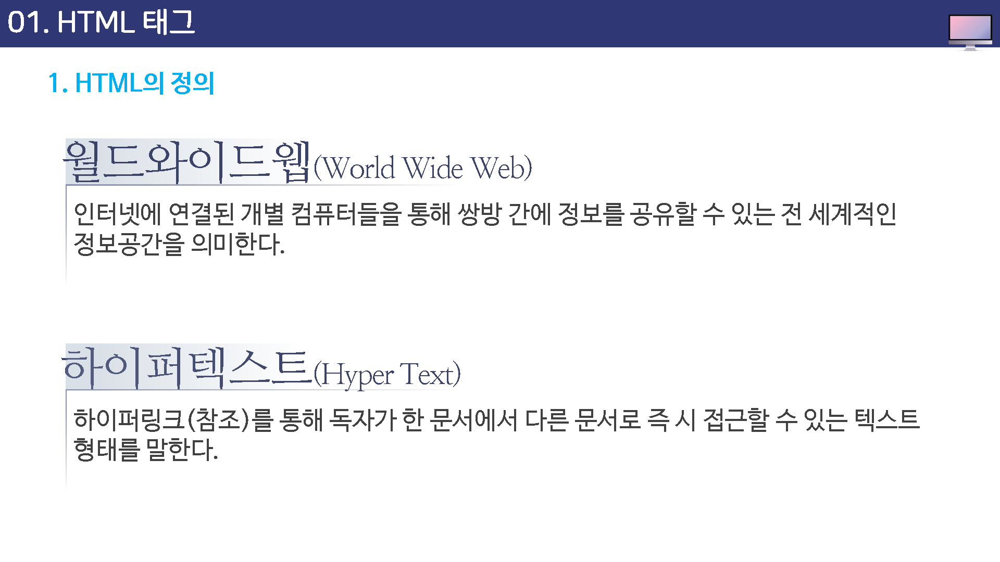
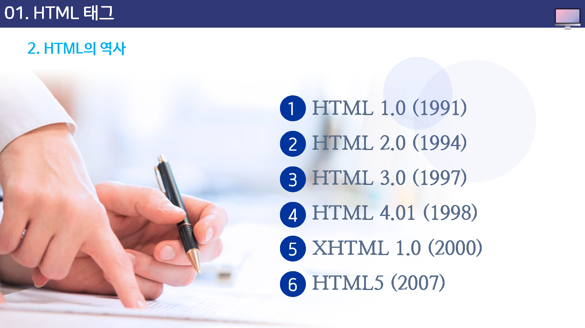
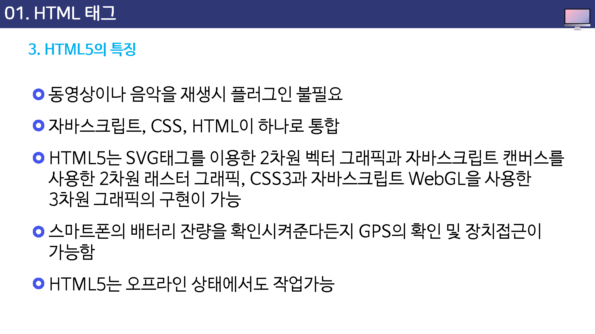
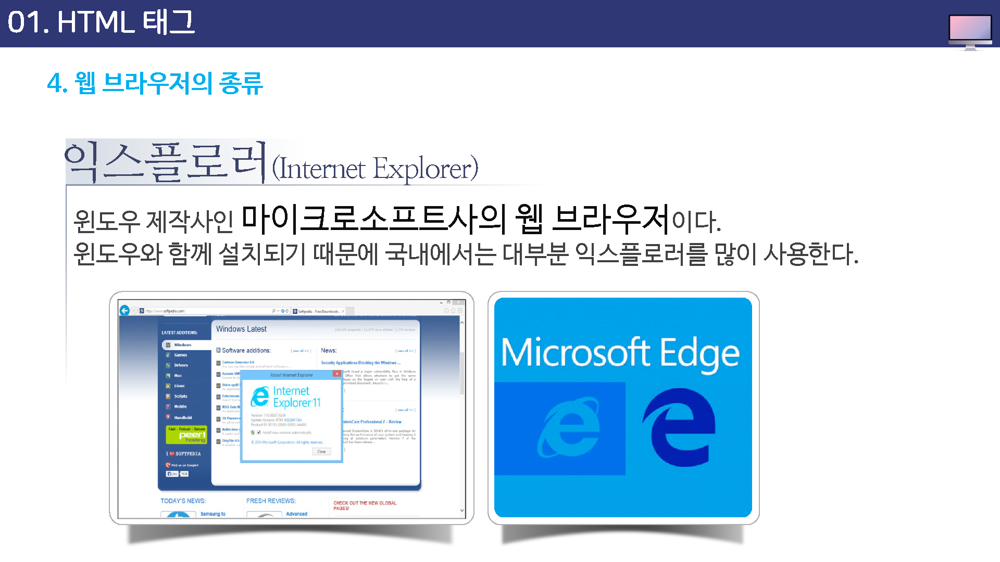
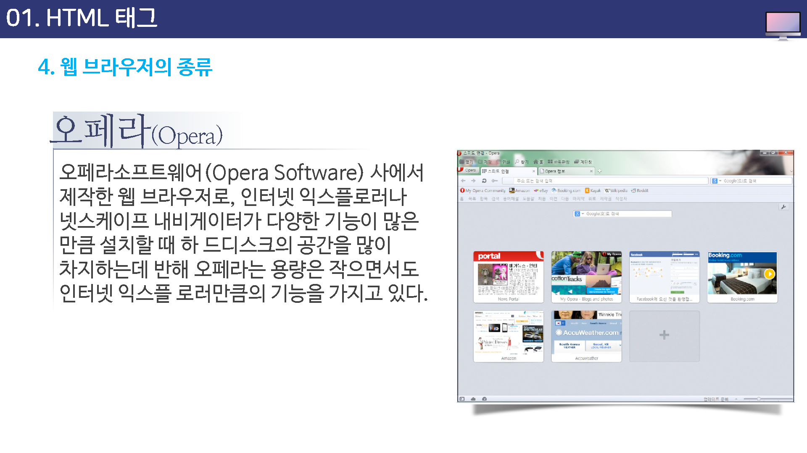
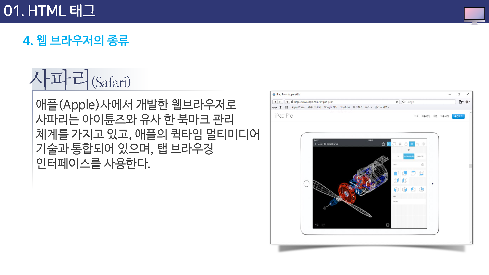
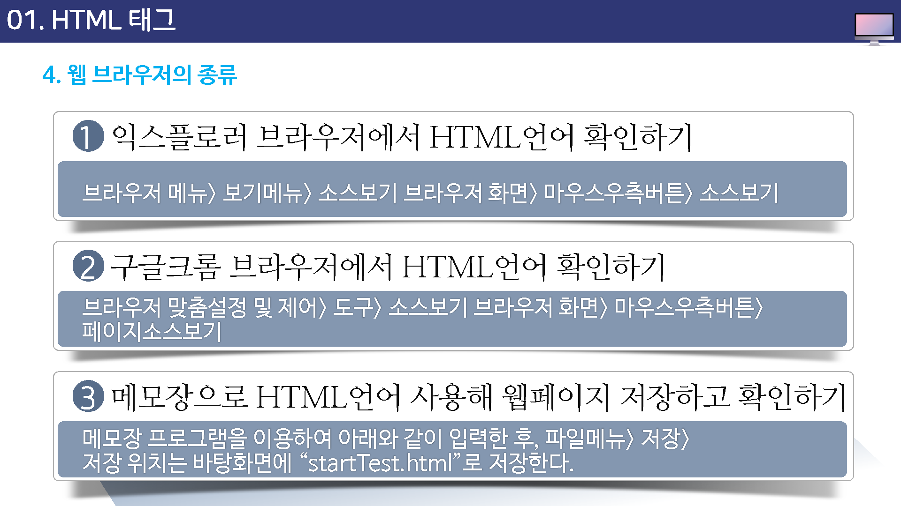
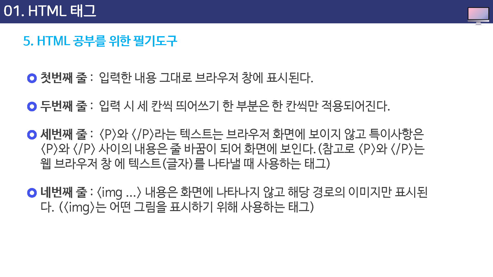
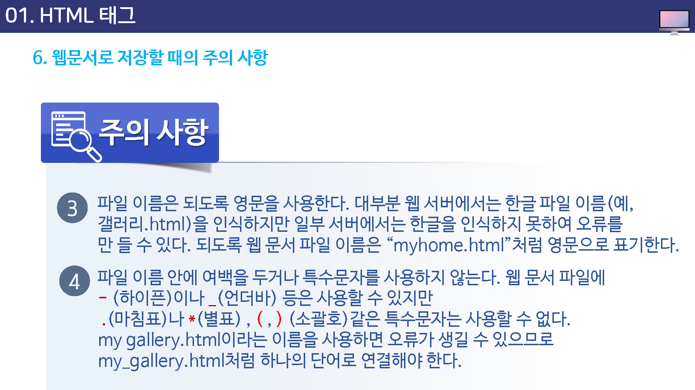
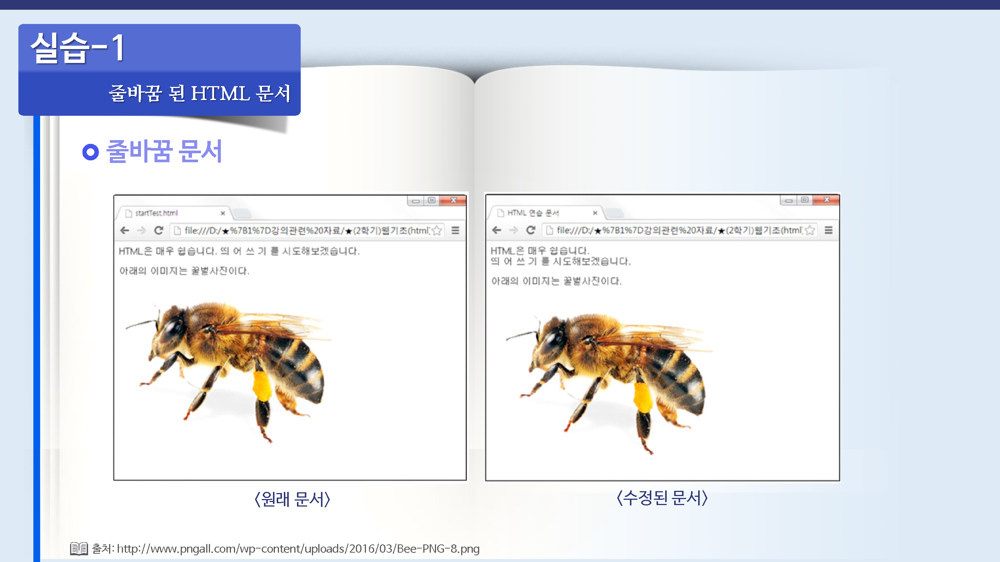

---

layout: home
---

# HTML 테그의 기본 개념

## 01. HTML 테그의 기본 개념

## 학습목표

* HTML 언어와 역사에 대해 살펴볼 수 있다.
* HTML 테그의 특징을 살펴볼 수 있다.
* HTML의 기본 테그들에 대해 살펴볼 수 있다.
* HTML 문서의 기본 구조에 대해 익힐 수 있다.

## 학습안내

* HTML 테그
* HTML 테그의 특징
* 기본 태그들
* HTML 문서 기본구조

## 01. HTML 태그

## 02. HTML 테그의 특징

## 03. 기본 태그들

## 04. HTML 문서의 기본 구조

## 학습정리

이번 시간에는 다음과 같은 내용을 학습 하였습니다.

* HTML 테그
* HTML 테그의 특징
* 기본 태그들
* HTML 문서의 기본 구조

