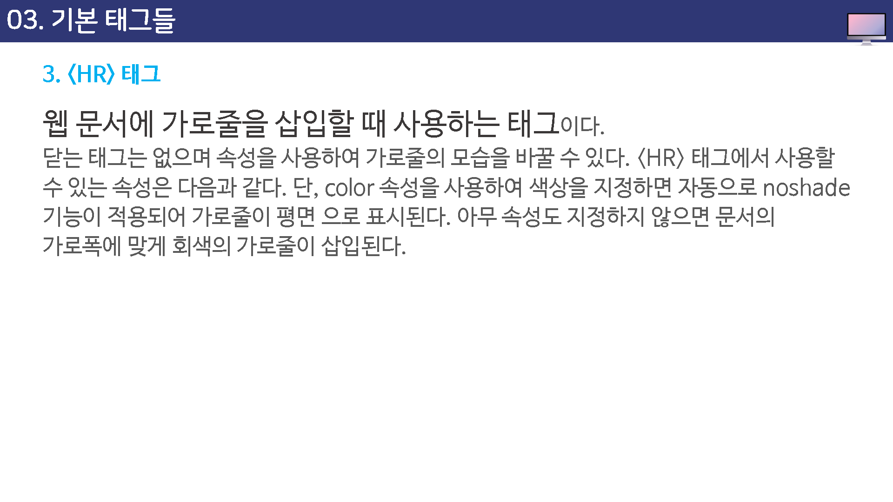
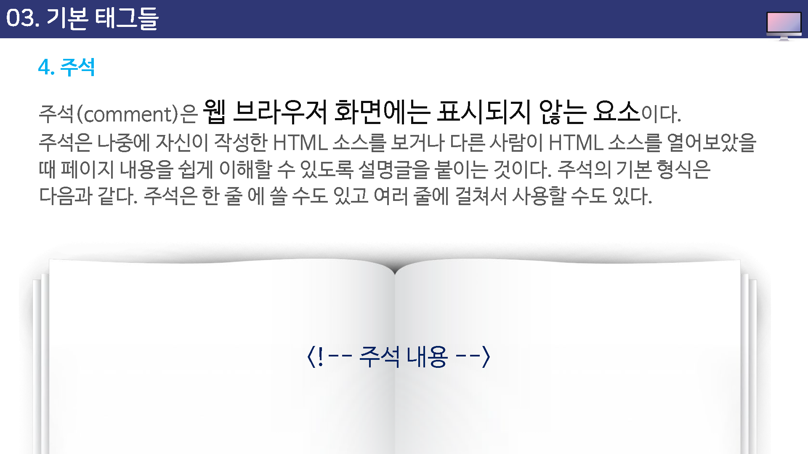

# 기본 태그들

## BR 테그

간단한 문서를 만들었을때 소스에서 아미뤼 줄바꿈을 하더라도 브라우저 창에서는 한 줄로 표시되는 것을 보았다.

실제로 웹 브라우저 창에서 줄바꿈이 되도록 하려면 ` `테그를 사용한다.

` `태그가 삽입된 위치에서 바로 줄이 바뀌는 것인데

태그를 여버 번 사용하면 사용하는 만틈 브라우저 상에서 엔터키를 누는 것과 같은 효과를 볼 수 있다.

## P 테그

웹 문서에서 가장 많이 사용하는 태주중의 하나가 p테그이다.

`
` 태그는 단락(paragraph)을 만드는 태그인데, 단략이란 앞뒤로 빈줄이 있는 텍스트 덩어리를 말한다.

> `
`태그는 다는 태그를 생략해도 되지만, 되도록 다는 태그를 같이 사용하는 급관을 가지는 것이 좋다.

`
`태그의 align 속성을 사용하면 단락의 정렬 방법을 조정할 수 있다.

사용할 수 있는 값은 다음과 같다

* left
* right
* center

align  속성을 따로 지정하지 않았을 때의 기본값은 left이다.

