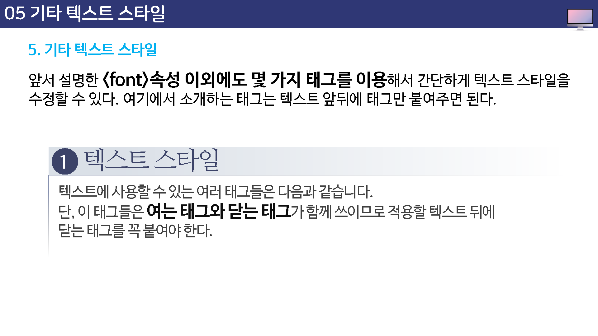
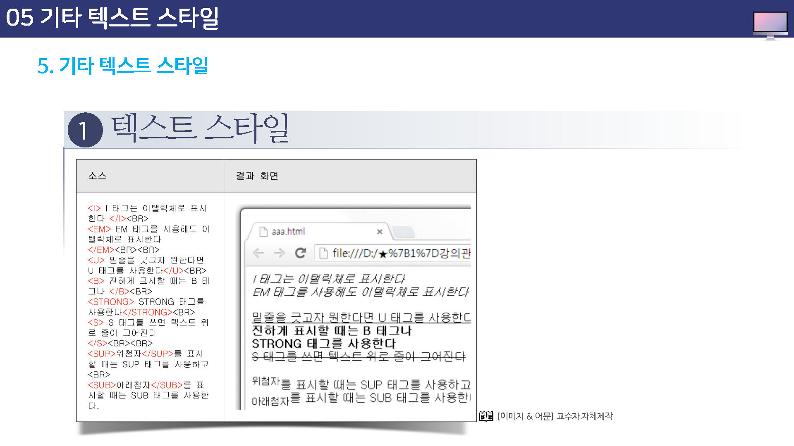
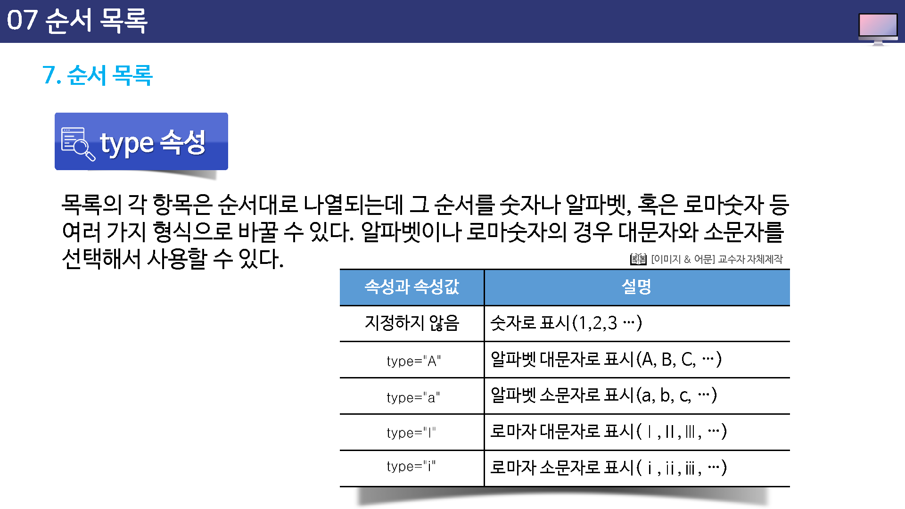

---

layout: home
---

# 텍스트 태그

## 학습목표

* 텍스트를 꾸미는 방법을 설명할 수 있다.
* "TEXT 이미지"와 "TEXT"의 차이점을 알 수 있다.
* "굴림"과 "굴림체"의 차이점을 파악할 수 있다.
* `<ul>`태그와 `<ol>`태그를 설명할 수 있다.

## 학습안내

* 텍스트 이미지와 텍스트
* 텍스트 색상(color) 변경
* 텍스트 크기(font-size) 변경
* 텍스트 글꼴(font-family) 변경
* 기타 택스트 스타일
* 순서 없는 목록
* 순서 목록

## 01. 텍스트 이미지와 텍스트

## 02. 텍스트 색상 변경

## 03. 텍스트 크기 변경

## 04. 텍스트 글꼴 변경

## 05. 기타 텍스트 스타일

## 06. 순서 없는 목록

## 07. 순서 목록

## 학습정리

이번 시간에는 다음과 같은 내용을 학습하였습니다.

* 텍스트 이미지와 텍스트
* 텍스트 색상 변경
* 텍스트 크기 변경
* 기타 텍스트 스타일
* 순서없는 목록
* 순서 목록

