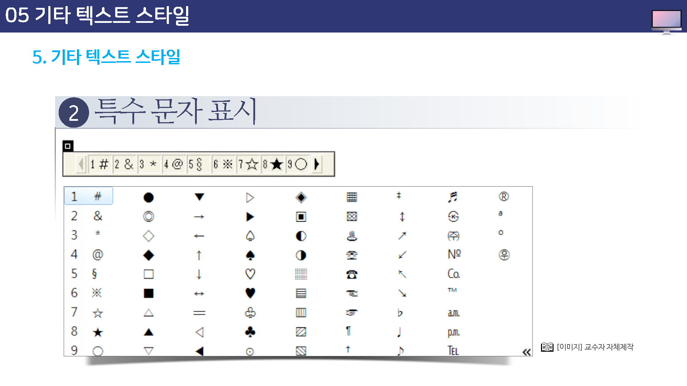

# 기타 텍스트 스타일

앞서 설명한 ``속성 이외에도 몇 가지 테그를 이요해서 간단하게 텍스트 스타일을 수정할 수 있다.

여기에서 소개하는 태그는 텍스트 앞뒤에 태그만 붙여주면 된다.

## 텍스트 스타일

텍스트에 사용할 수 잇는 여러 태그들은 다음과 같습니다.

단, 이 태그들은 여는 태그와 닫는 태그가 함께 쓰이므로 적용할 텍스트 뒤에 닫는 태그를 꼭 붙여야 한다.

## 특수 문자 표시

특수문자들은 텍스트의 주목 효과를 더 이끌기 위해서 사용되는데 특수문자를 사용하기 위해서는 우선 키보드에서 한글 자은 `ㅁ`키를 누른 후, 키보드의 `한자키`를 누르고 화면 오른쪽에 아래를 살펴 본다.

그러면 특수문자들이 나타날 것이다.

문자 앞에는 번호가 붙여있는데 마우스로 원하는 문자를 클릭하거나, 문자 앞의 번호를 키보드에서 눌러주면 된다.

스크롤바를 위 아래로 움직이면 더 많은 특수 문자를 볼 수 있다.

