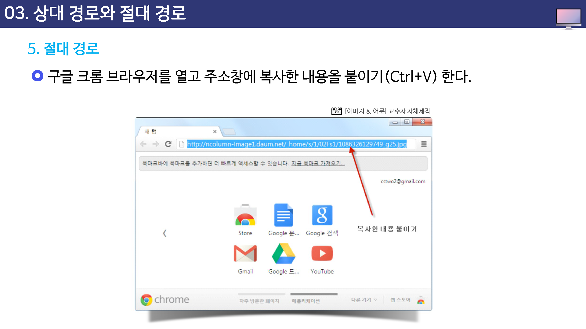

# 상대 경로와 절대 경로

웹 문서에 이미지를 삽입할 때는 직접적으로 삽입이 불가능 하고 간접적으로 이미지의 위치 

즉, 경로를 적어주어 웹 문서에서 이미자가 나타나게 만든다.

여기서 경로를 제대로 이해하고 표현하지 못한다면 자신이 만든 웹 문서에 이미지는 보이지 않게 된다.

`경로`란 현재 html 문서에 이미지 파일의 위치를 명확하게 적어주는 것으로 두가지 표현 방법이 있다.

하나는 `상대경로`이고 다른 하느는 `절대 경로`이다.

`상대 경로`란 현재 html문서를 기준으로 이미지가 어디에 있는지 위치를 알려주는 것이고, `절대경로`란 이미자가 저장된 위치를 `http://`부터 시작하는 전체 주소를 적어주는 것이다.

홈페이지를 만들때는 주로 상대 경로를 많이 사용하고,

계시판등에서 이미지를 사용할때는 절대 경로를 사용한다.

홈페이지를 만들면서 사용하는 이미지들은 별도로 폴더를 만들어 저장하는 것이 좋다.

이렇게 이미지 파일들과 html 파일들을 분리해 놓으면 나중에 파일 관리가 쉬워진다.

## 상대경로

윈도우의 탐색기를 보면 알 수 있듯이  컴퓨터에 파일을 저장할 때 계층적인 구조를 지닌다.

`aaa.html` 웹 문서 파일을 기준으로 이미지 파일의 위치를 보면 `sample`폴더 안에 웹 문서와 이미지들이 위치해 있는 것을 볼 수 있다.

즉, 웹문서와 이미지가 같은 폴더에 있는 경우이다.

### 상대경로 표기 원칙

상대경로의 표기 원칙 세 가지를 살펴본다.

* 웹 문서와 이미지가 같은 폴더에 있는 경우
* 이미지가 웹 문서의 바로 하위 폴더에 있는 경우
* 이미지가 웹문서의 바로 상위폴더에 있는 경우

웹 문서와 이미자가 같은 폴더에 있는 경우의 화면과 이미지의 경로의 표기이다.

### 상대경로 표기

웹 문서와 이미지가 같은 폴더에 있는 경우의 화면과 이미지의 경로의 표기이다.

이미지가 웹 문서의 바로 하위 폴더에 잇는 경우의 화면과 이미지의 경로의 표기이다.

이미지가 웹 문서의 바로 하위 폴더에 있는 경우의 화면과 이미지의 경로 표기이다.

## 절대경로

절대 경로는 자신의 컴퓨터가 아닌 인터넷에 있는 이미지를 다운받지 않고 연결만 하여 사용하고자 할때 이용하는 방법이다.

이 경우 문제점으로는 해당 사이트에서 이미지가 삭제될 경우 절대경로로 보이던 이미지는 깨져 보이게 된다.

인터넷에 있는 이미지의 절대 경로는 쉽게 앟 수 있다.

* 먼저 아래의 구글 이미지 사이트를 접속한다.

* 검색어에서 "풍경사진"이라고 입력한 후 원하는 이미지를 선택한다. 이미지의 절대 경로를 할고자 원한다면 이미지를 마우스 오른쪽 버튼으로 클릭한 후 `속성`을 클릭한다.
* 이미지 속성 대화상자에서 `주소(url)` 항목 바로 오른쪽에 표시된 것이 바로 현재 이미지의 절대 경로이다. 이주로를 드래그 하여 선택한 후 마우스 오른쪽 버튼으로 복사한다.

