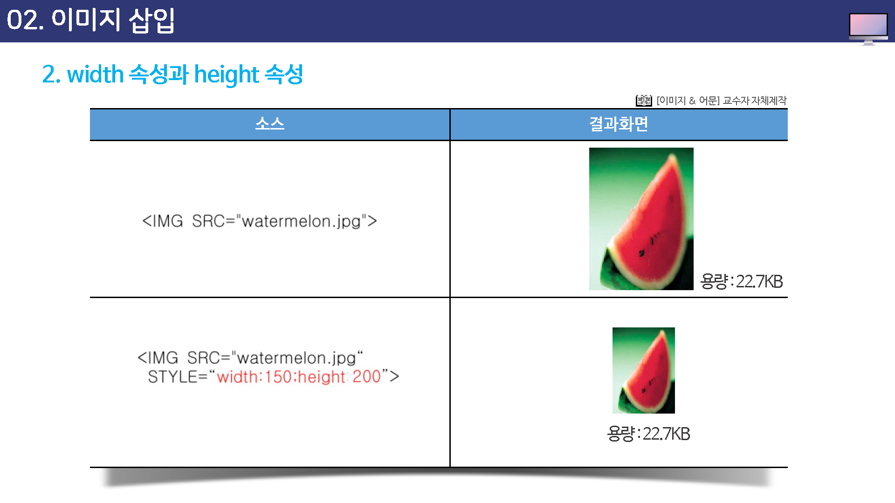
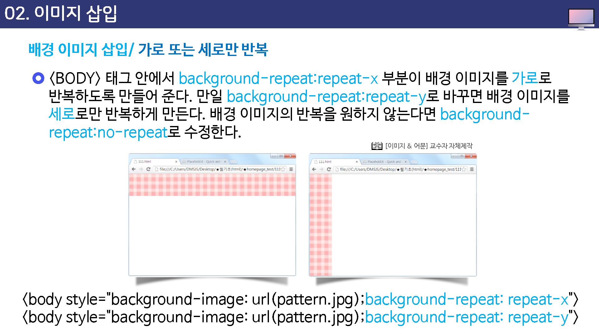

# 이미지 삽입

웹 문서에 이미지를 삽입할 때는 IMG 태그를 사용한다.

 ``태그 안에는 여러 가지 속성이 오게 되는데 src 속성은 이미지 파일의 위치를 알려주는 것이므로 반드시 필요한 속성이지만 그 외의 속성은 필요할 때만 넣으면 된다.


| 속성 | 설명                     |
| ---- | ------------------------ |
| src  | 이미지의 경로를 나타낸다 |
|      |                          |

width : 이미지의 폭을 나타낸다.

height : 이미지의 높이를 나타낸다.

alt : 이미지가 깨질 경우 대체 텍스트를 나타낸다.

title : 이미지 위로 마우스 커서를 가져가면 간단한 설명글을 나타낸다.

align: 이미지의 위치를 정렬한다.

	* 수평정렬 : left, right
	* 수직정렬 : top, middle, bottom

border : 이미지의 테두리를 나타낸다.


## SRC 속성

SRC는 Source의 약자로 이미지의 생대경로와 절대경로로 나타낼 때 사용한다.


```

```


## width와 height 속성

이미지의 폭(width)과 높이(height)를 조절하여 이미지 크기를 변경하는 속성이다.

이 속성을 사용하지 않으면 이미지의 원래 크기대로 표시되는데 웹 문서 안에서 다른 이미지나 텍스트의 크기를 고려해서 원래 이미지 크기를 늘리거나 줄일 수 있다.

이 속성으로 크기가 줄었다 하여 물리적인 크기까지 줄어든 것은 아니기 때문에 용량은 변화가 없다는 것을 명심한다.




## ALT 속성

* ALT 속성은 Alternative 의 약자로 이미지를 대신해서 텍스트를 나타낸다.
* 시각 장애인의 웹서핑 시 사용하는 리더(leader) 프로그램이 텍스트는 읽어주나, 이미지는 익을 수 없으므로 alt 태그 안의 설명을 읽어준다.
* 일반인 웹 서피이시 인터넷 접속 등의 문제로 해당 이미지를 불러오지 못했을때 , x표 상자와 함께 이미지 설명을 보여준다. 이미지 경로가 제대로 입력되어 있는 상태에서는 alt 속성에 있는 애용이 보이지 않는다.


이미지 경로가 제대로 입력되어 있는 상태에서는 alt 속성에 있는 내용이 보이지 않는다.

이미지 경로를 입력하지 않아 alt 속성에 있는 내용의 택스크가 보인다.


## TITLE 속성

title 속성은 이미지 위에 마우스를 올려 놓았을 때 풍선 도움말 처럼 나타낸다.

* 일반적인 게시판 리스트 페이지에서 게시물 제목을 일정 길이로 잘랐을 때, title 속성에 전체 제목을 넣어주면, 해당 게시물을 클릭할 필요 없이 마우스 오버만으로 전체 제적을 볼 수 있다.


이미지 뿐 아니라, a테그, a 태그, span 태그, td 태그 등 거의 대부분의 태그에 사용할 수 잇고, "클릭하면 다른 페이지로 이동합니다." 등의 간단한 풍선 도움말 형식을 사용할 수 있다. 특히, 웹 표준에서는 a태그에 title 속성은 필수 항목이다.

링크 주소에 대한 설명을 넣어, 링크 주소에도 의미를 부여할 수 있다.


## ALIGN 속성

이미지의 배치 방법은 align  속성을 사용해서 지정하는데 가로 배치 방법은 left와 right중에서 선택할 수 있고, 세로 배치 방법은 top, middle, bottom 중에서 선택할 수 있다.

특히 이미지 바로 옆에 텍스트가 오게 하려면 IMG 태그의 align 속성을 사용해서 이미지 위치를 정렬하면 된다.


## BORDER 속성

border 속성은 이미지 주위의 테두리선을 조절하는 것이다.

이 속성을 따로 설정하지 않거나 border=0 으로 지정하면 이미지 주변에 테두리 선이 나타나지 않는다.

이 속성을 통해 테두리선을 표시할 수도 있고 두께를 저절 수도 있고 두께를 조절할 수도 있으므로 간단한 액자 효과를 만들 수 있다.

데두리선의 색상은 검은색이며 HTML로는 데두리선 색상을 조절할 수 없다.


이미지 테두리선 색상이나 스타일 등을 조절하려면 스타일시트를 이용해야 한다.

아래 예제에서 보는 것처럼 `` 태그 안에 `sytle="border-style:스타일;border-color:색상;border-width:굵기"`같은 형식을 추가하면 된다.

테두리선과 관련된 속성과 속성값은 다음과 같다.


### border-style

* dashed(대시)
* dotted(점선)
* double(이중선)
* solid(실선)
* inset(움푹 들어가 보이게)
* outset(볼록 솟아나 보이게)


### border-width

* thin(얇게)
* medium(중간)
* thick(굵게)
* 숫자(픽셀값)


### border-color

색상이름 또는 색상값으로 지정함


## FIGURE 태그

figure 태그는 이미지, 그래프, 사진, 예제코드, 비디오, 일반 텍스트등을 하나로 묶어 블록을 형성하고 캡션을 포함시켜 서로 관계를 명확히 구조화 시킨다.

반다시 메인이 되는 문서 안에 삽입될 필요는 없으며 페이지 옆이나 참조용 별도 페이지 등에 넣어도 크게 상관 없는 내용을 지정할 수 있다.


## FIGCAPTION 태그

figcaption 태그는 익스플로어9, 파일어폭스, 오페라, 크롬 및 사파리 에서 지원된다.

익스플로러8 이전 버전에서는 figcaption 태그를 지원하지 않는다.


## 대체이미지 삽입 사이트 / palcehold.it

웹 문서를 만들때 이미지를 사용하고 싶은데 당장에 필요한 이미지가 없다면 좋은 방법이 있다.

아래의 사이트는 이러한 경우에 원하는 크기의 이미지를 제공해 주는 사이트이다.


## 배경 이미지 삽입 / 문서 전체에 배경 이미지 삽입

배경 이미지를 삽입하기 위해서는 body 태그에서 스카일의 background-image 속성을 사용한다.


### 전체 배경이지지 적용

배경 이미지로 사용할 수 있는 파일은 일반 이미지와 마찬가지로 GIF나 JPG, PNG 인데, 웹 문서 크기보다 작은 이미지를 사용할 경우 웹 문서에 가득 차게 가로와 세로로 반복해서 표시된다.

예를 들어, 다음과 같은 작은 이미지를 배경 이미지로 사용할 경우 웹문서 전체에 나타난다.


### 가로 또는 세로 반복

`<body>' 태그 안에서 background-repeat;repeat-x 부분이 배경 이미지를 가로로 반복하도록 만들어 준다.

만일 background-repeat:repeat-y로 바꾸면 배경 이미지를 세로로만 반복하게 만든다.

배경 이미지의 반복을 원하지 않는다면 background-repeat:no-repeat 로 수정한다.





### 배경 이미지 위치 설정

배경이미지를 반복하지 않으면서 화면 중앙에 표시하고 싶다면 background-repeat:no-repreat 속성과 backkgound-position:center 속성을 추가하면 된다.

여기에서 앞의 center는 세로 정렬을 지정하는 것이다.

center는 값 대신 사용할 수 있는 값은 left, right 그리고 정환한 픽셀값이다.


예를 들어, background-position:100px 이라고 한다면 배경이미지를 왼쪽에서 100px그리고 위에서 100px 떨어진 곳에 배치하게 된다.


### 배경 이미지 고정

지금까지 배운 방법으로 배경 이미지를 삽입하면 브라우저 화면을 스크롤 했을때 배경이미지도 함께 스크롤된다.

즉, 배경 이미지를 화면 중앙에 배치했다 하더라도 스크롤 막대를 아래로 이동하면 배경 이미지가 위로 올라가 버리게 된다.

하지만, 스타일 시트를 사용하면 배경 이미지는 움직이지 않고 그 위의 글자나 다른 요소들만 운직이게 할 수 있다. 이 대 사용하는 속성은` bakcground-attachment`인데 이 속성값을 `fixed`로 하면 배경이미지가 고정된다.


아래 로소에서는 배경 이미지의 위치를 background-position:left bottom으로 했기 때문에 배경이미지는 항상 화면 왼쪽 아래에 표시되고

background-attatchment:fixed 로 설정했으므로 화면을 스크롤 하더라도 배경 이미지는 스크롤 되지 않는다.


