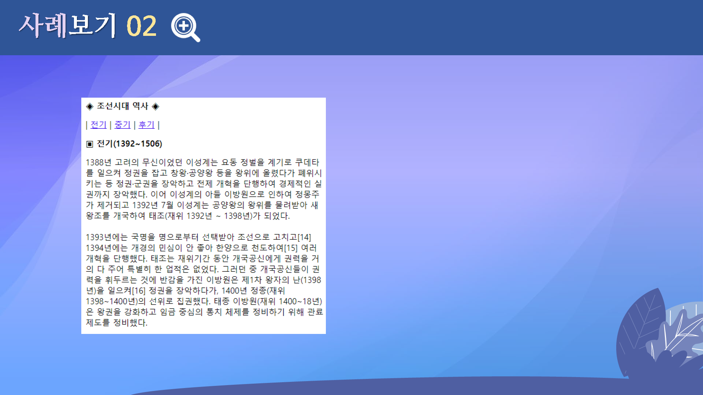

# 하이퍼링크 태그
---

 

## 학습목표
---
* 하이퍼링크에 대해 살펴볼 수 있다.
* 하이퍼링크의 종류를 익힐 수 있다.
* 하이퍼링크의 스타일을 변경할 수 있다.

 

## 학습안내

* [하이퍼링크](하이퍼링크)
* [텍스트링크](텍스트링크)
* [이미지링크](이미지링크)
* 하이퍼링크의 [종류들](종류들)
* 하이퍼링크 [스타일 변경](스타일변경)

 

## 학습정리
---
* 하이퍼링크
* 텍스트 링크
* 이미지 링크
* 하이퍼링크의 종류들
* 하이퍼링크 스타일 변경

