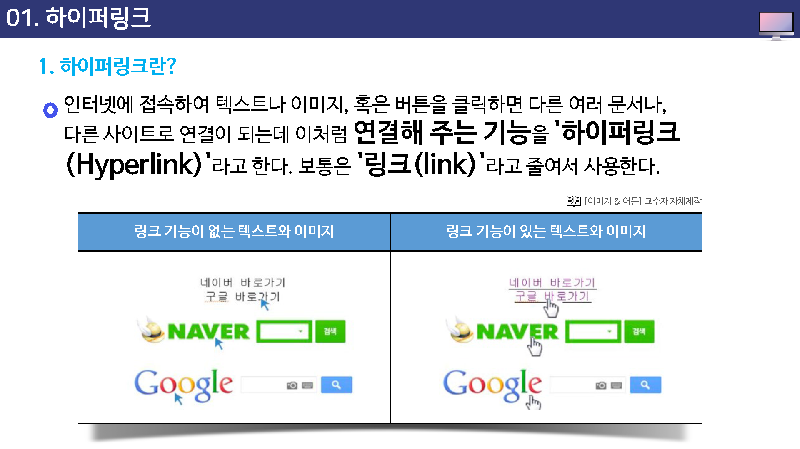
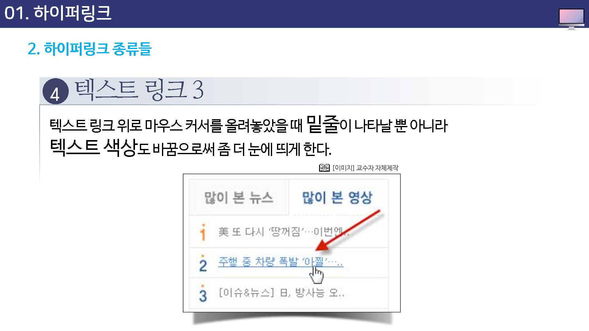
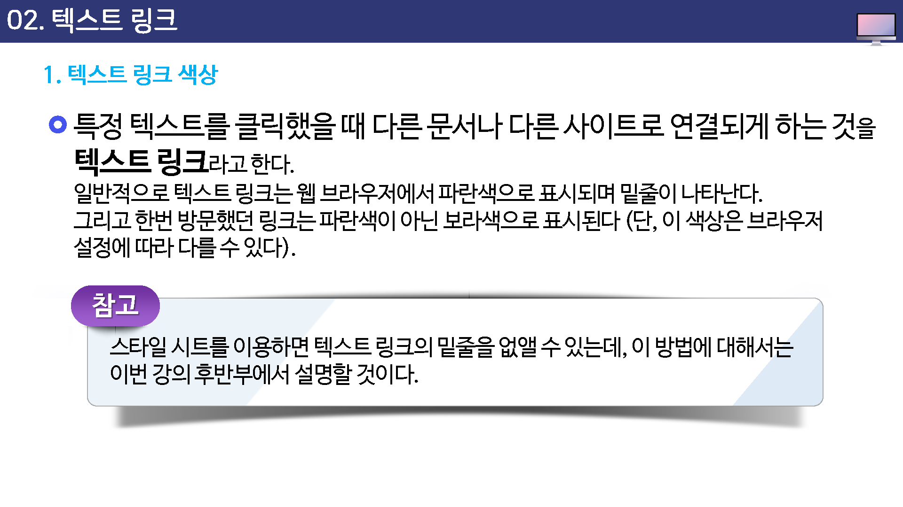
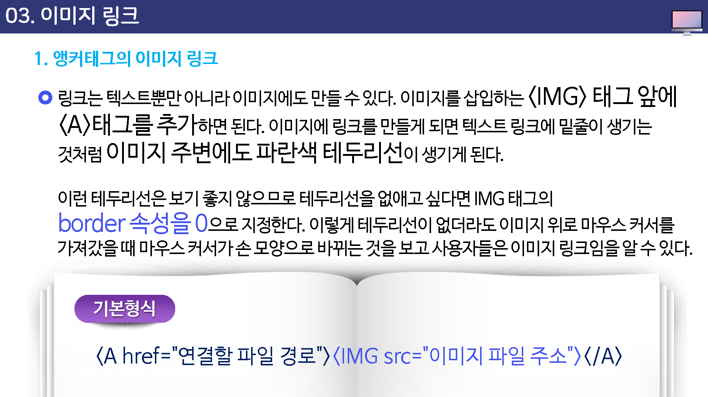

# 하이퍼링크 태그

## 학습목표

* 하이퍼링크에 대해 살펴볼 수 있다.
* 하이퍼링크의 종류를 익힐 수 있다.
* 하이퍼링크의 스타일을 변경할 수 있다.

## 학습안내

* 하이퍼링크
* 텍스트링크
* 이미지링크
* 하이퍼링크의 종류들
* 하이퍼링크 스타일 변경

## 01. 하이퍼링크

## 02.텍스트 링크

## 03. 이미지 링크

## 04. 하이퍼링크의 종류들

## 05. 하이퍼링크 스타일 변경

## 학습정리

* 하이퍼링크
* 텍스트 링크
* 이미지 링크
* 하이퍼링크의 종류들
* 하이퍼링크 스타일 변경

