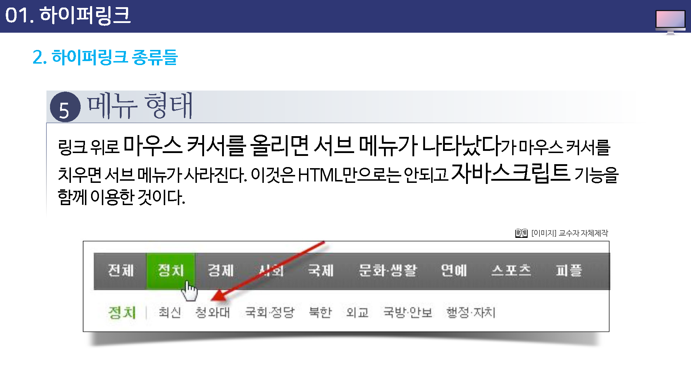

---

layout: home
---

# 하이퍼링크

## 하이퍼링크란?

인터넷에 접속하여 텍스트나 이미지, 혹은 버튼을 클릭하면 다른 여러 문서나, 다른 사이트로 연결이 되는데 이처럼 연결해 주는 기능을 `하이퍼링크(Hyperlink)`라고 한다. 보통은 `링크`라고 줄여서 사용한다.

## 하이퍼링크 종류들

링크들은 현재 페이지에서 다른 페이지로, 혹은 다른 사이트로 연결해 주는 역할을 하고 있지만

링크라는 사실을 좀 더 눈에 띄게 하기 위해 여러 가지 방법들이 사용되고 있다.

* 이미지 링크
* 텍스트 링크
* 메뉴 형태

### 이미지 링크

눈에 띄는 이미지를 사용해서 링크하는 방법이다. 이미지 대신 여러 개의 이미지들이 애니메이트 되는 듯한 Animated GIF 이미지를 사용하기도 하는데 이렇게 눈에 쉽게 띄는 동적인 이미지 링크들은 광고 링크 등에서 많이 사용한다.

### 텍스트 링크(마우스 호버)

원래 텍스트 링크에는 밑줄이 생겨야 하지만 요즘에는 웹 페이지를 좀 더 깔끔하게 만들기 위해 밑줄을 없애는 방법을 이용한다.

대산 마우스 커서를 올려 놓았을 대 커서 모양이 바뀌는 것을 보고 링크임을 알 수 있다.

### 텍스트 링크2

텍스트 리이크에 밑줄이 생기지 않게 해놓았지만, 링크 위로 마우스 커서를 올려 놓으면 밑줄이 생기게 하고 마우스를 치우면 다시 밑줄도 없어지게 함으로서 링크임을 쉽게 알 수 있게 한다.

### 텍스트 링크3

택스스 링크 위로 마우스 커서를 올려 놓았을때 밑줄이 나타날 뿐 아니라 택스트의 색상도 바꿈으로써 좀더 눈에 띄게 한다.

### 메뉴형태

링크 위로 마우스 커서를 올리면 서브 메뉴가 나타났다가 마우스 커서를 치우면 서브 메뉴가 사라진다.

이것은 HTML만으로는 안되고 자바스크립트 기능을 함께 이용한 것이다.

## 하이퍼링크 종류들

문서의 배경색이나 배경 이미지에 따라 웹 문서에서 링크 색상을 다르게 표시해야 할 경우가 있다.

예를 들어, 배경색이 검은색이라면 링크를 흰색이나 밝은 색으로 표시해야 눈에 띈다.

링크 색상을 조절하려면 태그의 link 속성과 vlink, rmflrh alink 를 이용한다.

* link : 링크의 색상
* vlink : 방문했던 링크의 색상
* alink : 링크를 클릭하는 순간의 색상

