# 테이블 테그

## 학습목표

* table 태그 구조에 대해 살펴볼 수 있다.
* table 태그의 속성들을 살펴볼 수 있다.
* th,tr,td 태그에 대해 살펴볼 수 있다.
* 테이블의 셀 병합하는 방법을 익힐 수 있다.

## 학습안내

* table 태그 구조
* table 태그와 함께 사용하는 태그들
* table 태그와 관련된 속성들
* th, tr, td 태그와 관련된 속성들
* 셀 병합

## 01. 테이블 태그 구조

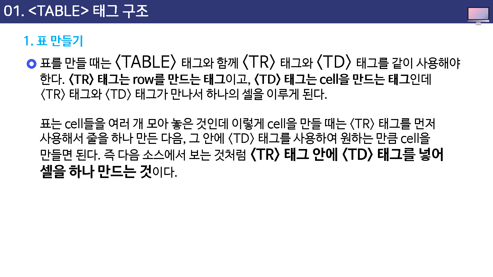

## 02. 테이블 태그와 함께 사용하는 태그들

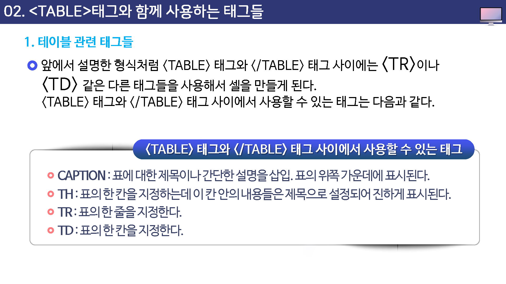

## 03. 테이블 태그와 관련된 속성들

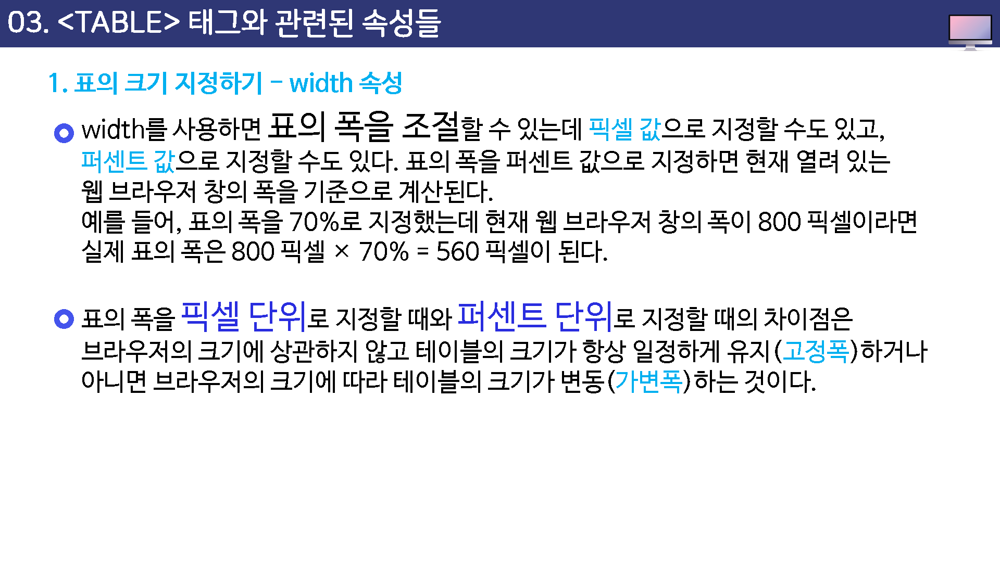

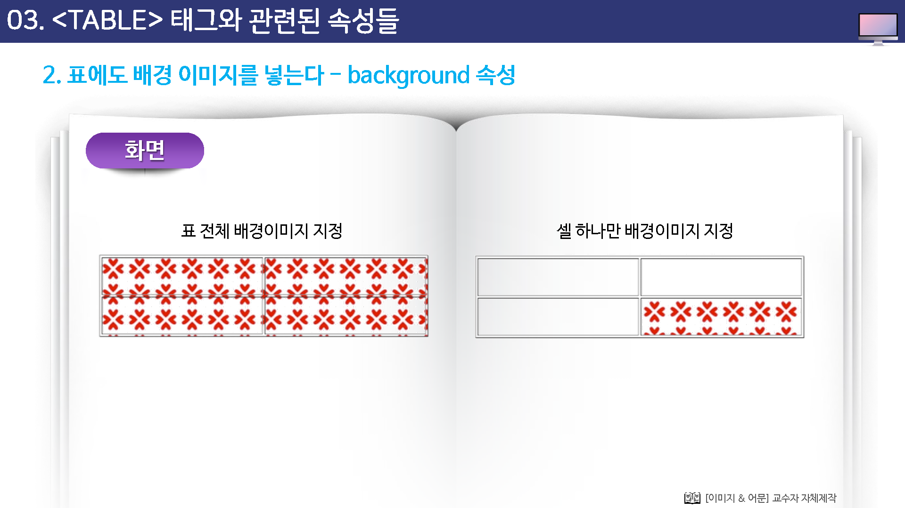

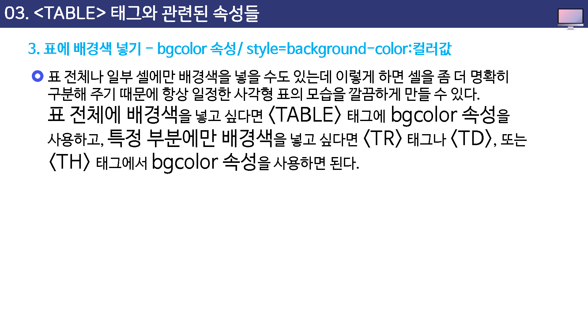

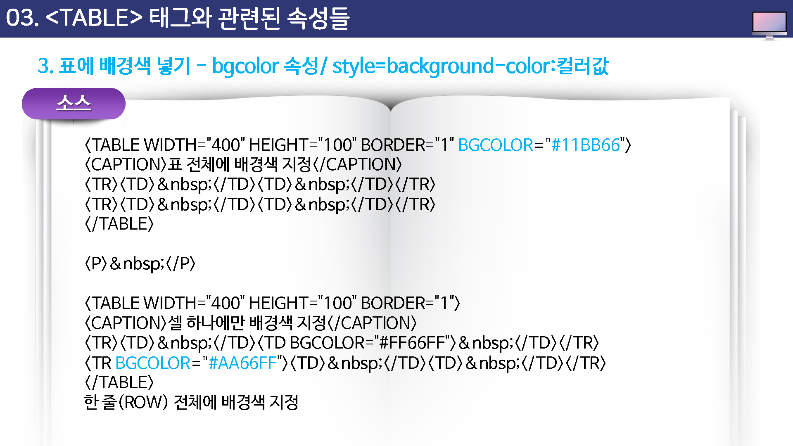

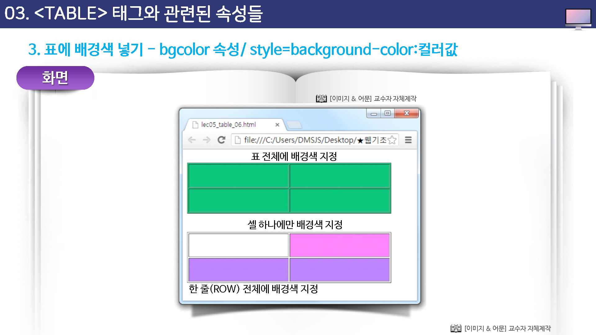

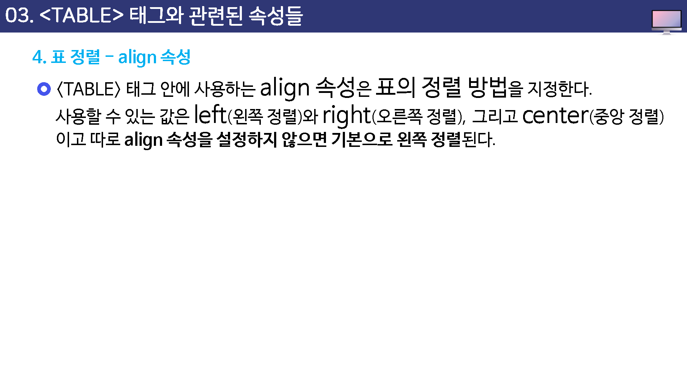

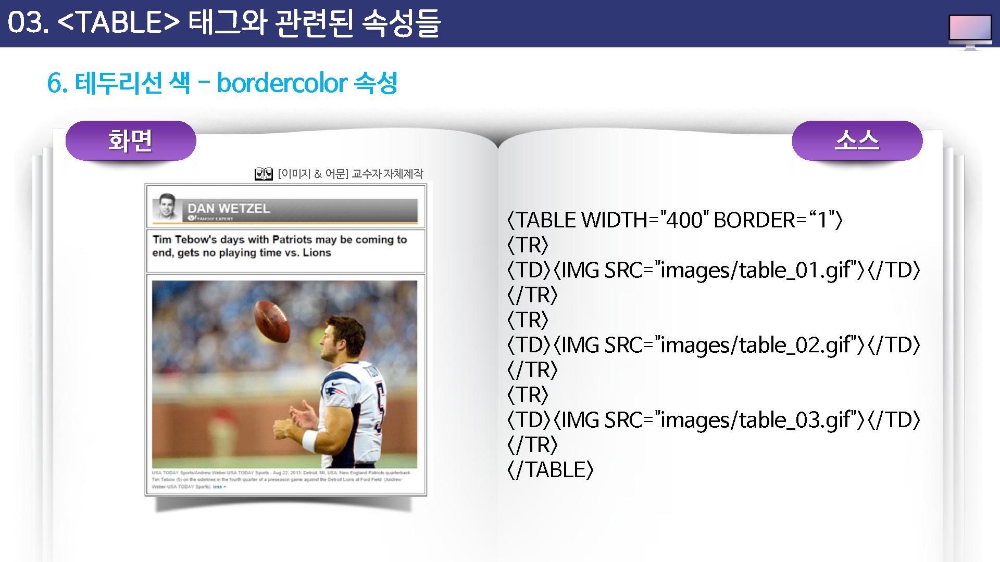

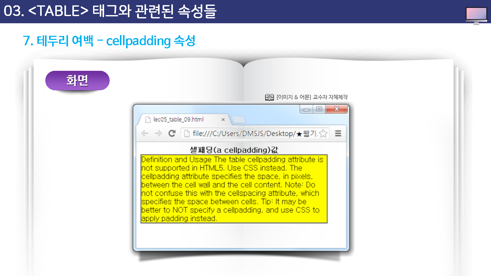

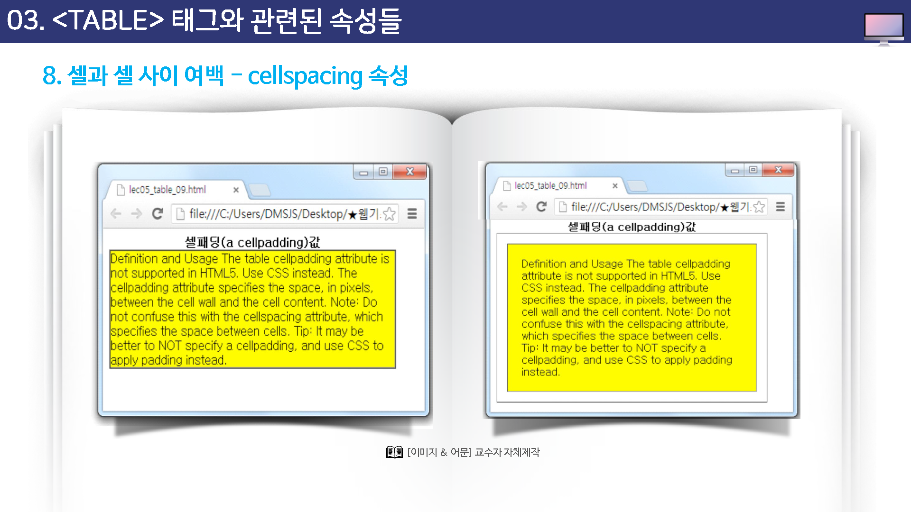

## 04. th,tr,td 태그와 관련된 속성들

## 05.셀 병합

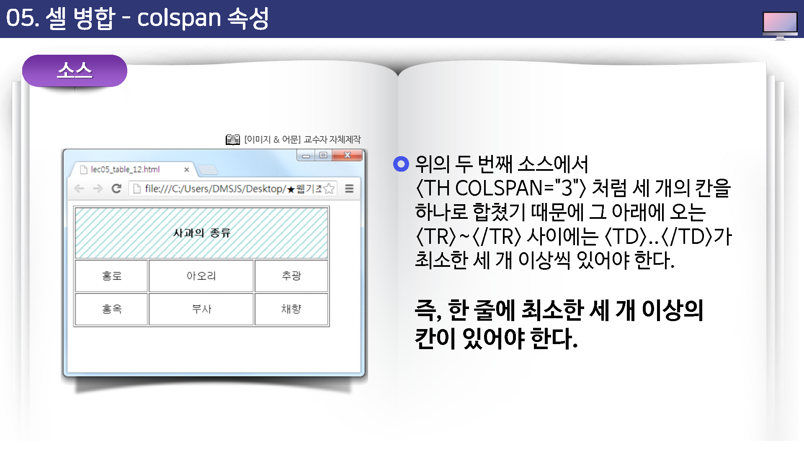

