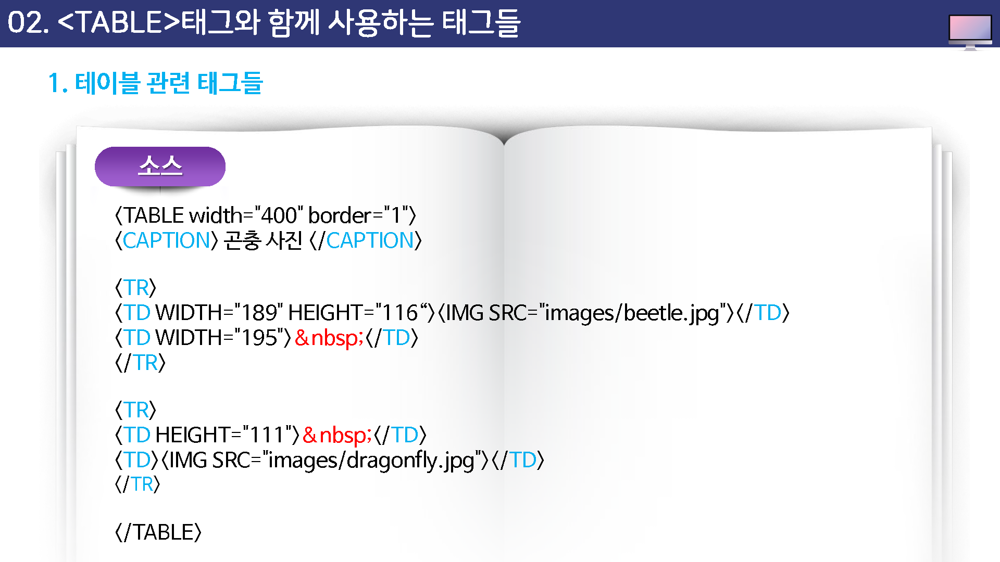
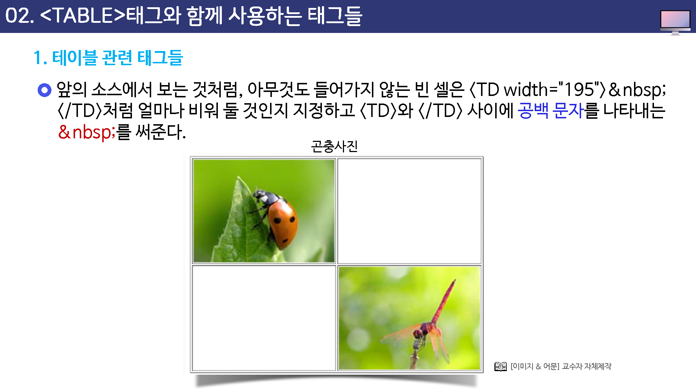

# 테이블 태그와 함께 사용하는 태그들


## 테이블 관련 태그들

앞에서 설명한 형식처럼 table 태그와 /table 태그 사이에는 tr 이나 td 같은 다른 태그들을 사용해서 셀을 만들게 된다.

table 태그와 /table 태그 사이에서 사용할 수 있는 태그는 다음과 같다.


* cation : 표에 대한 제목이나 간단한 설명을 삽입, 표의 위쪽 가운데에 표시된다.
* th : 표의 한 칸을 지정하느데, 이 칸 안의 내용들은 제목으로 설정되어 진하게 표시된다.
* tr:표의 한줄을 지정한다.
* td: 표의 한 칸을 지정한다.





앞의 소스에서 보는 것처럼, 아무것도 들어기지 않는 빈 셀은 width 속성으로 크기를 지정해 주는 좋이 좋다

```
<td width="200"> &nbsp; </td>
```

 그리고 공백 문자를 나타내는 `&nbsp;`를 써준다.

