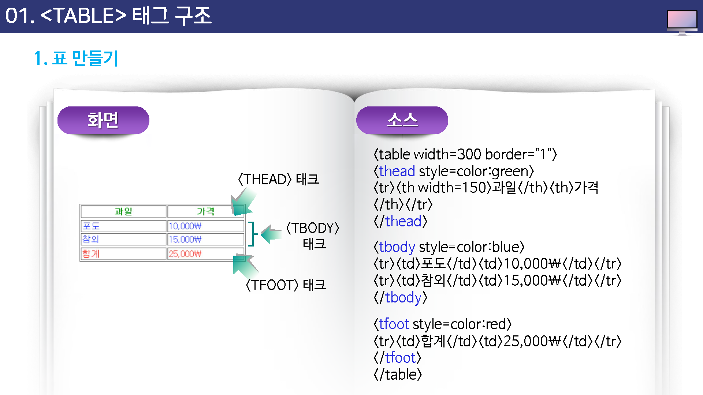

# 테이블 태그 구조

## 표 만들기

표는 row와 column, 그리고 cell로 이루어진다.

셀은 row과 column이 만나는 곳으로, 표를 이루고 있는 한 cell 한 cell을 의미한다.

표에서는 여러 cell을 하나로 합칠 수도 있고, 하나의 cell을 여러 개로 나눌 수도 있다.

이런 방법에 대해서는 앞으로 하나씩 배울 것이다. 다음은 row가 3개이고 column이 3으로 된 표의 예이다.

## 표 만들기

표를 만들때는 table 태그와 함께 tr 태그와 td 태그를 같이 사용해야 한다.

tr 태그는 row를 만드는 태그이고, td 태그는 cell을 만드는 태그인데 tr 태그와 td 태그가 만나서 하나의 셀을 이루게 된다.

표는 cell들을 여러개 모아 놓은 것인데 이렇게 cell을 만들 때는 tr 태그를 먼저 사용해서 줄을 하나 만든 다음,  그 안에 td 태그를 사용하여 원하는 만큼 cell을 만들면 된다.

즉, 다은 소스에서 보는 것처럼 tr 태그안에 td 태그를 넣어 셀을 하나로 만드는 것이다.

조금 전에 보았던 소스에서 보는 것처럼 tr 태그를 한번 사용하고 나서 td 태그를 사용하면 하나의 셀이 만들어 진다.

## 태그 구조

### thead 태그 : 그룹 테이블 해더 태그(table header)

`<thead>` 태그는 HTML테이블에서 각각의 셀 들에 있는 머리글 내용을 묶는데 사용 되어진다.

이 태그는 주로 테이블의 `<body>`,`<footer>`를 지정해주는 `<tody>` 태그와 `<tfoot>` 태그를 함께 결합하여 사용한다.

### TBody 태그 : 테이블 바디 태그 (table body)

tbody 태그는 HTML 테이블에서 본문 부분에 있는 내용을 묶는데 사용되어진다.

### TFoot 태그

tfoot 태그는 HTML 테이블에서 꼬리 부분에 있는 애용을 묶는데 사용되어진다.

