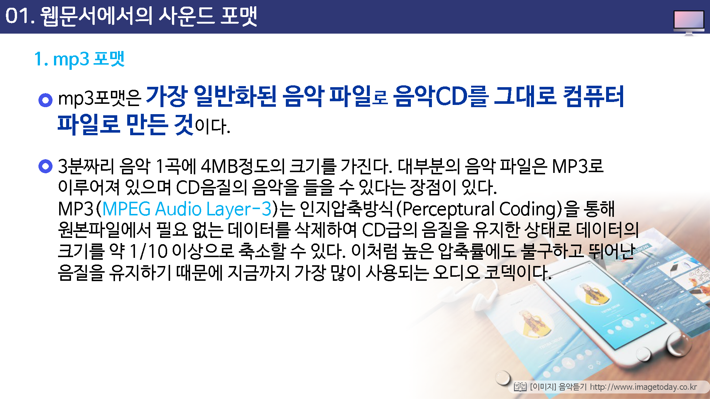
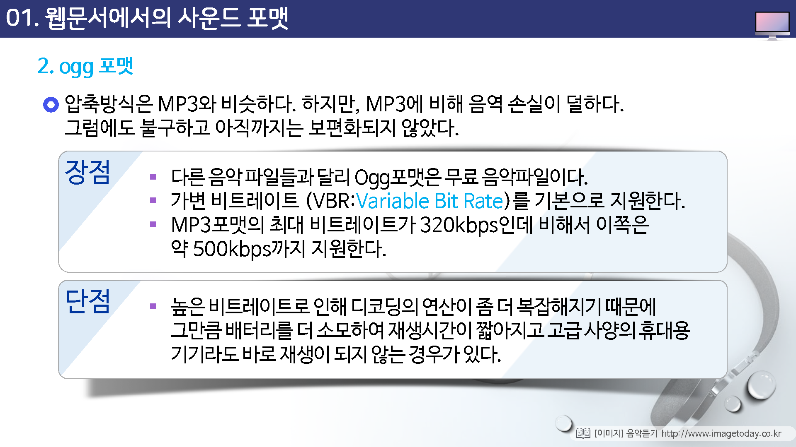
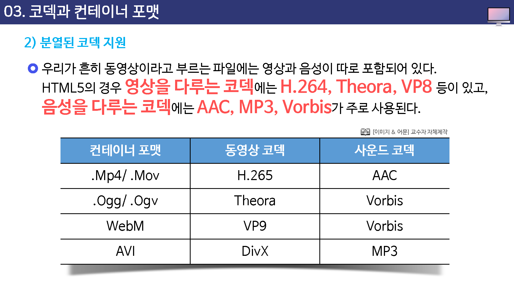
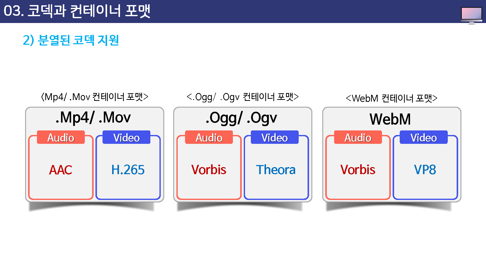
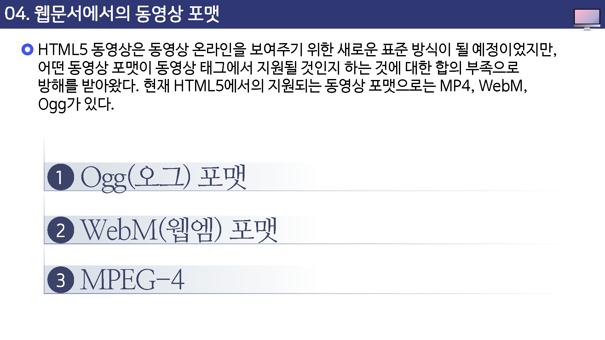
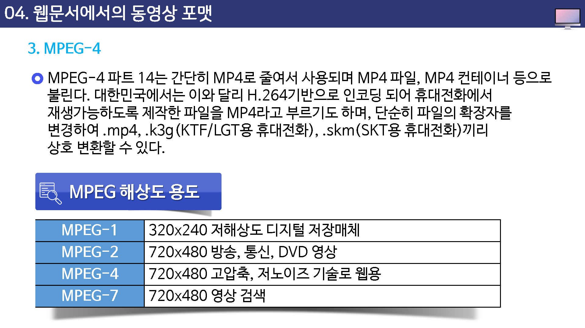
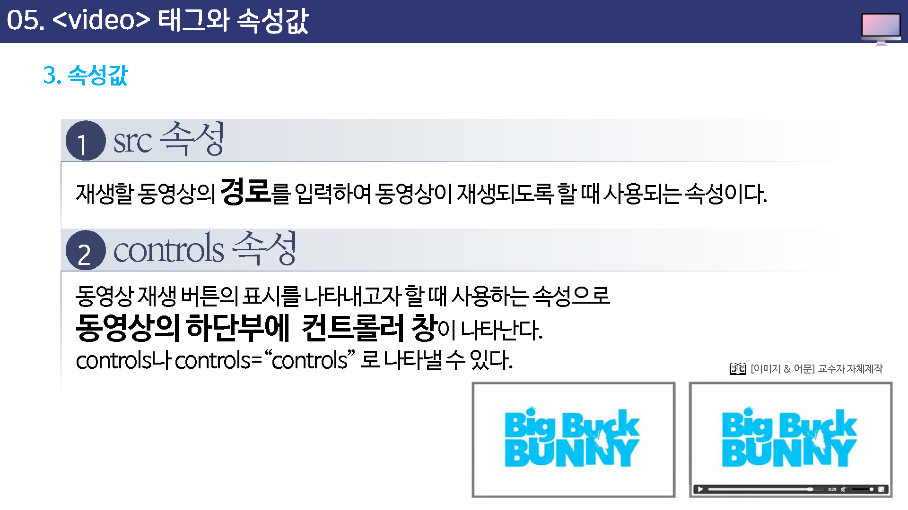
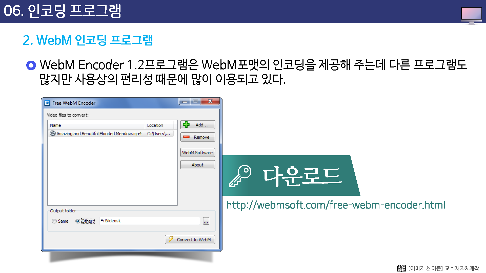
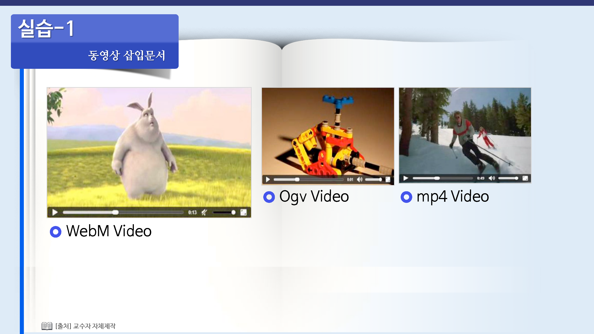

# 멀티미디어 삽입 태그

## 학습목표

* 멀티미디어 삽입 태그에 대해 살펴볼 수 있다.
* 압축코덱에 대해 살펴볼 수 있다.
* 사운드와 동영상 포맷에 대해 살펴볼 수 있다.

## 학습안내

* 웹문서에서의 사운드 포맷
* audio 태그와 속성값
* 코덱과 컨데이너 포맷
* 웹문서에서의 동영상 포맷
* video 태그와 속성값
* 인코딩 프로그램

## 01. 웹문서에서의 사운드 포맷

## 02. audio 테그와 속성값

## 03. 코덱과 컨테이너 포맷

## 04. 웹문서에서의 동영상 포맷

## 05. video 태그와 속성값

## 06.인코딩 프로그램

