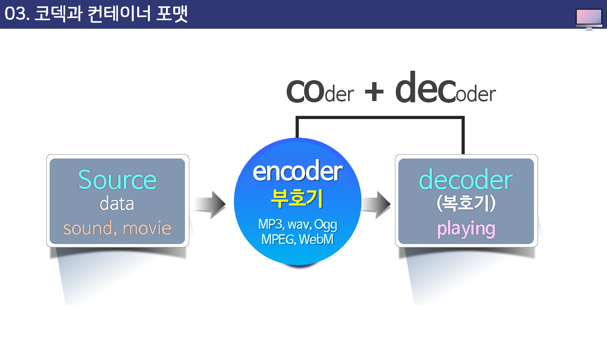
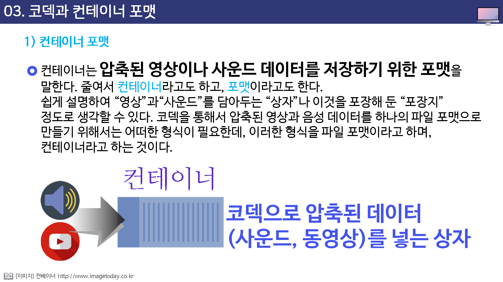
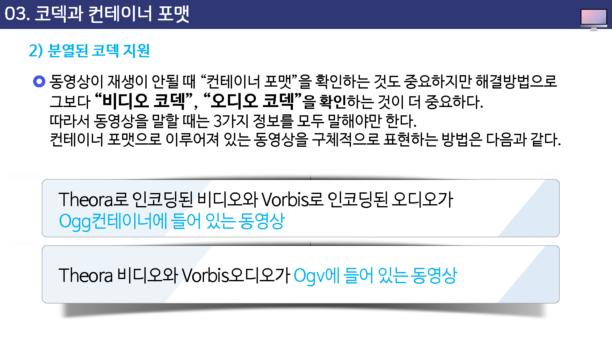

# 코덱과 컨테이너 포맷

코덱(codec)

사운드와 동영상 등의 데어터나 신호를 인코딩 또는 디코딩 할 수 있능 하드웨어나 소프트웨어를 일컫는 말로 압축 알고리즘을 가리키는 용어로도 사용

코덱에서는 데이터 압축 기능을 사용하여 자료룰 압축하거나 압축을 푸는 소프트웨어나, 사운드 ,동영상 등의 자료를 다른 형식으로 변환하는 장치 및 소프트웨어가 포함된다.

코덱은 또한 송수신 장치를 뜻하는 말로 전기 통신 분야에서도 사용되어지는데 송신과정에서 부호화 하고 수신과정에서 복호화 하는 부분을 말하기도 한다.

## 컨테이너 포맷

컨테이너는 압축된 영상이나 사운드 데이터를 저장하기 위한 포맷을 말한다.

줄여서 컨테이너라고도 하고 포맷이라고도 한다.

쉽게 설명하여 영상과 사운드를 담아두는 상자나 이것을 포장해둔 포장지 정도로 생각할 수 있다.

코덱을 통해서 압축된 영상과 음성 데이터를 하나의 파일 포맷으로 만들기 위해서는 어떠한 형식이 필요한데, 이러한 형식을 파일 포맷이라고도 하며, 컨테이너라고 하는 것이다.

