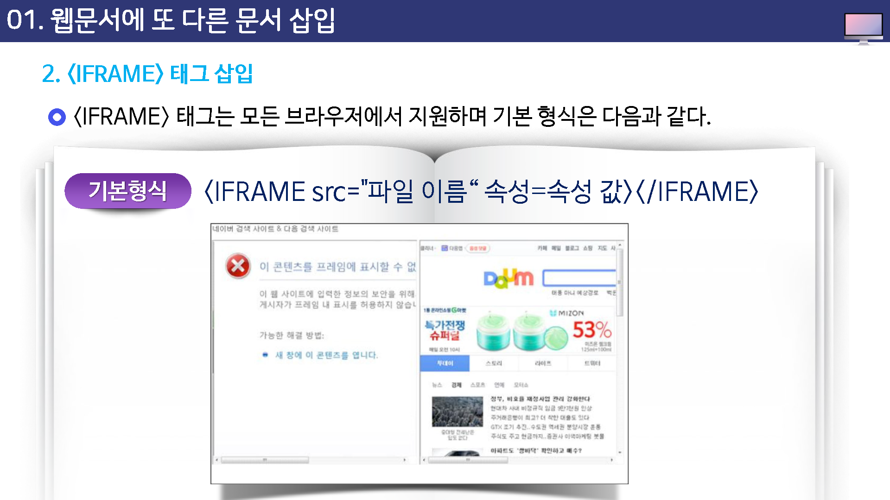
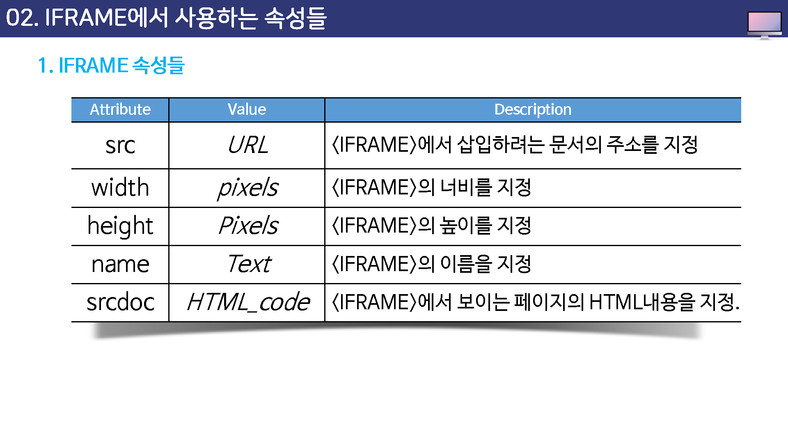
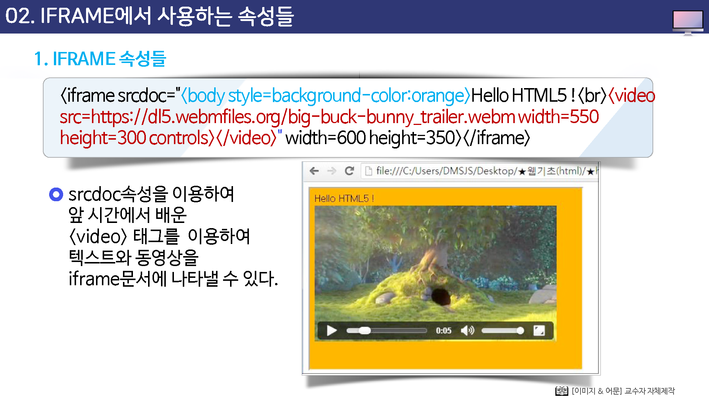
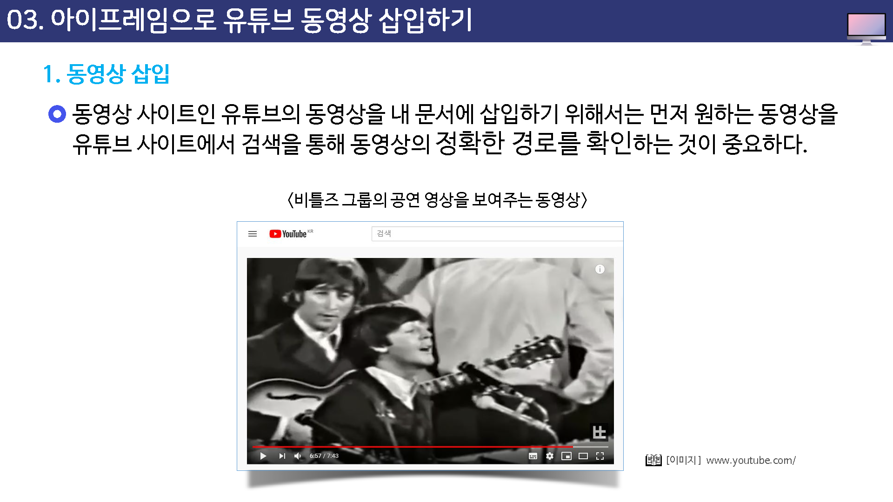
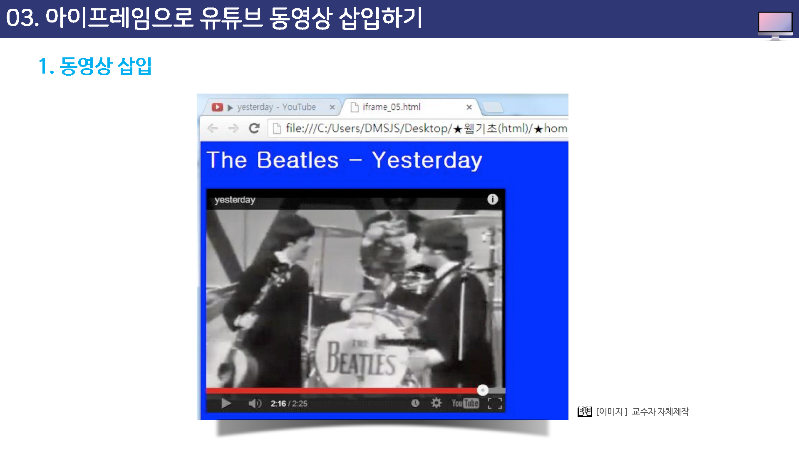
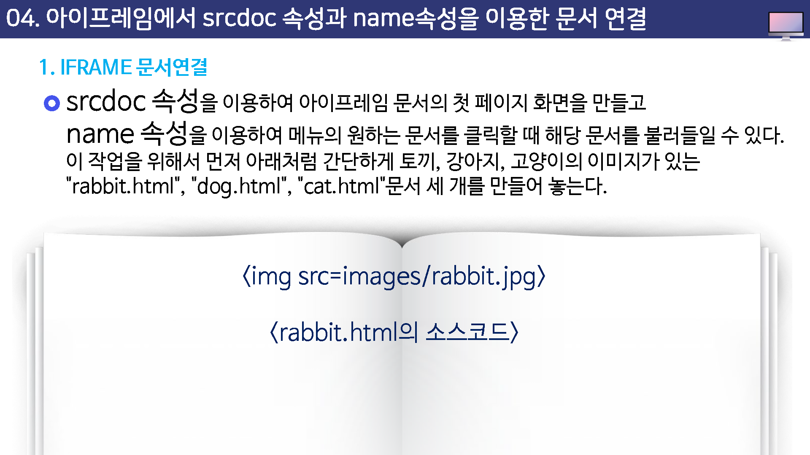

# 아이프레임 테그

## 학습목표

* iframe에 대해 살펴볼 수 있다.
* iframe의 속성들을 살펴볼 수 있다.
* iframe에 페이지 삽입을 실습해 볼 수 있다.
* iframe에 응용작업을 실습해 볼 수 있다.

## 학습안내

* 웹문서에 또 다른 문서 삽입
* iframe에서 사용하는 속성들
* 아이프렘으로 유튜브 동영상 삽입하기
* 아이프레임에서 srcdoc 속성과 name 속성을 이용한 문서 연결

## 01.웹문서에 또 다른 문서 삽입

## 02. iframe에서 사용하는 속성들

## 03. 아이프레임으로 유튜브 동영상 삽입하기

## 04. 아이프레임에서 srcdoc 속성과 name 속성을 이용한 문서 연결

