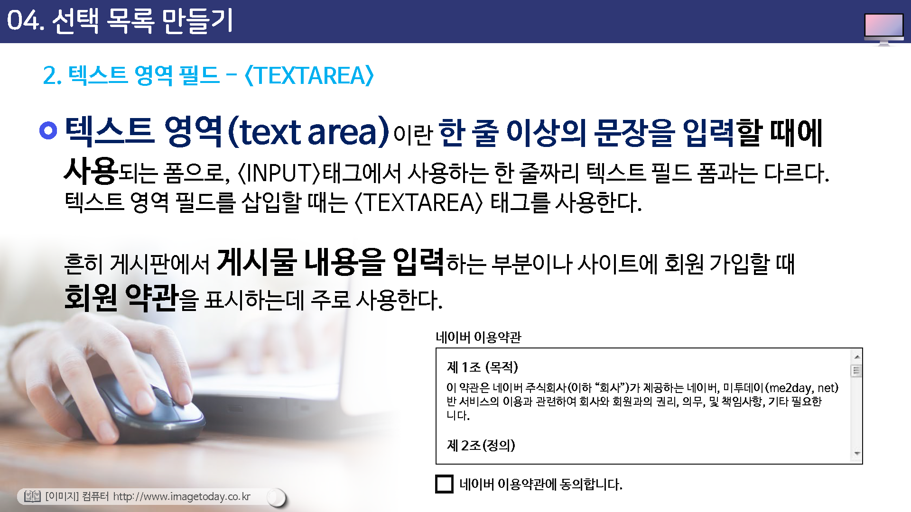
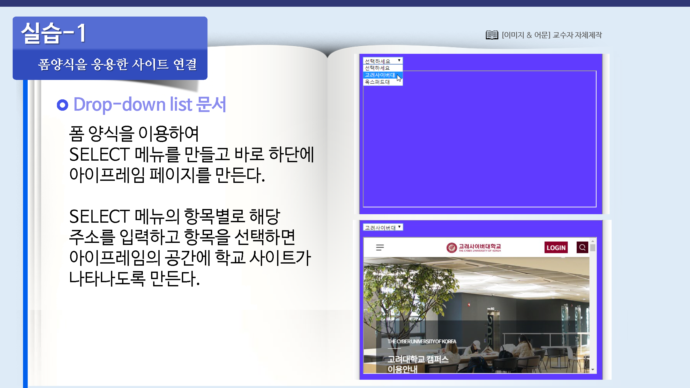

# 선택 목록 만들기

## select 태그와 option 태그

선택 목록이란 선택 항목을 목록으로 만들어서 삽입하는 것이다.

선택 항목을 표시할 때는 라디오 버튼이나 체크박스를 삽입할 수도 있지만 이런 목록을 사용하면 전체적으로 사각 영역만 표시되기 때문에 좀 더 깔끔해 보일 수 있다.

선택 목록을 만들 때에는 사례에서 보는 것처럼 select 태그와 option태그를 사용한다.

### select

선택 목록의 시작과 끝에 붙는 태그로 이 태그 안에서 사용할 수 있는 속성은 다름과 같다.

* name : 선택 목록의 이름이다. 여러 개의 목록이 있을 경우, 이름을 사용해서 목록을 구분한다.
* size :  선택 목록의 크기를 지정한다. 여기에서 설정하는 값만큼만 목록에 표시되고 목록을 펼쳐야 전체 내용을 볼 수 있다.
* multiple : 여러 개의 항목을 선택 할 수 있다. shift 키나 ctrl키를 사용해서 한번에 여러 개를 선택한다. 이때 size 속성은 반드시 2이상이어야 한다.

### option

목록 안에 있는 각 항목을 나타낼때 사용하는 태그로, 보통 닫는 태그 `</option>`는 생햑한다. 사용할 수 있는 속성은 다음과 같다.

* value : 각 항목을 선택했을때 서버로 넘겨질 값을 지정한다.
* selected : 초기 선택 항목을 지정한다.

## 텍스트 영역 필드 : textarea

텍스트 영역(textarea)이란 한 줄 이상의 문장을 입력할 때에 사용되는 폼으로, <input> 태그에서 사용하는 한 줄짜리 텍스트 필드 폼과는 다르다.

텍스트 영역 필드를 삽입할 때는 <textarea? 태그를 사용한다.

흔희 게시판에서 게시물 내용을 입력 하는 부분이나 사이트에 회원 가입할 때 회원 약관을 표시하는데 주로 사용한다.

`<textarea>` 태그에서 사용할 수 있는 속성은 다름과 같다.

* name : 택스트 영역 필드의 이름

* cols : 택스트 영역 필드의 가로폭 (문자단위)

* rows : 텍스트 영역 필드의 세로 길이(라인단위).

  지정한 숫자보다 줄의 개수가 많아지면 스크롤바가 생긴다.

