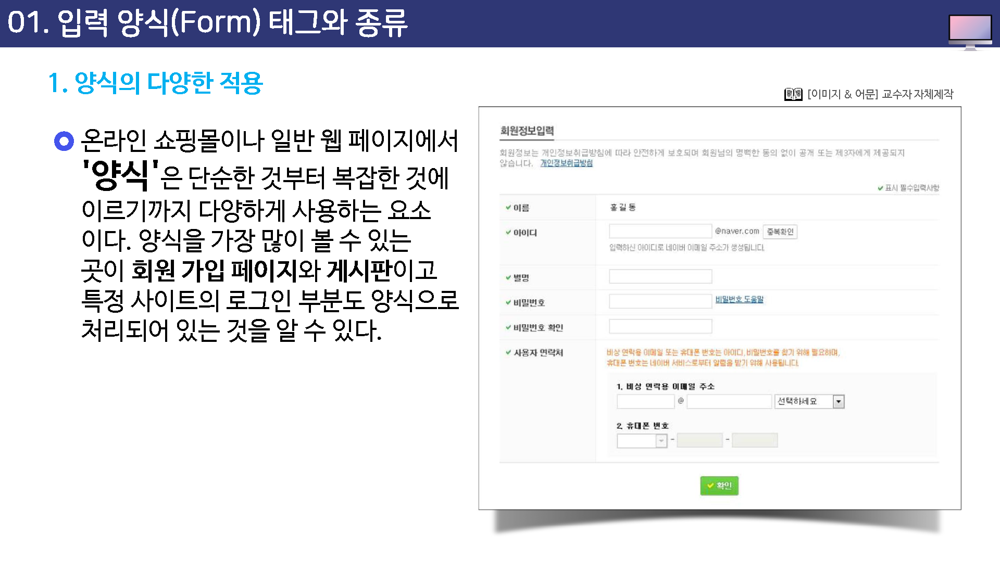
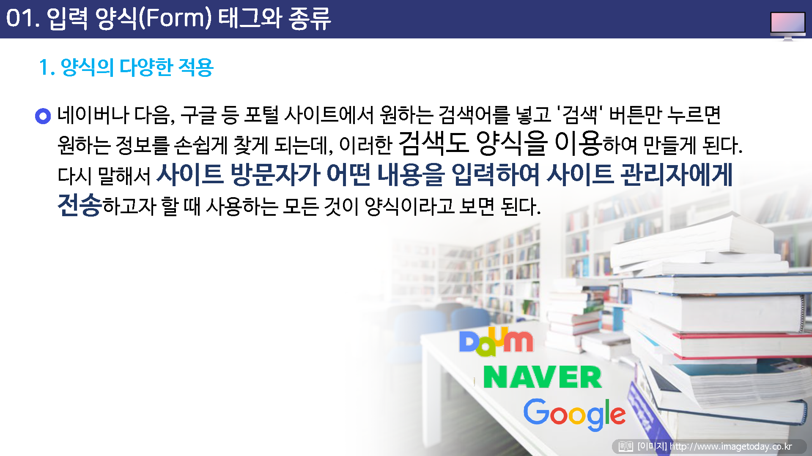
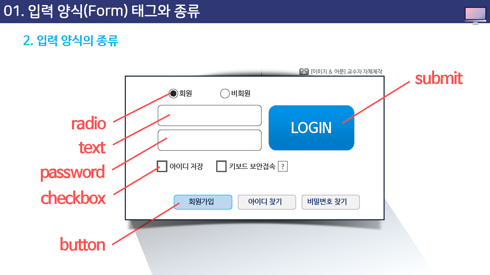
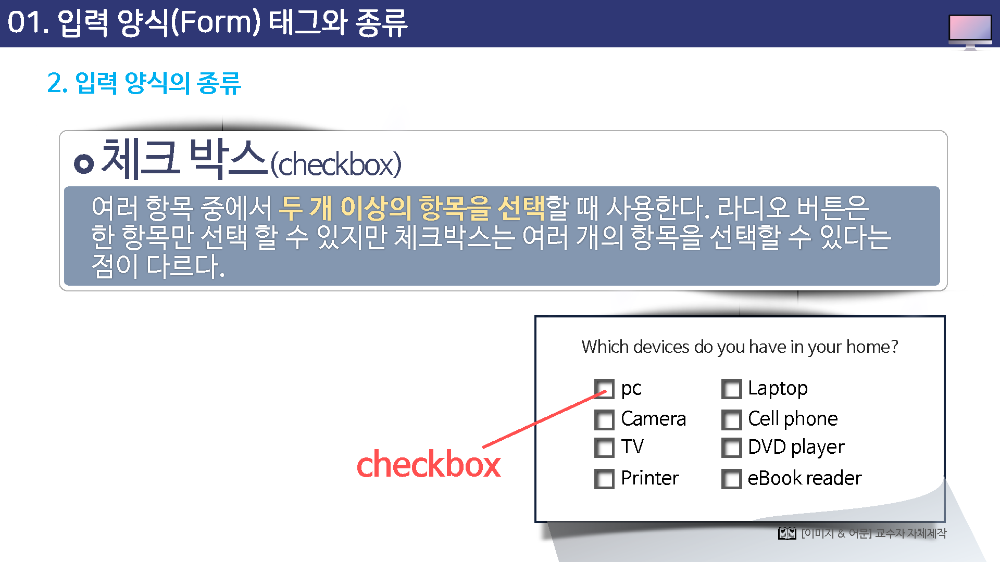
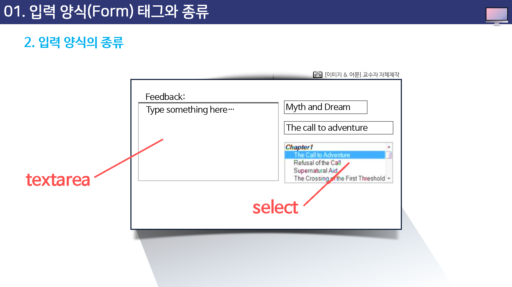

# 입력 양식 태그와 종류

## 양식의 다양한 적용

온라인 쇼핑몰이나 일반 웹 페이지에서 `양식`은 단순한 것부터 복잡한 것에 이르기까지 다양하게 사용하는 요소이다.

양식을 가장 많이 볼 수 있는 곳이 `회원가입 페이지`와 `게시판`이고 특정 사이트의 로그인 부분도 양식으로 처리 되어 있는 것을 알 수 있다.

네이버나 다음, 구글등 포털 사이트에서 원하는 검색어를 넣고 `검색`버튼만 누르면 원하는 정보를 손쉽게 찾게 되는데, 이러한 검색도 양식을 이용하여 만들게 된다.

다시 말해서 사이트 방문자가 어떤 내용을 입력하여 사이트 관리자에게 전송 하고자 할 때 사용하는 모든 것이 양식이라고 보면 된다.

### 양식이 없다면?

사용자는 홈페이지가 일방적으로 제공하는 정보만 얻을 뿐 자신의 생각이나 정보를 홈페이지에 기록할 수 있는 방법이 없는 것이다.

### 주의해야 할 것은?

회원가입이나 검색, 게시물 작성 등에서 사용된 양식은 CGI나 ASP, PHP,JSP 같은 특별한 프로그램을 거쳐야 처리할 수 있다.

HTML코드만으로는 양식을 사용해서 양식 문서를 만들 수 있을 뿐 회원을 가입시킨다거나 검색할 수는 없다는 것을 이해 해야만 한다.

## 입력 양식의 종류

웹에서 사용하는 양식은 아주 다양하고 각 양식을 부르는 이름도 서로 다르다.

이 강의에서도 양식 이름으로 양식을 구별하기 때문에 각 양식의 이름은 알아 두는 것이 좋다.

웹에서 사용하는 양식은 아주 다양하고 각 양식을 부르는 이름도 서로 다르다.

이 강의에서도 양식 이름으로 양식을 구별하기 때문에 각 양식의 이름은 알아 두는 것이 좋다.

### 텍스트 필드 (text field)

영역 안에 `직접 테스트를 입력`할 수 있다.

영역의 가로 길이와 최대 입력 문자수를 지정할 수 있다.

## 비밀번호 필드(password field)

텍스트 필드와 같은 기능과 특징을 가지지만, 단 사용자가 입력한 내용이 그대로 화면에 나타나지 않고 `***표시`나 `***표시`로 나타난다.

### 라디오 버튼 (radio button)

원형 버튼, 여러개의 항목 중에서 한가지만 선택할 수 있다.

### 체크박스(checkbox)

여러 항목 중에서 `두 개 이상의 항목을 선택`할 때 사용한다.

라디오 버튼은 한 항목만 선택 할 수 있지만 체크박스는 여러 개의 항목을 선택할 수 있다는 점이 다르다.

### 텍스트 영역(textarea)

텍스트 필드는 한 줄의 텍스트만 입력할 수 있는 반면, `텍스트 영역은 여러줄의 내용을 입력`할 수 있다.

몇 줄까지 표시할 것인지 지정하면 지정된 줄 수 보다 내용이 더 실어질 경우 텍스트 영역 안에 스크롤바가 표시된다.

### 선택메뉴(select)

좁은 공간에서 사용하면 편리한 메뉴로 화살표를 클릭하면 여러 항목이 펼쳐지며 항목을 선택하면 링크해 놓은 페이지로 연결된다.

팝업 메뉴, 점프 메뉴라고도 한다.

