# 스타일시트

## 학습목표

* CSS 스타일 적용 방법에 대해 살펴볼 수 있다.
* 태그 스타일과 클래스 스타일에 대해 파악할 수 있다.
* 선택 범주 스타일에 대해 이해할 수 있다.
* 내부 스타일과 외부 스타일에 대해 이해할 수 있다.

## 학습안내

* 스타일 시트 정의
* 태그 스타일과 클래스 스타일
* 선택 범주 스타일
* 외부 스타일 시트

## 01. 스타일 시트 정의하기

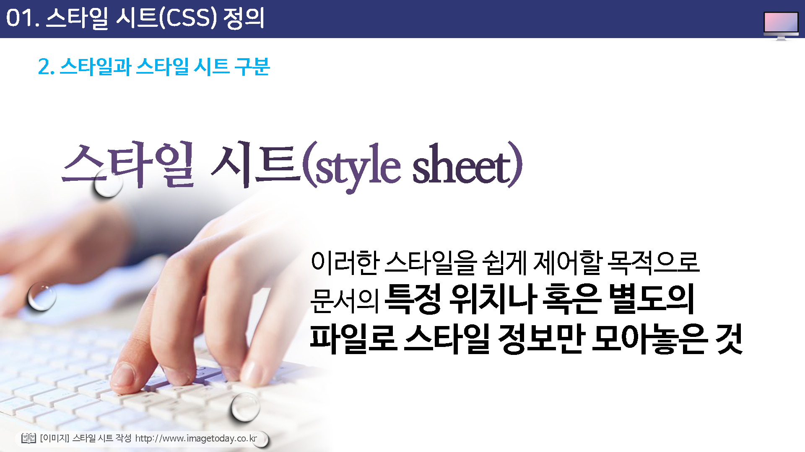

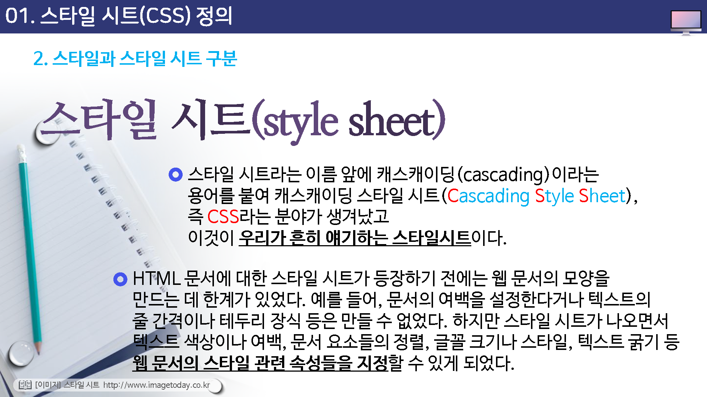

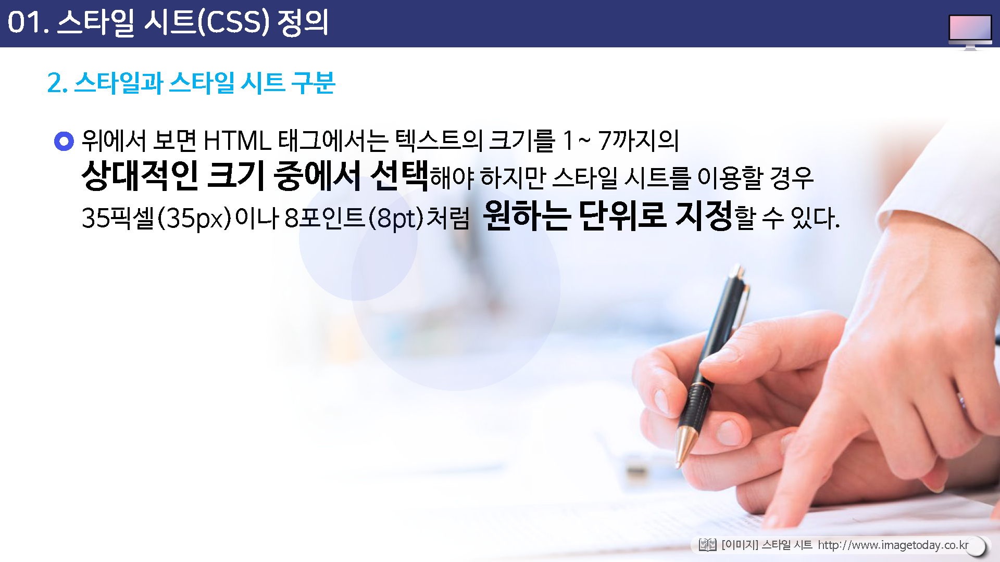

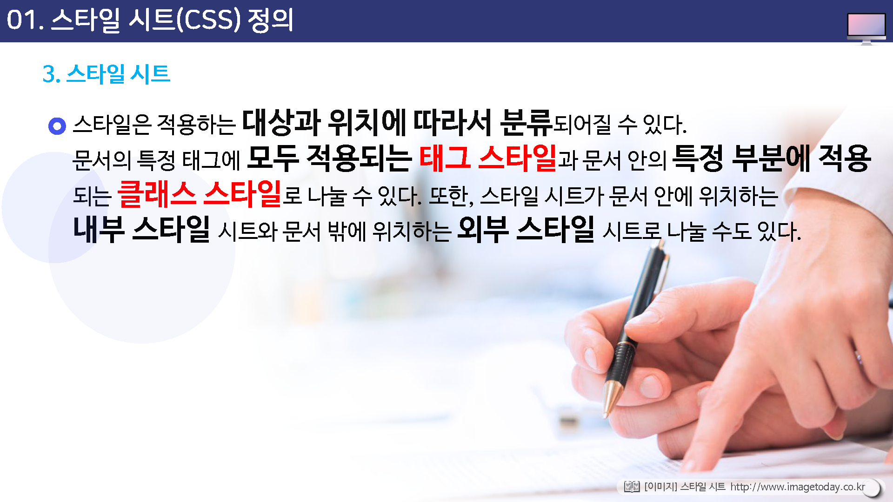

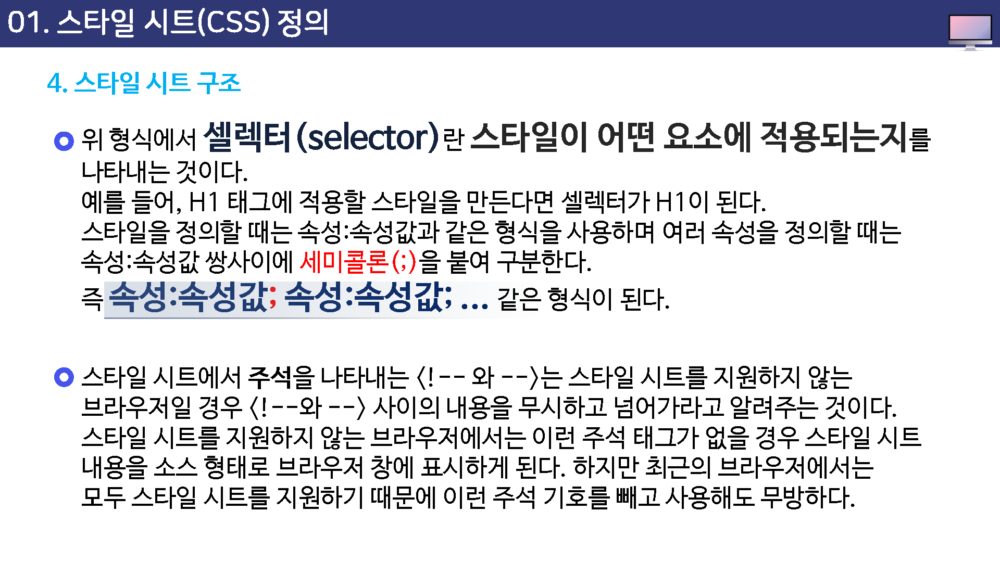

## 02. 태그 스타일과 클래스 스타일

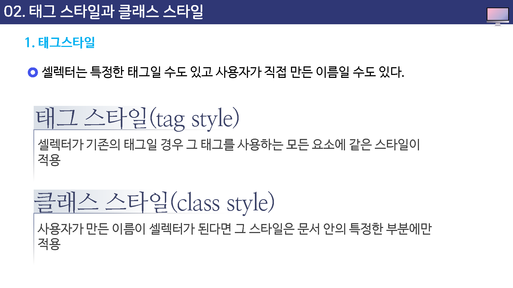

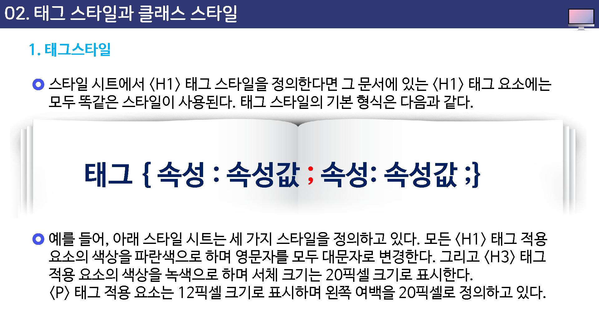

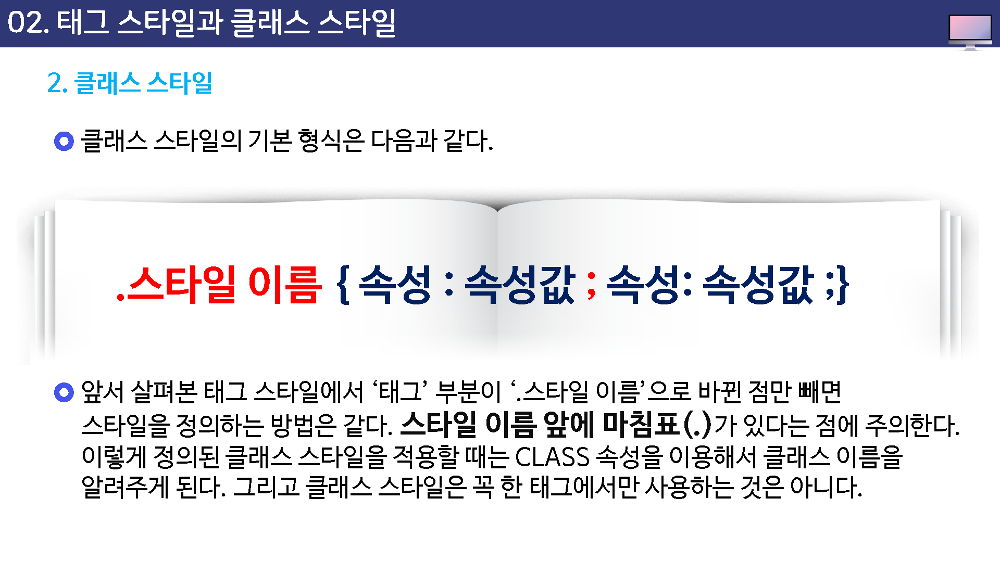

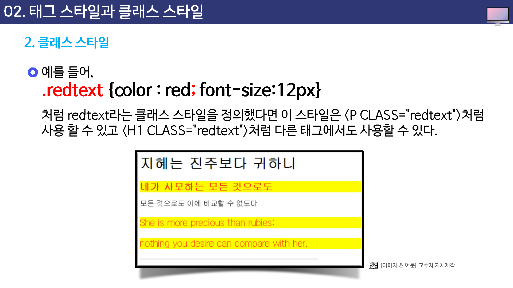

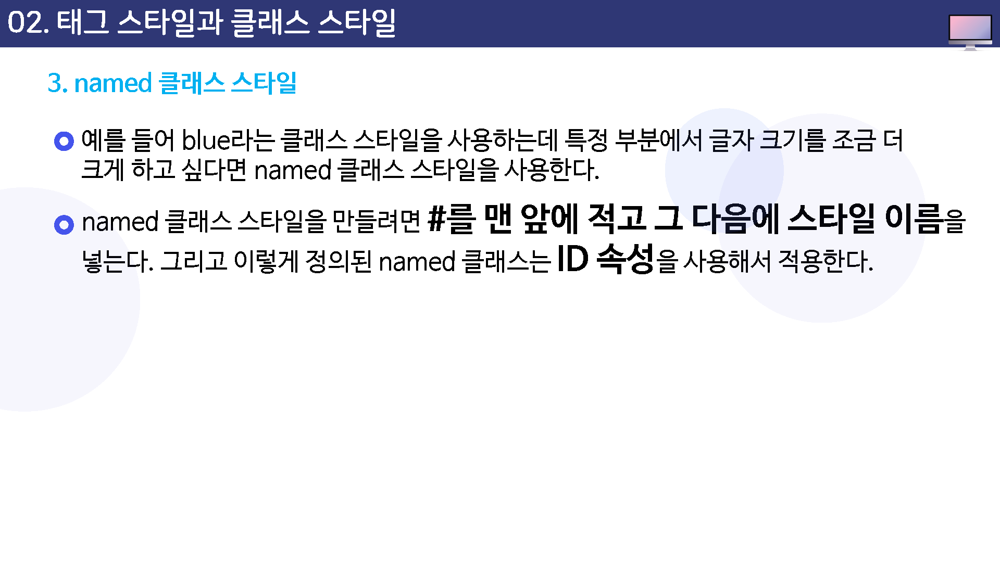

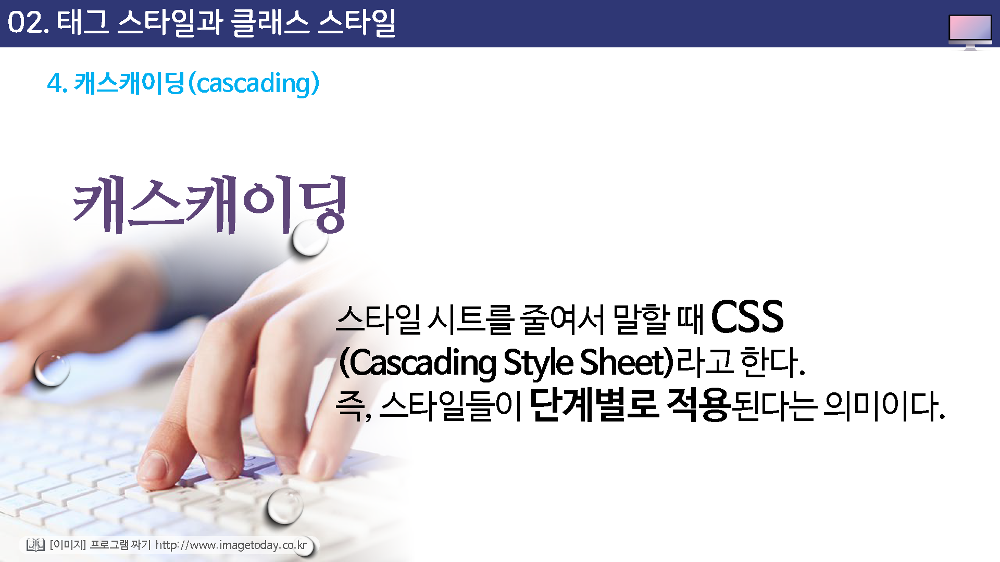

## 03. 선택 범주 스타일

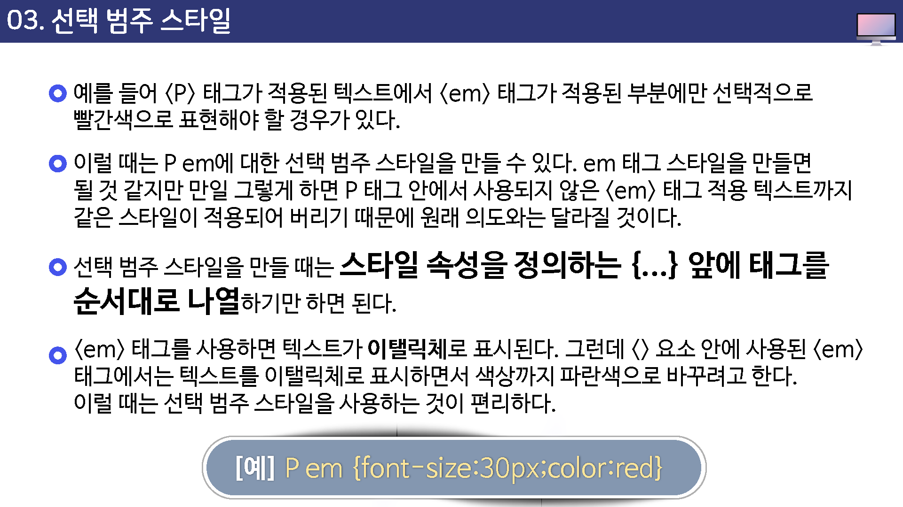

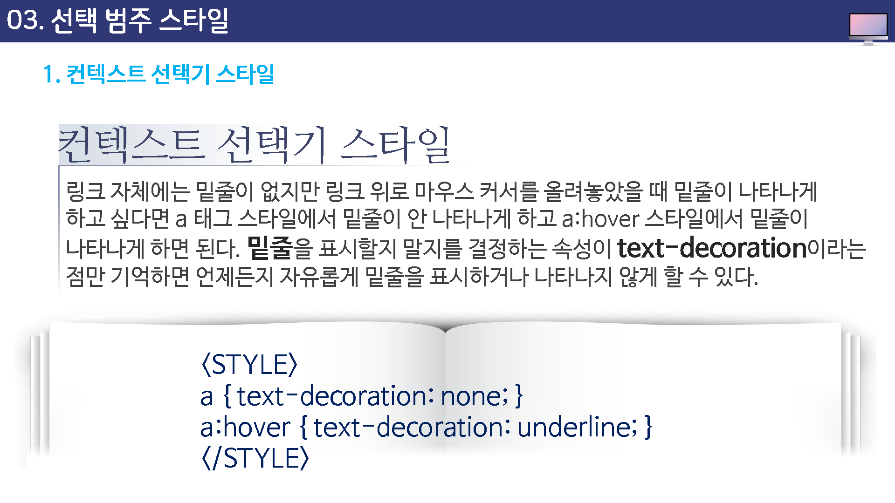

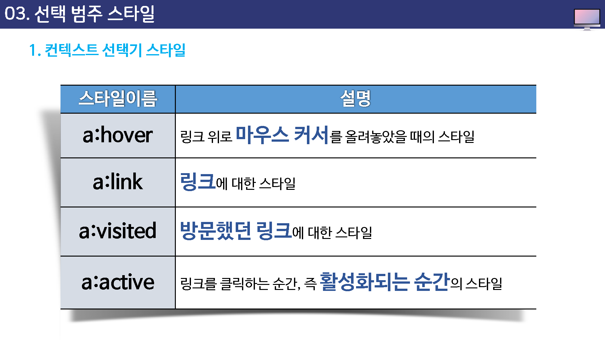

## 04. 외부 스타일 시트

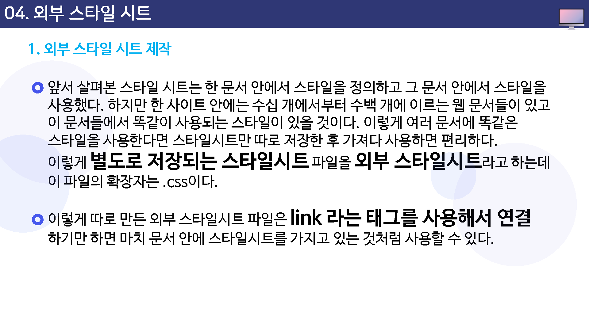

