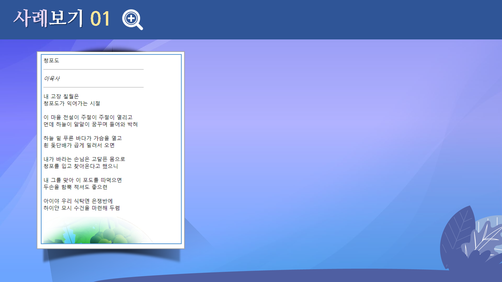

# 스타일시트
---

 

## 학습목표
---
* CSS 스타일 적용 방법에 대해 살펴볼 수 있다.
* 태그 스타일과 클래스 스타일에 대해 파악할 수 있다.
* 선택 범주 스타일에 대해 이해할 수 있다.
* 내부 스타일과 외부 스타일에 대해 이해할 수 있다.

 

## 학습안내
---
* [스타일 시트 정의](정의하기)
* [태그 스타일과 클래스 스타일](스타일)
* [선택 범주 스타일](선택범주)
* [외부 스타일 시트](외부스타일)

 

