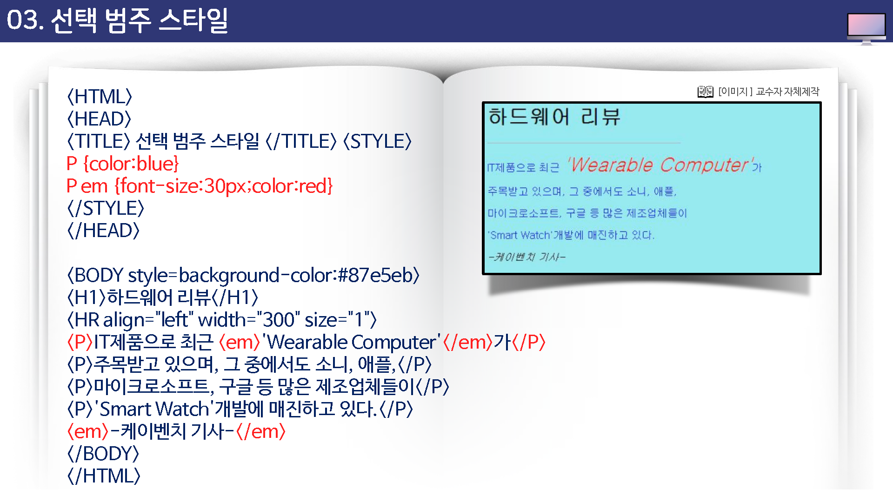
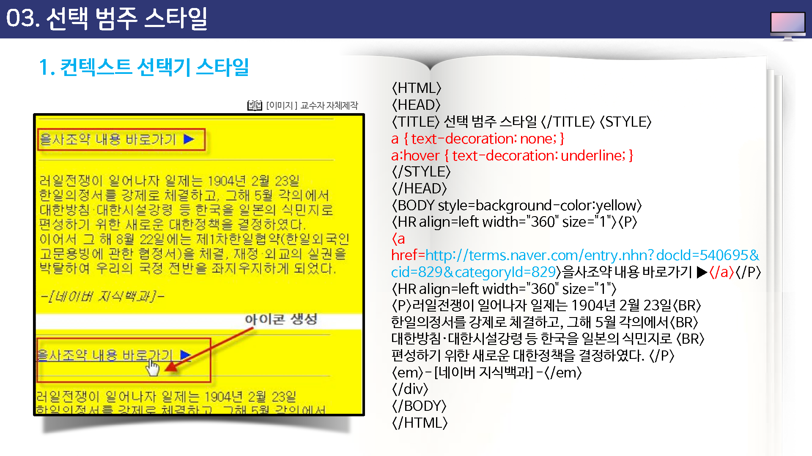

# 선택 범주 스타일

둘 이상의 태그가 중복 적용된 요소에 적요하는 스타일


* 예를 들어 `<p>`태그가 적용된 텍스트에서 `<em>`태그가 적용된 부분에만 선택적으로 빨간색으로 표현해야 할 경우가 있다.
* 이럴 때는 P em에 대한 선택 범주 스타일을 만들 수 있다. em 태그 스타일을 만들면 될 것 같지만 만일 그렇게 하면 P태그 안에서 사용되지 않은 `<em>`태그 적용 텍스트까지 같은 스타일이 적용되어 버리기 때문에 원래 의도와는 달라질 것이다.
* 선택 범주 스타일을 만들 때는 `스타일 속성을 정의하는 {...} 앞에 태그를 순서대로 나열`하기만 하면 된다.
* `<em>`태그를 사용하면 텍스트가 이탤릭체로 표시된다. 그런데 <>요소 안에 사용된 <em>태그에서는 택스트를 이탤릭체로 표시하면서 색상까지 파란색으로 바꾸려고 한다. 이럴 때는 선택 범주 스타일을 사용하는 것이 편리하다.


예)

```css
 p em {
 	font-size:30;
 	color:red;
 }
```





## 컨택스트 선택기 스타일

링크 자체에는 밑줄이 없지만 링크 위로 마우스 커서를 올려놓았을 때 밑줄이 나타나게 하고 싶다면 a 태그 스타일에서 밑줄이 안 나타나게 하고 a:hover 스타일에서 밑줄이 나타나게 하면 된다.

밑줄을 표시할지 말지를 결정하는 속성이 text-decoration 이라는 점만 기억하면 언제든지 자유롭게 밑줄을 표시하거나 나타나지 않게 할 수 있다.


```css
a {
	text-decoration:none;
}

a:hover {
	text-decoration:underline;
}
```


a:hover

링크 위로 마우스 커서를 올려놓았을때의 스타일


a:link

링크에 대한 스타일


a:visited

방문했던 링크에 대한 스타일


a:active

링크를 클릭하는 순간, 즉 할성화되는 순간의 스타일


