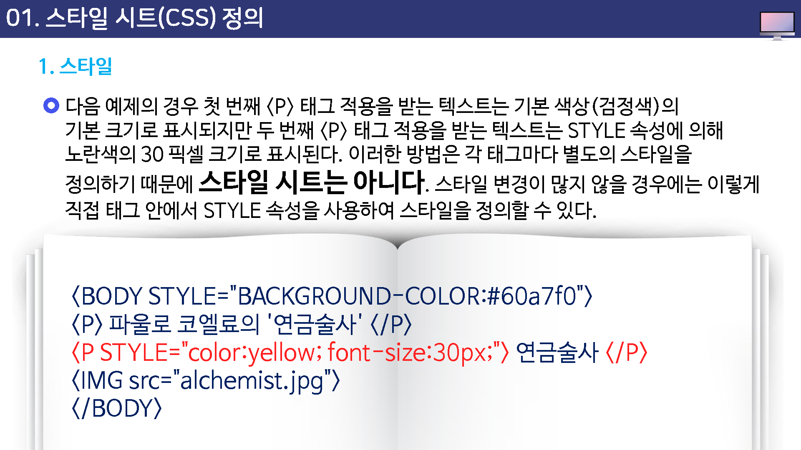
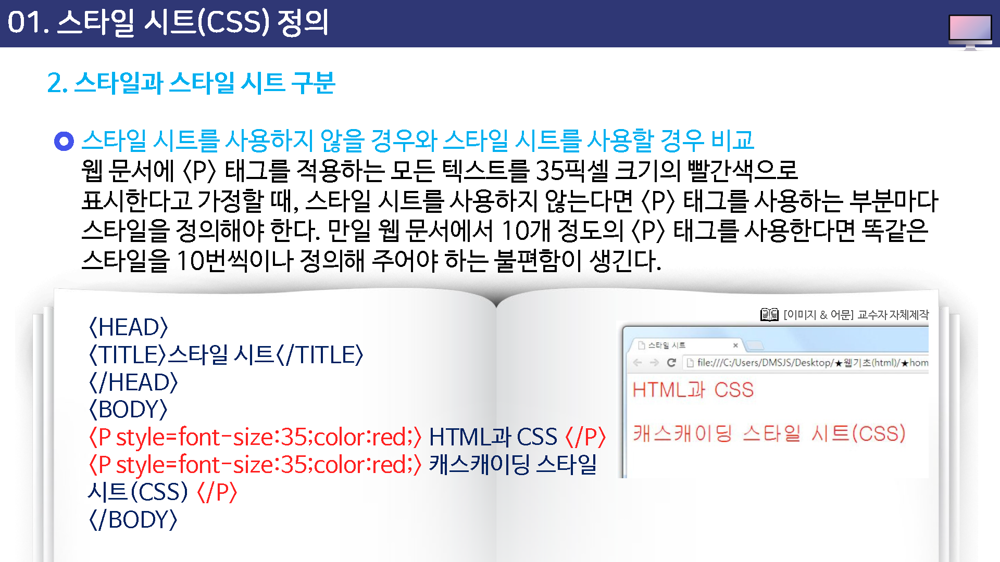
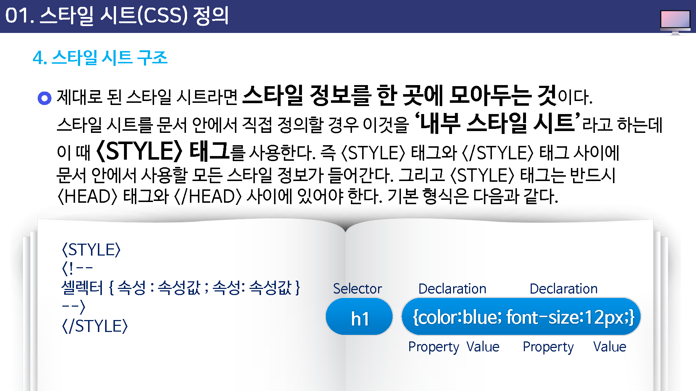

# 스타일 시트 정의하기

## 스타일

서체 종류나 크기, 색상, 정렬등의 유형들을 미리 정의해 두었다가 필요할 때마다 불러 사용하는 것

* HTML 뿐만 아니라 한글 문서에서도 자주 사용
* 매번 반복해서 지정할 필요가 없기 때문에 매우 편리

---
다음 예제의 경우 첫 번째 `<p` 태그 적용을 받는 텍스트는 기본 색상(검정색)의 기본 크기로 표시되지만 두 번째 `
`태그 적용을 받는 텍스트는 stype 속성에 의해 노란색의 30픽셀 크기로 표시된다.

이러한 방법은 각 태그마다 별도의 스타일을 정의하기 때문에 스타일 시트는 아니다.

스타일 변경이 많지 않을 경우에는 이렇게 직접 태그 안에서 style 속성을 사용하여 정의할 수 있다.

## 스타일과 스타일 시트 구분

이러한 스타일을 쉽게 제어할 목적으로 문서의 특정 위치나 혹은 별도의 파일로 스타일 정보만 모아놓은 것

#### 스타일시트(style sheet)

스타일 시트라는 이름 앞에 캐스캐이딩(cascading)이라는 용어를 붙여 캐스캐이딩 스타일 시트(Cascading style sheet), 즉 CSS라는 분야가 생겨났고

이럿이 우리가 흔히 애기하는 스타일 시트이다.

HTML 문서에 대한 스타일 시트가 등장하기 전에는 웹 문서의 모양을 만드는데 한계가 있었다.

예를 들어, 문서의 여백을 설정한다거나 텍스트의 줄 간격이나, 테투리 장식등은 만들 수 없었다.

하지만 스타일 시트가 나오면서 텍스트 색상이나 여백, 문서 요소들의 정렬, 글꼴 크기나 스타일, 텍스트 굵기 등 웹 문서의 스타일 관련 속성들을 지정할 수 있게 되었다.

위에서 보면 HTML 태그에서는 택스트의 크기를 1~7까지의 상태적인 크기 중에서 선택해야 하지만 스타일 시트를 이용할 경우

35픽셀이나 8포인트처럼 원하는 단위로 지정할 수 있다.

스타일은 적용하는 대상과 위치에 따라서 분류 되어질 수 있다.

문서의 특정 태그에 모두 적용되는 태그 스타일과 문서 안의 특정 부분에 적용되는 `클래스 스타일`로 나눌 수 있다.

또한, 스타일 시트가 문서 안에 위치하는 `내부 스타일` 시트와 문서 밖에 위치하는 `외부 스타일` 시트로 나눌 수도 있다.

### 스타일 시트 구조

제대로 된 스타일 시트라면 스타일 정보를 한곳에 모아두는 것이다.

스타일 시트를 문서 안에서 직접 정의할 경우 이럭슬 `내부 스타일 시트`라고 하는데 이때 ``태그 사이에 문서 안에서 사용할 모든 스타일 정보가 들어간다. 그리고 `<style>태그는 반드시 `<head>태그와  `</head>`사이에 있어야 한다.

기본 형식은 다음과 같다.

위 형식에서 셀렉터(select)란 스타일이 어떤 요소에 적용되는지를 나타내는 것이다.

예를들어, H!태그에 적용할 스타일을 만든다면 셀렉터가 H!이 된다.

스타일을 정의할 때는 속성:속성값과 같은 형식을 사용하며 여러 속성을 정의할 때는 속성:속성값 쌍사이에 `세미콜론(;)`을 붙여 구분한다.

즉, 속성:속성값; 속성:속성값; ... 같은 형식이 된다.

스타일 스트에서 `주석`을 나타내는 `<!--`와 `-->`는 시타일 시스를 지원하지 않는 부라우저일 경우 `<!--`와 `-->` 사이의 내용을 무시하고 넘어가라고 알려 주는 것이다.

스타일 시트를 지원하지 않는 브라우저에서는 이런 주석 태그가 없을 경우 스타일 시트 내용을 소스 형태로 브라우저 창에 표시하게 된다. 

하지만 ㅊ최근의 브라우저에서는 모두 스타일 시트를 지원하기 때문에 이런 주석 기호를 빼고 사용해도 무방하다.

