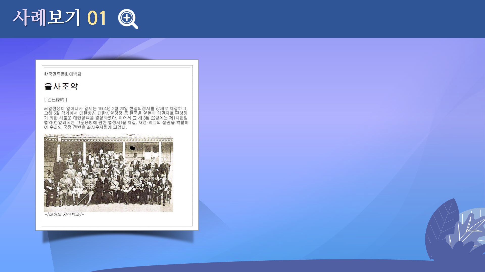
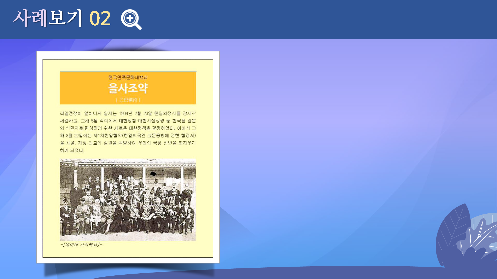

# 스타일시트2
---

 

## 학습목표
---
* 텍스트 관련 스타일에 대해 살펴볼 수 있다.
* 글자 색상을 조절하는 스타일에 대해 이해할 수 있다.
* 다양한 웹폰트 사용에 대해 이해하고 적용할 수 있다.

 

## 학습안내
---
* [글꼴 관련 스타일시트](글꼴관련)
* [글자 색상 관련 스타일시트](색상관련)
* [웹문서에 구글 폰트 적용](구글폰트)
* [스타일 시스틀 이용한 텍스트 꾸미기](텍스트꾸미기)

