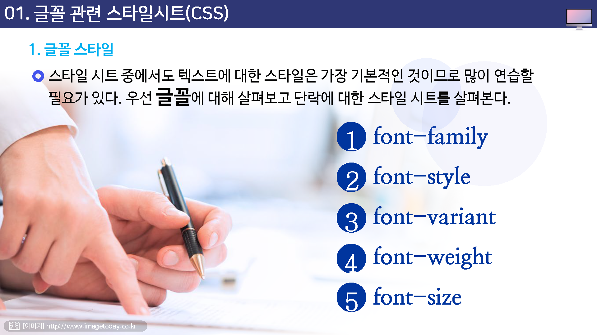
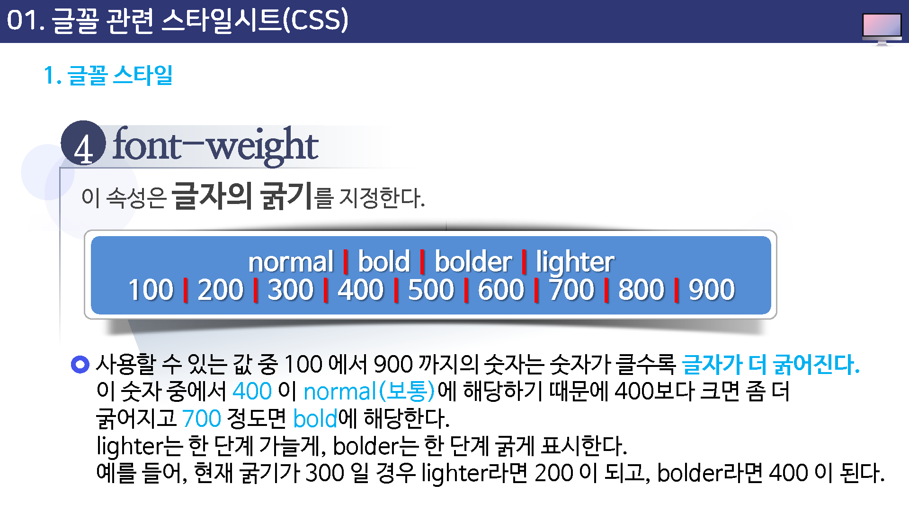
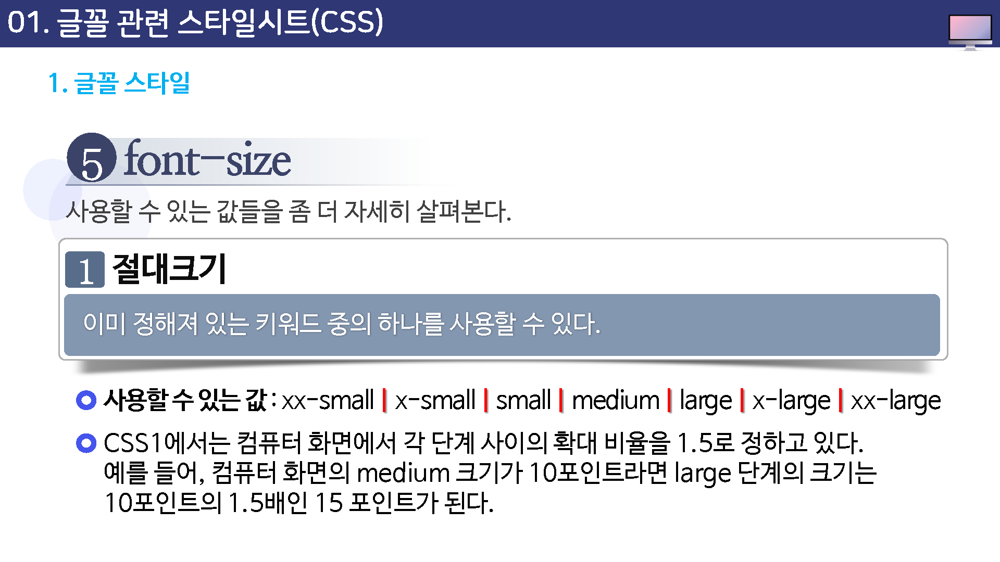
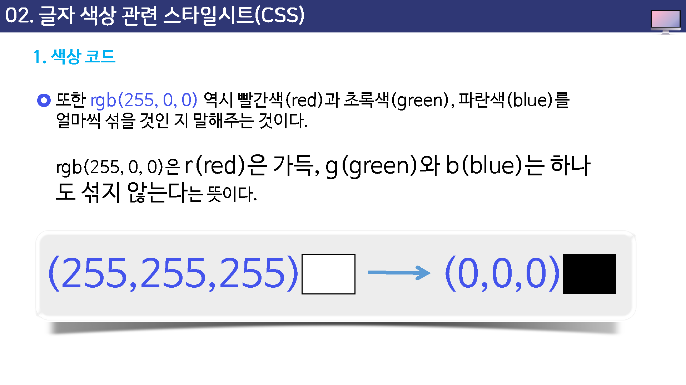
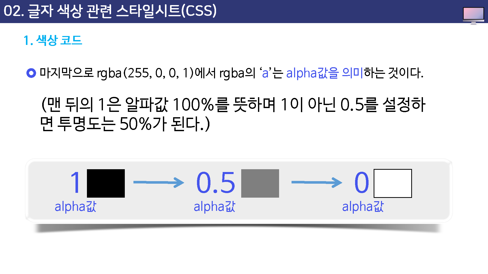
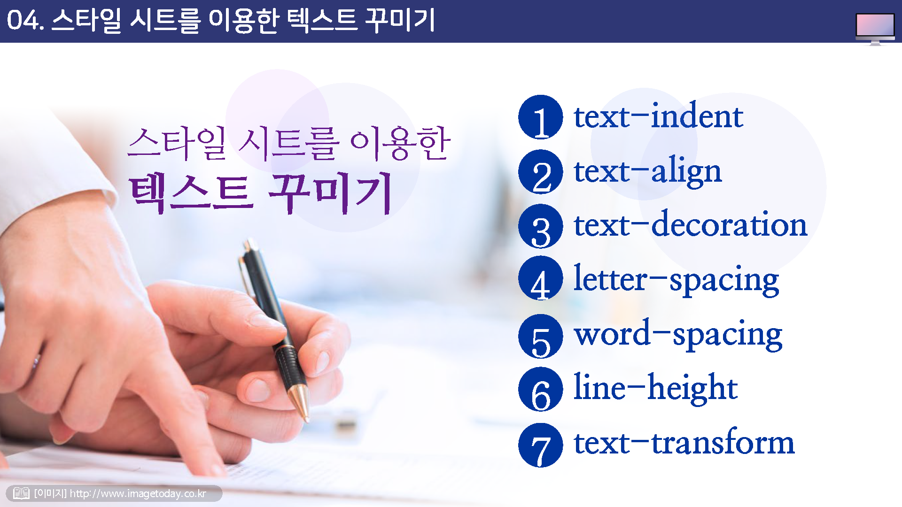
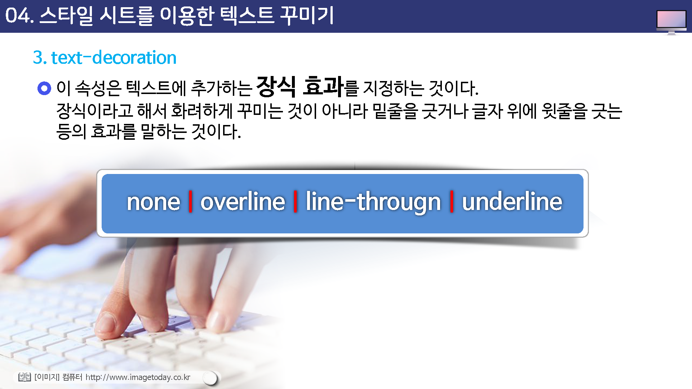

# 스타일시트2

## 학습목표

* 텍스트 관련 스타일에 대해 살펴볼 수 있다.
* 글자 색상을 조절하는 스타일에 대해 이해할 수 있다.
* 다양한 웹폰트 사용에 대해 이해하고 적용할 수 있다.

## 학습안내

* 글꼴 관련 스타일시트
* 글자 색상 관련 스타일시트
* 웹문서에 구글 폰트 적용
* 스타일 시스틀 이용한 텍스트 꾸미기

## 01. 글꼴 관련 스타일시트

## 02. 글자 색상 관련 스타일시트

## 03. 웹문서에 구글 폰트 적용

## 04. 스타일 시스를 이용한 텍스트 꾸미기

