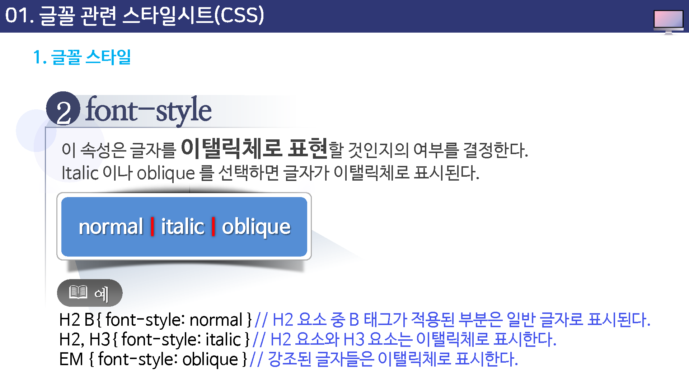
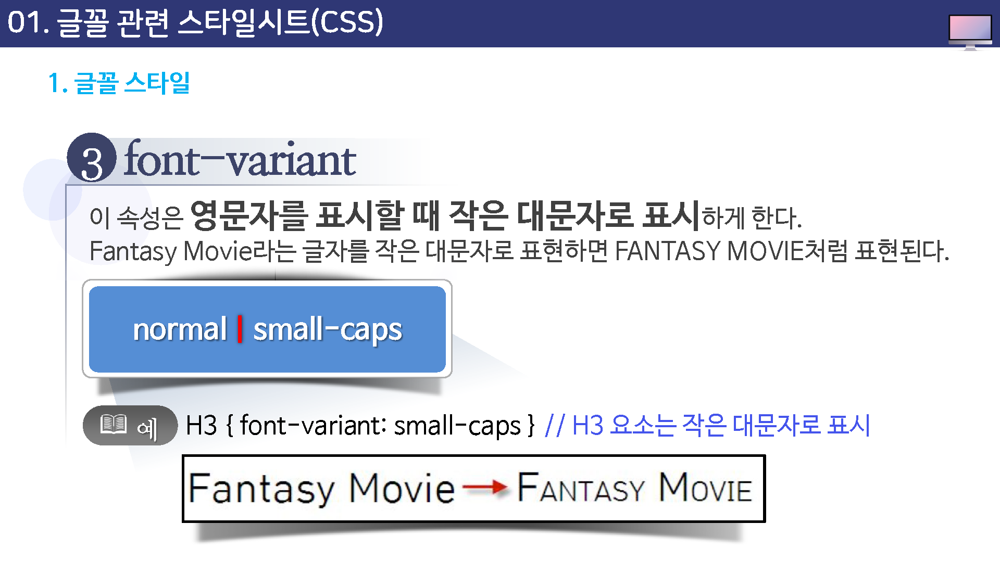

# 글꼴 관련 스타일시트


## 글꼴 스타일

스타일 시트 중에서도 텍스트에 대한 스타일은 가장 기본적인 것이므로 많이 연급할 필요가 있다.

우선 글꼴에 대해 살펴보고 단락에 대한 스타일 시트를 살펴본다.

* font-family
* font-style
* font-variant
* font-weight
* font-size


---


### font-family

이 속성은 웹 문서에서 사용할 글꼴의 종류를 지정한다.

단일 글꼴로 사용할 수도 있고 두 세 개의 글꼴을 정의할 수도 있다.


예를들어, '돋움체','나눔손글씨붓','궁서체'처럼 세가지 글꼴을 정의한다면 제일 먼저 사용자 시스템에 돋음체가 있는지 살려보고 돋음체가 없을 경우 나눔손글씨붓을 다시 찾는다. 나눔손글씨붓 마저 없다면 마지막으로 궁서체를 사용하게 된다.

이렇게 순서대로 글꼴을 찾아가기 때문에 `글꼴세트(font set)`라고도 한다.


### font-style

이 속성은 글자를 이탤릭체로 표현할 것인지의 여부를 결정한다. italic 이나 oblique를 선택하면 글자가 이탤릭체로 표시된다.

```
normal | italic | oblique
```





### font-variant

이 속성은 영문자를 표시할 때 작은 대문자로 표시하게 한다.

Fantasy Movie라는 글자를 작은 대문자로 표현하면 FANTASY MOVIE처럼 표현된다.


```
normal | small-caps
```





### font-weight

이 속성은 글자의 굵기를 지정한다.

```
normal | bold | bolder | lighter
100 | 200 | 300 | 400 | 500 | 600 | 700 | 800 | 900
```


사용할 수 있는 값 중 100 에서 900까지의 숫자는 숫자가 클수록 글자가 더 굵어진다.

이 숫자 중에서 400이 normal(보통)에 해당하기 때문에 400보다 크면 좀 더 굵어지고 700정도면 bold에 해당한다.

lighter는 한 단계 가늘게, bolder는 한 단계 굵게 표시한다.

예를 들어, 현재 굵기가 300일 경우 lighter라면 200이 되고, bolder라면 400이 된다.


### font-size

이 속성은 글자의 크기를 조절하기 위한 것이다.

픽셀이나 포인트를 비롯해 여러 단위의 크기로 지정할 수도 있고 백분율 크기를 사용할 수도 있다.

```
절대크기 | 상대크기 | 길이 | 백분율
```


사용할 수 있는 값들을 좀 더 자세히 살펴 봅니다.

#### 1.절대크기

이미 정해져 있는 키워드 중의 하나를 사용할 수 있다.

* 사용할 수 있는 값 : xx-small | x-small | small | medium | large | x-large | xx-large

* CSS1에서는 컴퓨터 화면에서 각 단계 사이의 확대 비율을 1.5로 정하고 있다.

  예를 들어, 컴퓨터 화면의 medium 크기가 10 포인트라면 large 단계의 크기는 10포인트의 1.5배인 15포인트가 된다.


#### 2.상태크기

상대 크기는 부모 요소의 크기를 기준으로 한 크기이다.

* 사용할 수 있는 값: larger : smaller
* 예를들어, 부모 요소의 글꼴 크기가 medium 일 경우 font-size:larger로 지정하게 되면 현재 요소의 클꼴 크기는 large가 된다.


#### 3.길이

font-size:12px 이나 font-size:10pt 처럼 직접 크기를 지정한다.

웹 페이지에서 보기 좋은 글꼴의 크기는 12픽셀이거나 10포인트 이다.

단 음수값은 사용할 수 없다.


#### 4.백분율

백분율 역시 부모 요소의 글꼴 크기를 기준으로 계산된다.

예를들어, 부모 요소의 글꼴 크기가 10포인트였을 때 font-size:150%로 지정하다면 실제 글꼴 크기는 15포인트가 될 것이다.


## Em 으로 폰트 크기 조절

익스플로러의 구 버젼에서 서체의 크기조절에서 픽셀 단위의 문제점을 피하기 위해서는 em 단위를 사용하는 것이 바람직하다.

W3C에서는 서체의 크기를 설정할 때 em 단위를 추천하고 있다.


브라우저에서 기본 서체크기는 16픽셀인데 1em단위는 16px과 동일하다.

예를 들어, 40vlrtpfdml zmrlsms 몇 em인가를 계산하고자 한다면 아래의 계산식을 대입하면 된다.


pixels / 16 = em


따라서, 40픽셀은 2.5em이라는 식이 나오게 된다

> 주의 :  서체 크기 단위인 em과 `<em>`태그는 다르기 때문에 주의.

