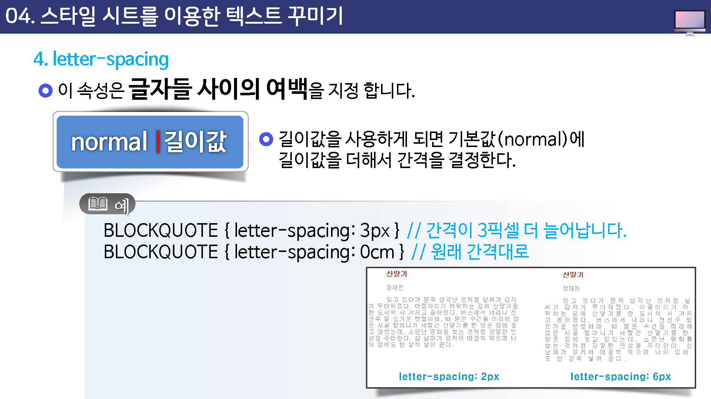
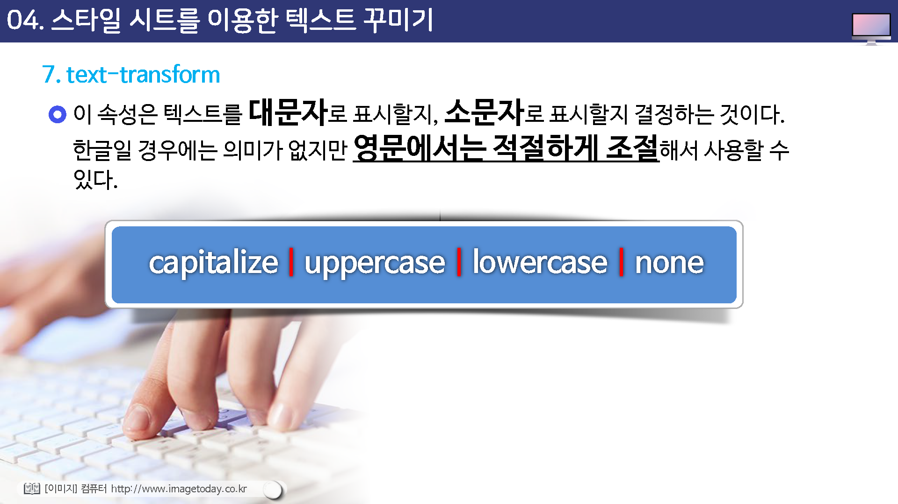

# 스타일 시스를 이용한 텍스트 꾸미기

* text-indent
* text-align
* text-decoration
* letter-spacing
* word-spacing
* line-height
* text-transform

---
## text-indent

이 속성은 단락의 첫 번째 줄을 얼마나 들여 쓸 것인지를 지정한다.

px,pt,cm,em

## text-align

이 속성은 요소 안에서 텍스트의 정렬 방법을 지정합니다.

* left
* right
* center
* justify

## text-decoration

이 속성은 텍스트에 추가하는 장식 효과를 지정하는 것이다.

장식이라고 해서 화려하게 꾸미는 것이 아니라 밑줄을 긋거나 글자 위에 윗줄을 긋는 등의 효과를 말하는 것이다.

* none
* overline
* line-througn
* underline

## text-decoration

* none : 장식이 없다.
* overline : 텍스트 위쪽에 줄을 긋습니다.
* line-through : 텍스트 위로 가로지르는 줄을 긋는다.
* underline : 밑줄을 긋습니다.

## letter-spacing

이 속성은 글자들 사이의 여백을 지정 합니다.

normal | 길이값

길이값을 사용하게 되면 기본값(normal)에 길이값을 더해서 간격을 결정한다.

## word-spacing

이 속성은 단어와 단어 사이의 간격을 조절한다.

## line-height

이 속성은 줄과 줄 사이의 간격, 즉, 줄간격을 지정합니다.

normal | 숫자 | 길이값 | 백분율

숫자값이 지정되면 현재 요소의 글꼴 크기에 숫자를 곱하여 줄 간견을 구한다.

줄 간격에서는 음수값을 사용할 수 없다.

## text-transform

이 속성은 텍스트를 대문자로 표시할지, 소문자로 표시할지 결정하는 것이다.

한글일 경우에는 의미가 없지만 영문에서는 적절하게 조절해서 사용할 수 있다.

