# 스타일시트3

## 학습목표

* 배경 관련 스타일에 대해 살펴볼 수 있다.
* 벤더 프리픽스에 대해 살펴볼 수 있다.
* 테두리 관련 스타일에 대해 살펴볼 수 있다.
* 사진 인화지의 효과를 표현할 수 있다.

## 학습안내

* 배경 스타일
* 테두리 스타일
* 사진 인화지 효과 나타내기

## 01. 배경 스타일 시트

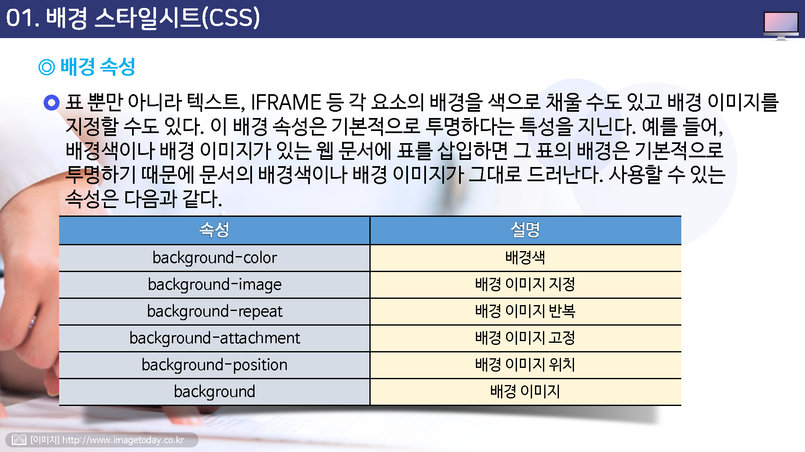

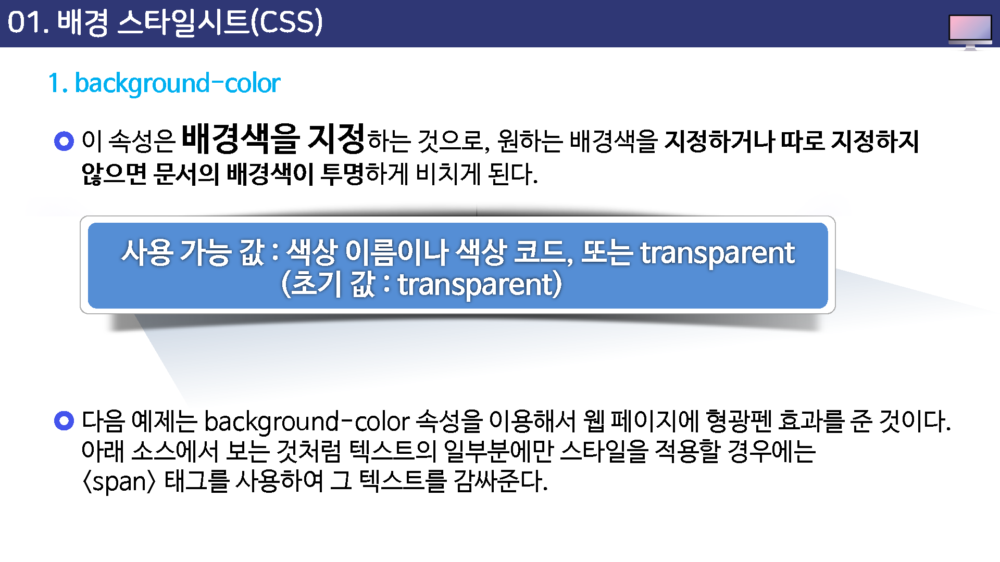

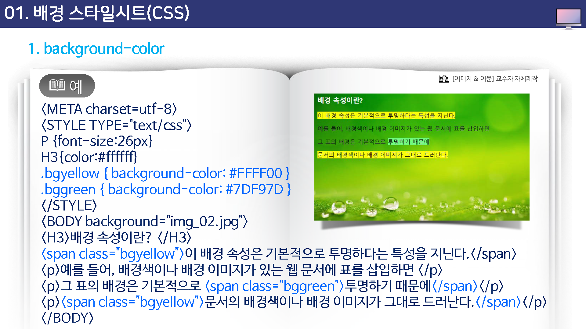

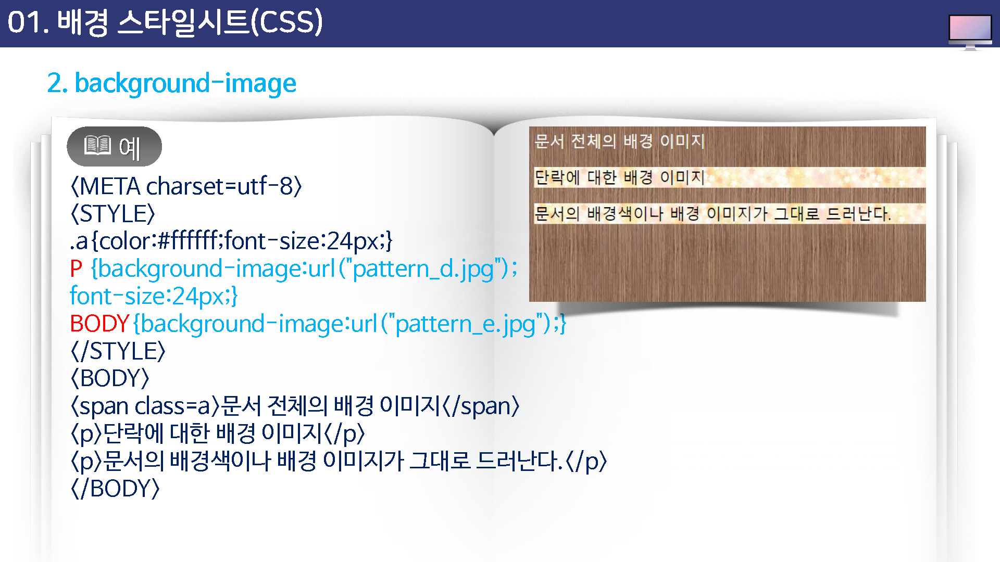

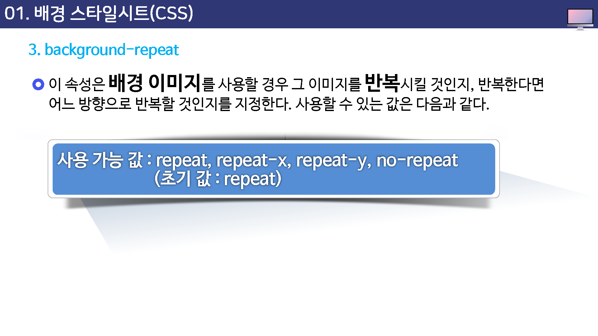

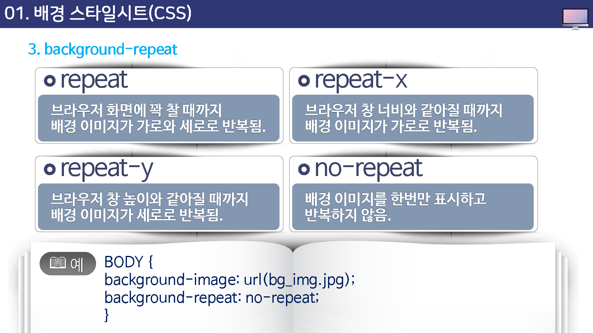

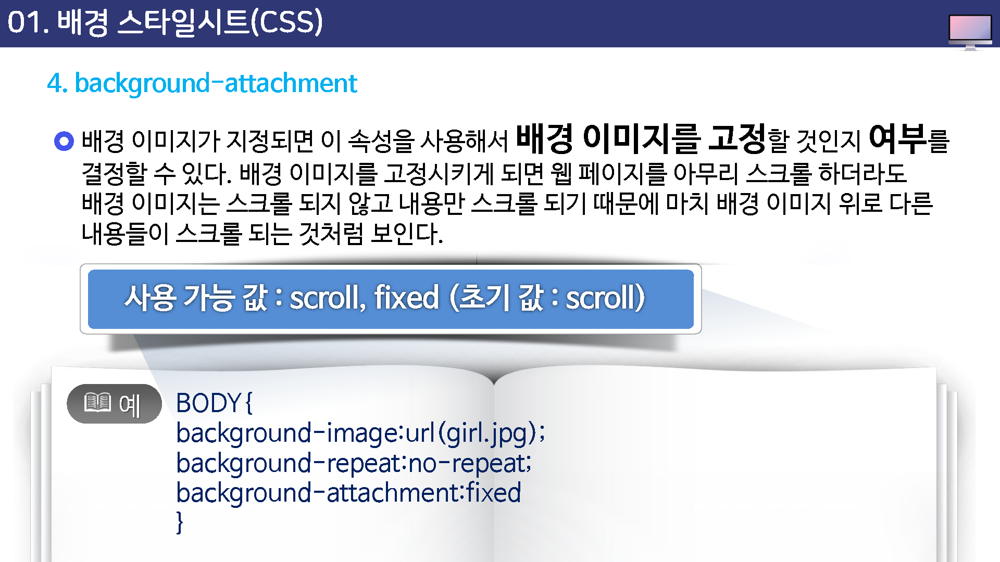

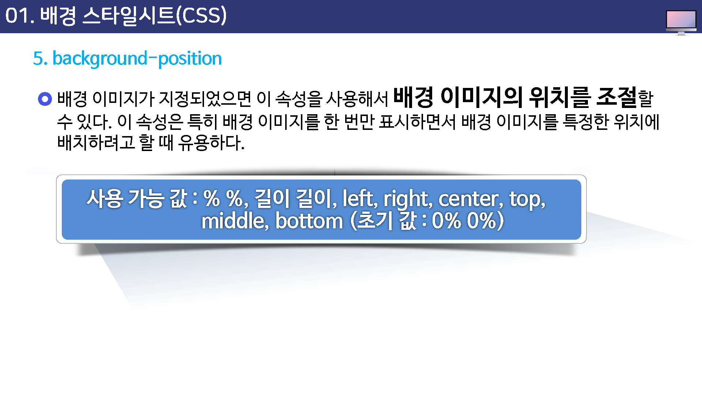

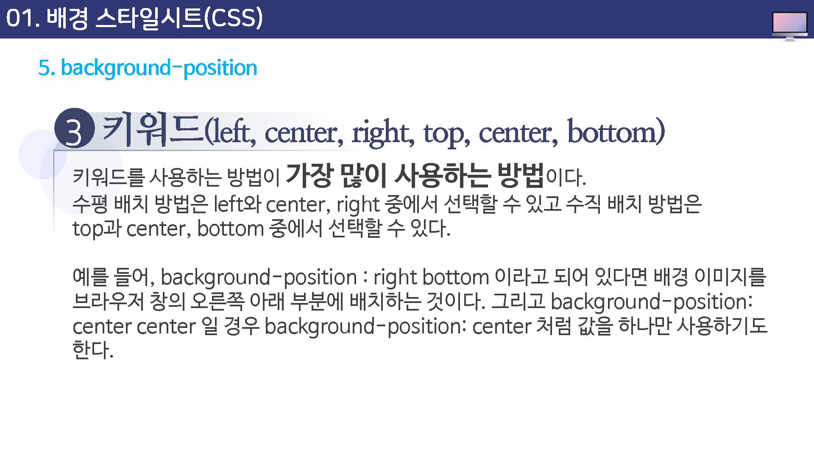

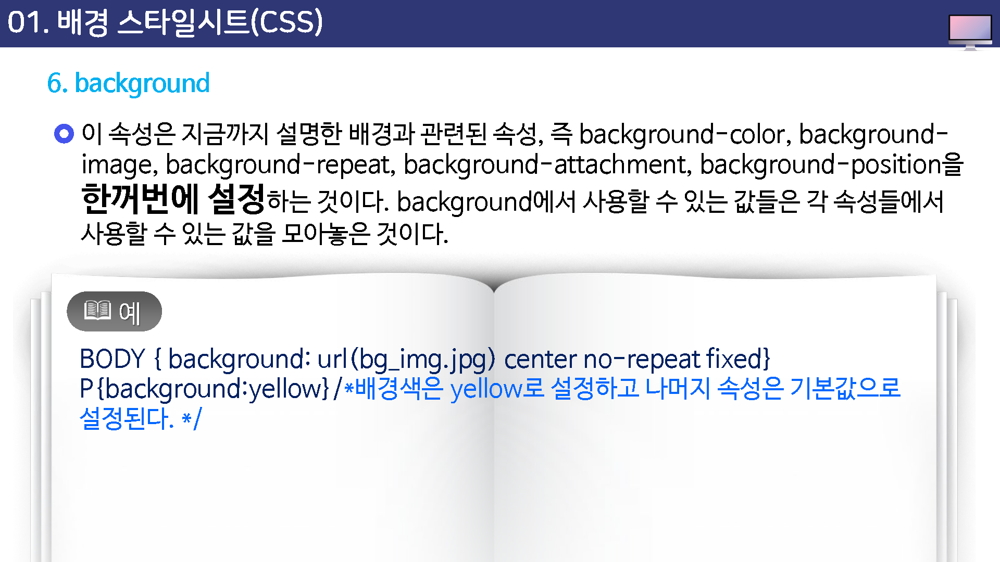

## 02. 테두리 스타일

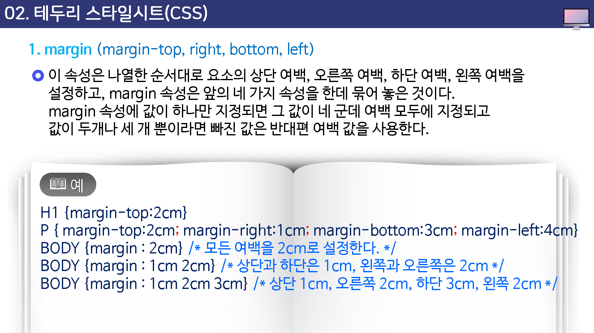

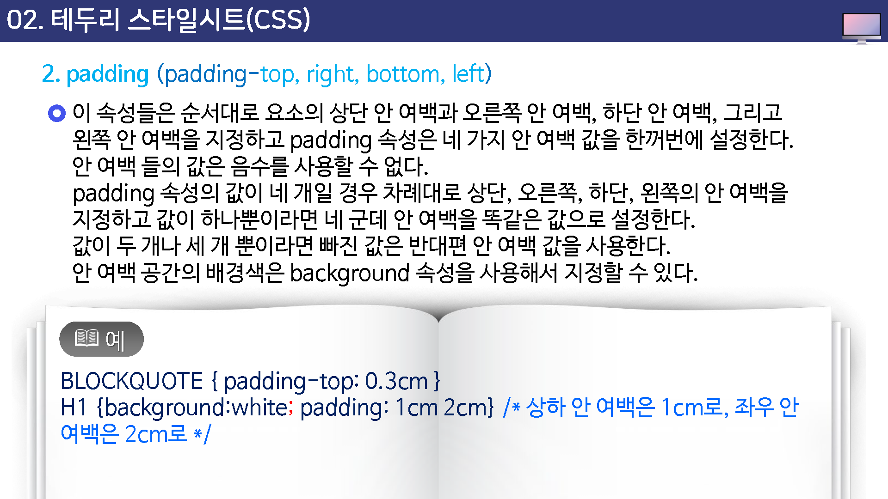

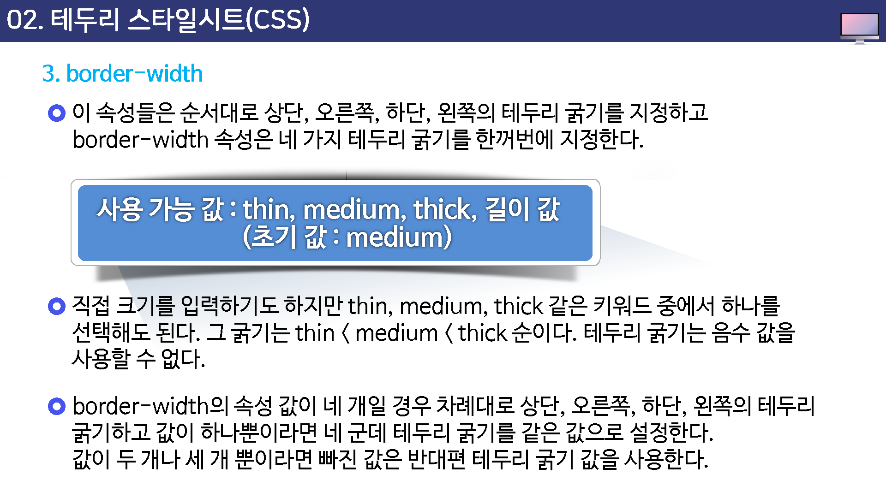

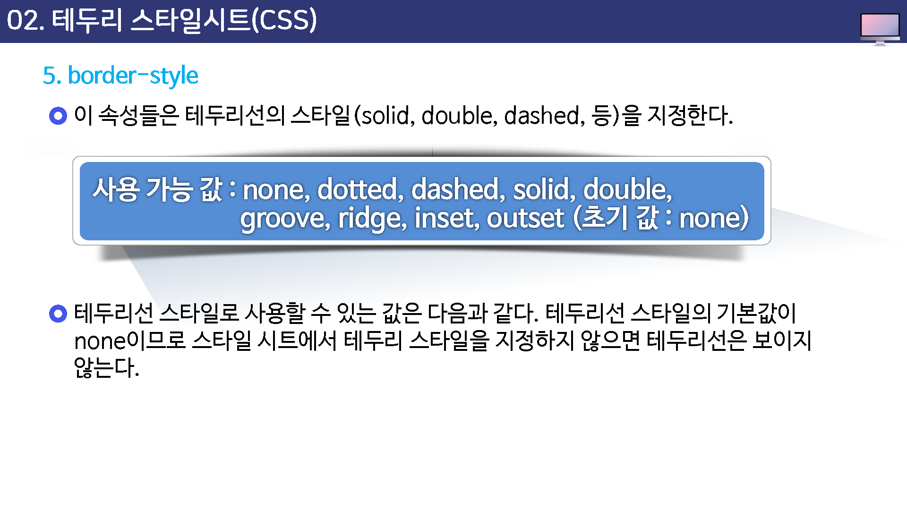

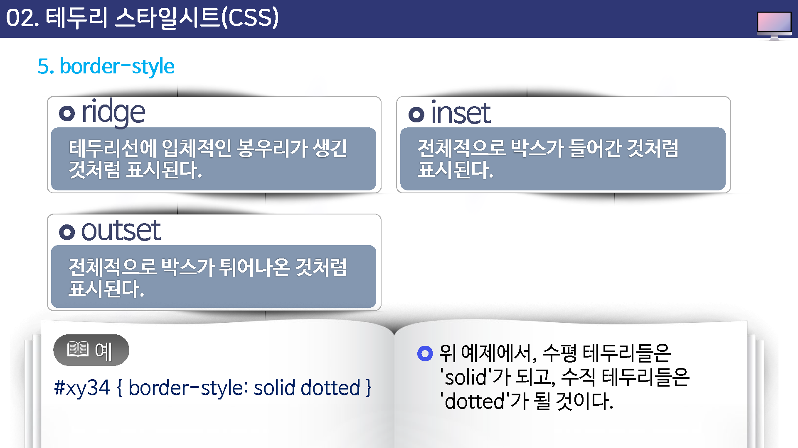

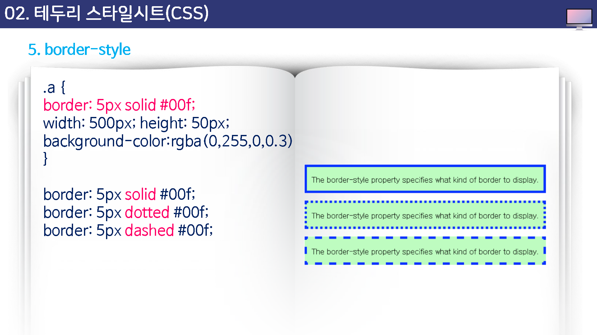

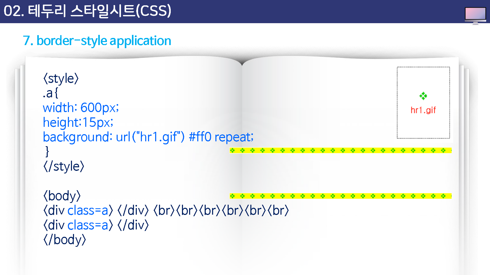

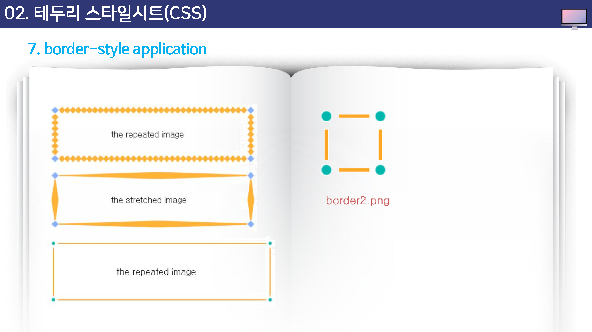

## 03. 사진 인화지 효과 나타내기

