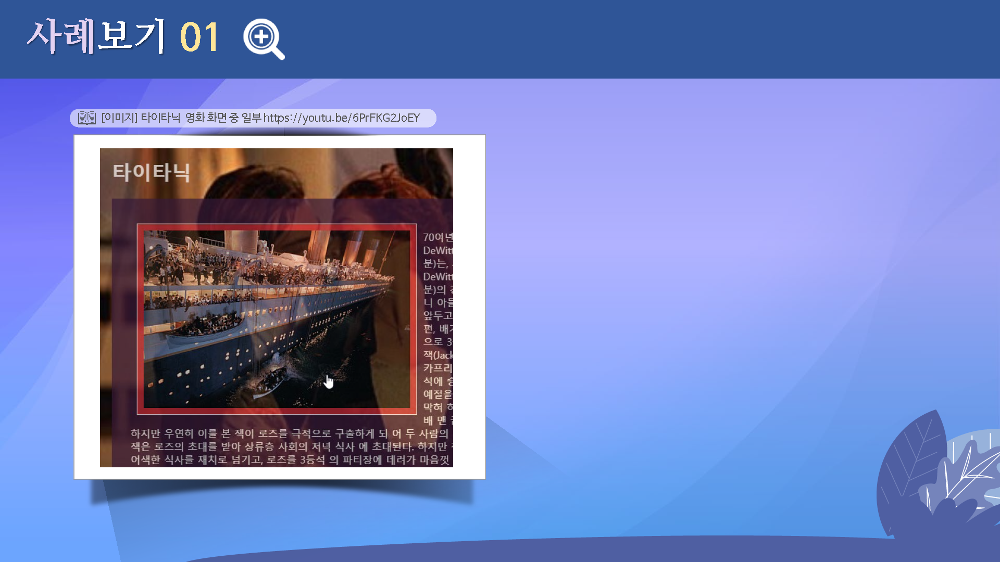
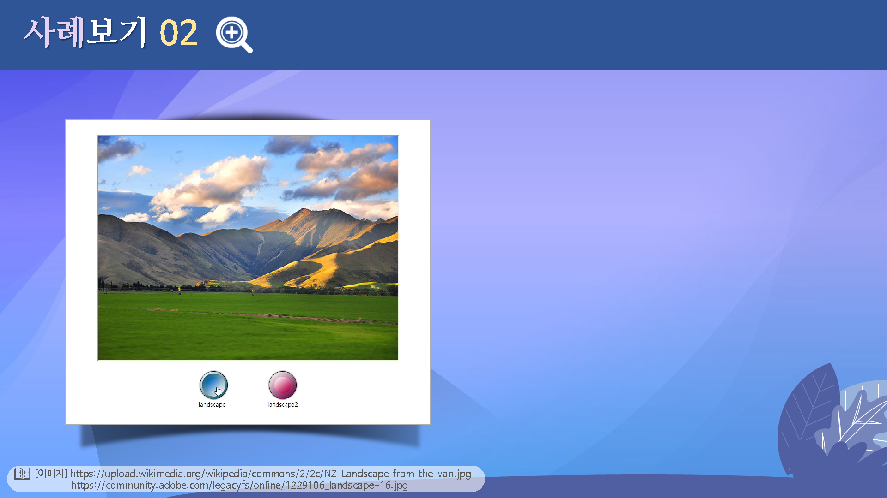
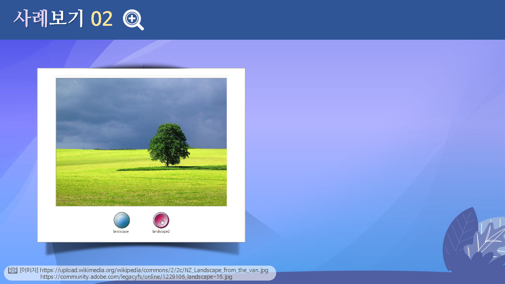

# 자바스크립트
---

 

## 학습목표
---
* 자바스크립트에 대해 살펴볼 수 있다.
* 자바스크립트의 특징을 살펴볼 수 있다.
* 자바스크립트 선언 방법을 살펴볼 수 있다.

 

## 학습안내
---
* [자바스크립트 기초](basic)
* [자바스크립트 선언 방법](선언방법)
* [객체 방식 프로그래밍](객체방식)
* [스크립트 실행하기](실행하기)

 
