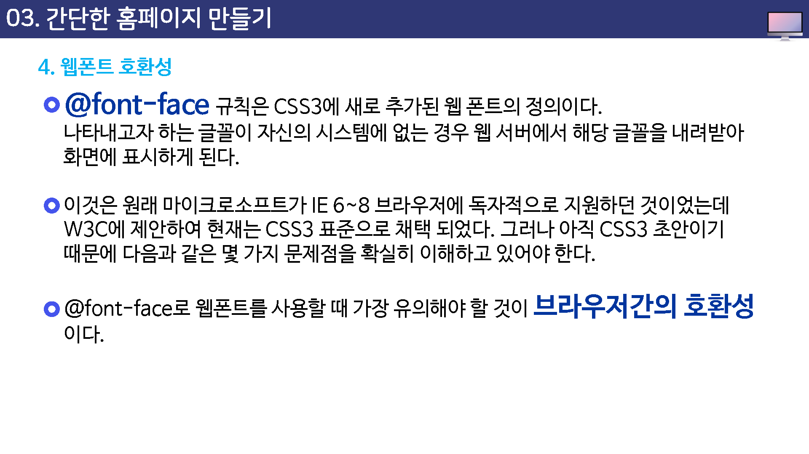
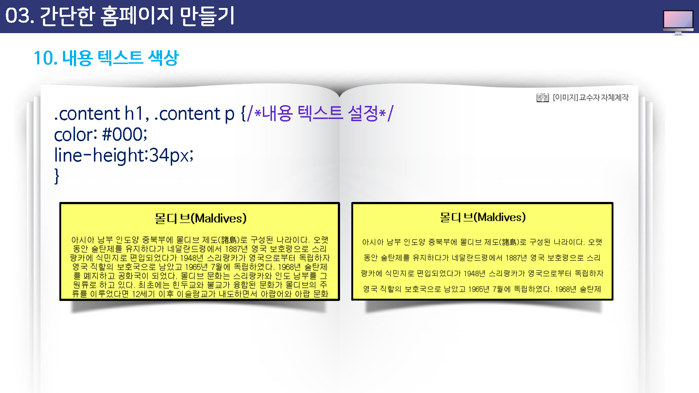
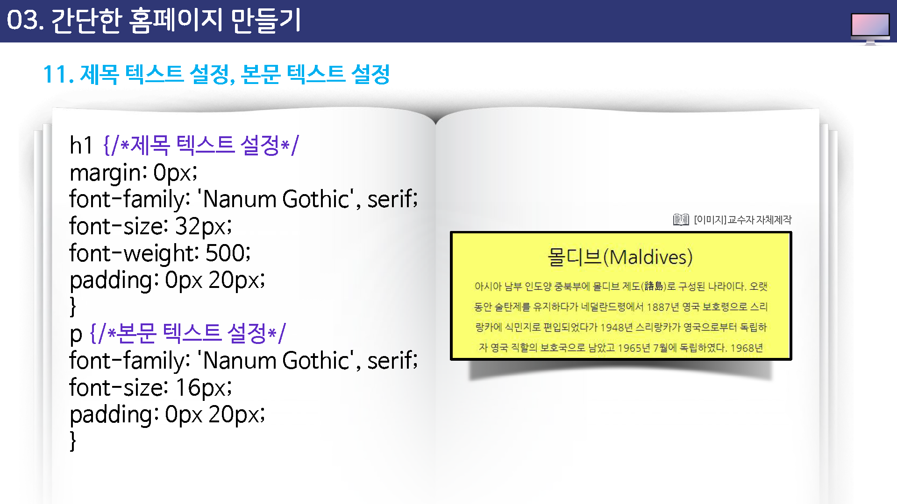
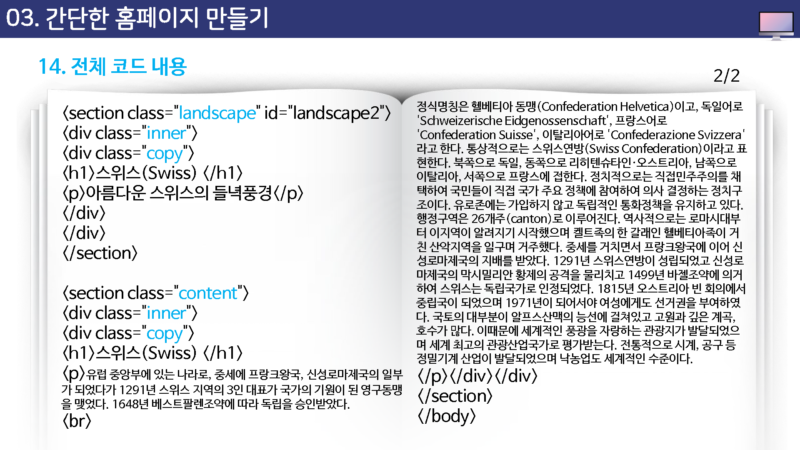

# HTML과 CSS, 자바스크립트 팁

## 학습목표

* 마우스 커서에 대해 살펴볼 수 있다.
* 이미지의 롤오버 기능을 살펴볼 수 있다.
* 홈페이지 제작 과정에 대해 살펴볼 수 있다.

## 학습 안내

* 마우스 커서 관련 팁
* 스타일시트로 이미지 폴오버
* 간단한 홈페이지 만들기

## 01. 마우스 커서 관련 팁

## 02. 스타일시트로 이미지 롤오버

## 03. 간단한 홈페이지 만들기

