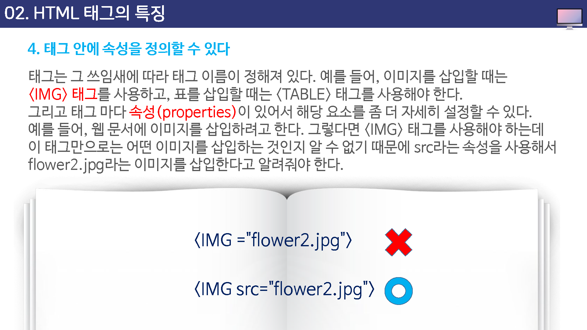

# HTML 테그의 특징


## 여는 테그와 다는 테그

HTML 의 모든 명령은 태그와 그 안의 내용들로 구성되어 있다.

테느는 `<`와 `>`사이에 영문이나 굿자가 오는 것인데, 앞에서 살펴본 `<p>`와 `</p>`, ``들이 모두 태그이다.


```html
<p>안녕하세요</p>
```


태그는 여는 태그와 다는 태그가 한쌍으로 구성되어 있다. 

이렇게 닫는 태그를 지정해 주어야 정확히 태그가 적용될 범위를 알 수 있다.

하지만 `` 태그나 `<hr>` 과 같은 태그는 닫는 태그 없이 사용할 수 있다.


## 대소문자 구별이 없다.

태그는 대소문자 구별 없이 사용할 수 있다. 

즉, 아래의 두 가지 소스는 웹 브라우저에서 똑같이 인식한다.


대문자 사용

```
<H1>안녕하세요</H1>
<P>Hello world</P>
```


소문자 사용

```
<h1>안녕하세요</h1>
<p>Hello world</p>
```


## 들여쓰기

HTML 소스 상에서 태그의 들여쓰기는 웹 브라우저에 적용되지 않는다.

아래의 두가지 예는 모두 같은 결과를 보여준다. 단, 이렇게 태그를 들여 쓰는 것은 제작자나 다른 사람이 다시 소스를 들여다 보았을 때 쉽게 문서의 구조를 이해할 수 있도록  하기 위해서 이다.


## 테그 안에 속성을 정의할 수 있다.

태그는 그 쓰임새에 따라 태그 이름이 정해져 있다.

예를 들어, 이미지를 삽입할 때는 `` 태그를 사용하고, 표를 삽입할 때는 `<table>` 태그를 사용해야 한다.


그리고 태그 마다 속성(properties)이 있어서 해당 요소를 좀더 자세히 설정할 수 있다.

예들 들어, 웹 문서에 이미지를 삽입하려고 한다. 그렇다면 `` 태그를 사용해야 하는데 이 태그만으로는 어떤 이미지를 삽입하는 것인지 알 수 없기 때문에 src라는 속성을 사용해서 이미지를 삽입한다고 알려줘야 한다.		





## 태그 안에 속성을 정의할 수 있다

``태그의 다른 속성을 이용하면 이지지의 크리를 지정할 수 있다.

각 태그마다 사용할 수 있는 속성들이 다르고 사용할 수 있는 속성 값도 달라직는데 필요에 따라 원하는 속성만 사용하면 된다.

그리고 속성들은 연속해서 여러개를 함께 사용할 수도 있다.


## 태그 중복 문제

한가지 내용에 대해서 여러 개의 태그가 함께 사용될 수도 잇다.


예를 들어, "hello world"라는 택스트를 이탤리체 속성을 주거가 밑줄이 그어져 잇는 진한 텍스트로 표시하고 싶다면 다음과 같이 테그를 사용한다.


잘못된 사용

```
<i><u><b>Hello World</i></u></b>
```


정확한 사용

```
<i><u><b>Hello World</b></u></i>
```


이렇게 여러 태그가 사용될 때는 여는 태그의 순서에 크게 신경쓰지 않아도 된다.

즉, 다음과 같이 순서를 바꿔 표현해도 된다.


```
<i><u><b>Hello world</b></u></i>

<b><u><i>Hello World</i></u></b>
```


하지만 꼭 명신해야 할 것이 있다.

여러 태그를 함께 사용할 경우 여는 태그와 다는 태그의 순서를 정확히 지텨야 한다는 것이다.


가장 바깥쪽의 여는 태그는 다는 태그를 가장 바깥쪽에, 가장안쪽에 있는 태그는 닫는 태그를 가장 안쪽에 넣어야 한다.