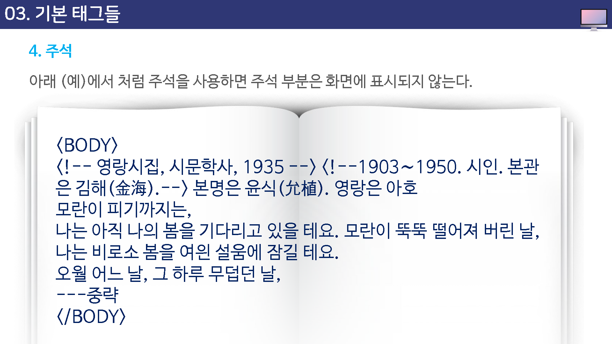

# 기본 태그들


## BR 테그

간단한 문서를 만들었을때 소스에서 아미뤼 줄바꿈을 하더라도 브라우저 창에서는 한 줄로 표시되는 것을 보았다.

실제로 웹 브라우저 창에서 줄바꿈이 되도록 하려면 `<br>`테그를 사용한다.


`<br>`태그가 삽입된 위치에서 바로 줄이 바뀌는 것인데

태그를 여버 번 사용하면 사용하는 만틈 브라우저 상에서 엔터키를 누는 것과 같은 효과를 볼 수 있다.


## P 테그

웹 문서에서 가장 많이 사용하는 태주중의 하나가 p테그이다.

`<p>` 태그는 단락(paragraph)을 만드는 태그인데, 단략이란 앞뒤로 빈줄이 있는 텍스트 덩어리를 말한다.


> `<p>`태그는 다는 태그를 생략해도 되지만, 되도록 다는 태그를 같이 사용하는 급관을 가지는 것이 좋다.


`<p>`태그의 align 속성을 사용하면 단락의 정렬 방법을 조정할 수 있다.

사용할 수 있는 값은 다음과 같다

* left
* right
* center

align  속성을 따로 지정하지 않았을 때의 기본값은 left이다.


## HR 태그

웹 문서에 가로줄을 삽입할 때 사용하는 태그이다.

닫는 태그는 없으며 속성을 사용하여 가로줄의 모습을 바꿀 수 있다.

`<hr>`태그에서 사용할 수 있는 속성은 다음과 같다. 단, color 속성을 사용하여 색상을 지정하면 자동으로 noshade 기능이 적용되어 가로줄이 평면으로 표시된다.

아무 속성도 지정하지 않으면 문서의 가로폭에 맞게 회색의 사로줄이 삽입된다.


* width : 

  수평선의 가로길이. px단위나 %단위 모두 사용할 수 있다.

```
<hr>
<hr width="200px">
<hr width="50%">
```


* sise

  수평선의 높이. 즉, 수평선의 세로 두께가 된다.

```
<hr width="200px" size="1">
```


* align

  정렬방법. left와 right, center 중에서 사용할 수 있다.

  ```
  <hr width="200px" align="left">
  <hr width="200px" align="center">
  ```

  

* color

  수평선의 색상을 변경합니다.

  ```
  <hr width="200px" align="right" size="3" color="red">
  ```

* noshaded

  수평선을 삽입하면 기본으로 입체 효가가 추가되는데 이런 입체효과를 없애고 싶다면 noshade 속성을 사용한다.

  ````
  <hr width="200px" size="5" noshade>
  ````

  


## 주석

주석(comment)은 웹 브라우저 화면에서는 표시되지 않는 요소이다.

주석은 자중에 자신이 작성한 html 소스를 보거나 다른 사람이 html 소스를 열어 보았을 때 페이지 내용을 쉽게 이해할 수 있도록 설명글을 붙이는 것이다.

주석의 기본 형식은 다음과 같다.


주석은 한 줄에 쓸 수도 있고, 여러줄에 걸쳐서 사용할 수도 있다.


```
<!-- 주석내용 -->
```





## 제목을 나타내는 `<Hn>`태그

웹 문서에서 제목 부분은 대부분 다른 텍스트보다 크고 진하게 표시한다.

이렇게 자주 사용하는 제목 스타일을 미리 태그 형태로 만들어 두었는데 그 형태는 `<Hn>`이다.


H는 Heading을 줄인 말이고 n 자리에 1에서 부터 6까지의 숫자를 사용하여 제목 텍스트를 진하게, 크기 별로 표시할 수 있다.

기본 형식은 다음과 같다.


```
<h1>안녕하세요</h1>
<h2>안녕하세요</h2>
<h3>안녕하세요</h3>
<h4>안녕하세요</h4>
<h5>안녕하세요</h5>
<h6>안녕하세요</h6>
```


