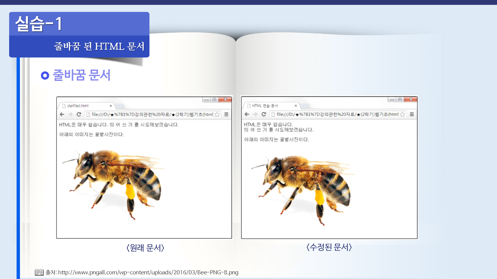
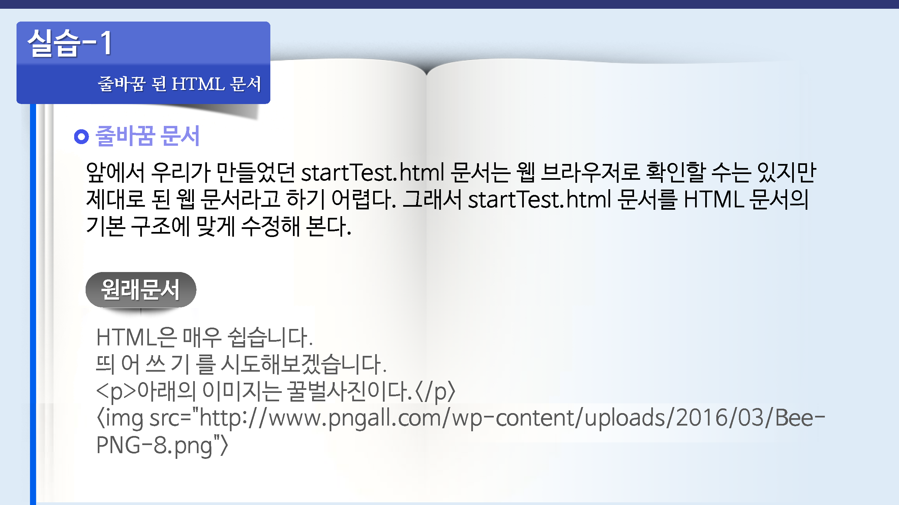
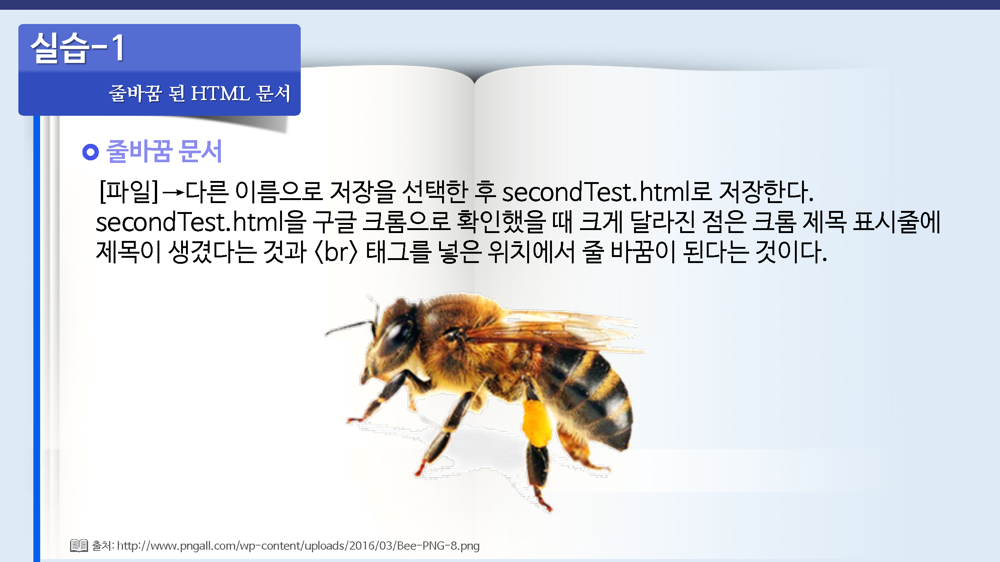
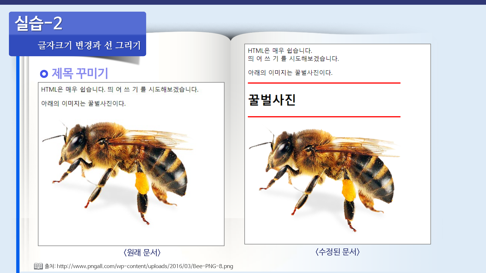
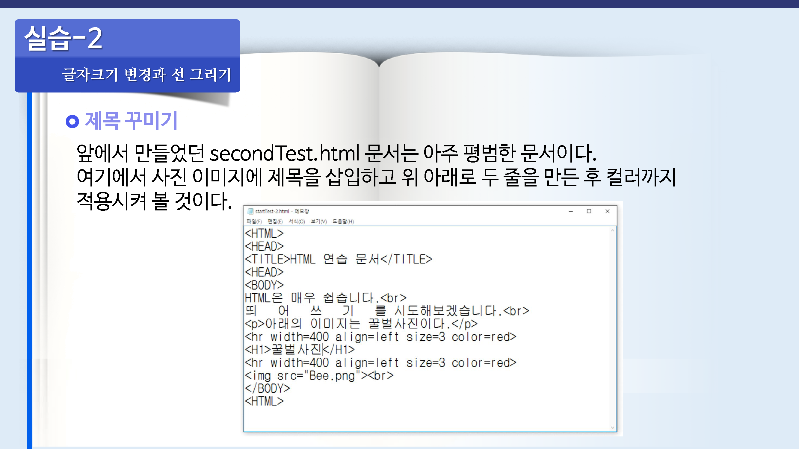

# HTML 문서의 기본 구조
---

<br>

## HTML 문서 기본 뼈대
---
HTML 문서를 이루는 가장 기본적인 뼈대는 다음과 같다.


```html
<html>
	<head>
		<title>웹브라우저 창 제목</title>
	</head>
	<body>
		실제적인 웹문서 내용
	</body>
</html>
```

<br>

## `<html>`태그
---
현재 작성하는 문서가 HTML 웹 문서입을 알려주기 위한 태그 이다.  
웹 문서의 시작부분에는 `<html>`태그를, 그리고 문서의 마지막에는 `</html>`태그를 사용한다.  
즉, 이 태그는 문서의 시작과 끝을 나타내는 태그이다.  

`<html>`태그 안을 보면 문서의 정보를 지정하는 `<head>~</head>`부분과 실제 문서 내용이 들거가는 `<body>~</body>`부분으로 나뉘어져 있다.

<br>

## `<head>`태그
---
`<head>`태그에서 시작해서 `</head>`태그까지는 **웹문서 제작자**나 **사용된언어**, **문서의 제목**등 웹 문서의 여러 정보들이 들어간다.  

위의 예에서는 `<head>`	와 `</head>`사이에 `<title>`태그만 사용되었지만 이외에도 여러가지 태그들이 있다.

<br>
 
## `<title>`태그
---
웹 문서의 제목을 지정하는 태그로 `<title>`태그와 `</title>`태그 사이의 태용이 웹 브라우저의 맨 윗부분에 제목으로 표시된다.

이부분을 지정하지 않을 경우 웹 브라우저 창 맨 위에는 `웹 즈라우저 창의 제목입니다.` 또는 이전 버전의 브라우저에서는 `Untitled Document(제목없음)`이라고 표시된다.

<br>

## Body 태그
---
`<body>`태그에서 `</body>`까지 실제 웹 브라우저 창에 나타나는 여러 가지 내용들이 들어간다.  

여기에서 배우는 대부분의 내용들이 이 `<body>` 태그와 `</body>` 태그 사이에 삽입될 태그들이다.

<br>

## 실습
---












