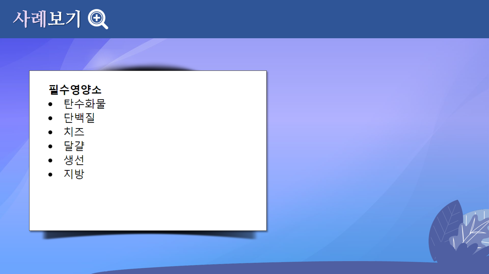
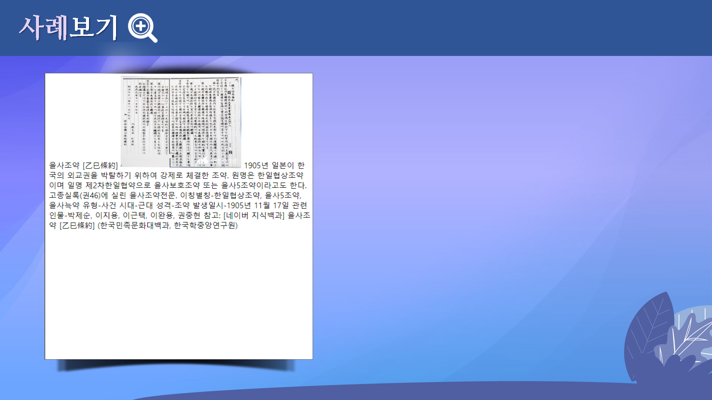

# 텍스트 태그

 

## 학습목표
---
* 텍스트를 꾸미는 방법을 설명할 수 있다.
* "TEXT 이미지"와 "TEXT"의 차이점을 알 수 있다.
* "굴림"과 "굴림체"의 차이점을 파악할 수 있다.
* `<ul>`태그와 `<ol>`태그를 설명할 수 있다.

 

## 학습안내
---
* 텍스트 [이미지와 텍스트](이미지와텍스트)
* 텍스트 [색상(color) 변경](색상변경)
* 텍스트 [크기(font-size) 변경](크기변경)
* 텍스트 [글꼴(font-family) 변경](글꼴변경)
* 기타 [택스트 스타일](택스트스타일)
* [순서 없는 목록](순서없는)
* [순서 목록](순서목록)

 

## 학습정리
---
이번 시간에는 다음과 같은 내용을 학습하였습니다.

* 텍스트 이미지와 텍스트
* 텍스트 색상 변경
* 텍스트 크기 변경
* 기타 텍스트 스타일
* 순서없는 목록
* 순서 목록

