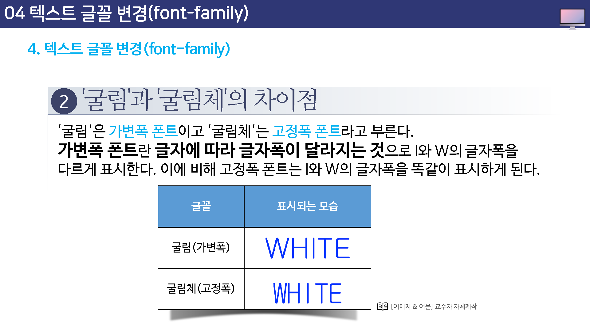

# 텍스트 글꼴 변경

웹문서에서 글꼴은 폰트(font)라고도 하는데 바탕체, 굴림체, 궁서체, 돋움체등 윈도우 기본 글꼴이 있다.

```
<p style="font-family:글꼴, 글꼴">텍스트</p>
```


## 한글은 윈도우 기본 글꼴로 사용

텍스트의 글꼴을 지정할때 주의해야 할 점이 있다. 웹문서는 어떤 컴퓨터에서나 접근해서 볼 수 있기 때문에 여러분이 지정한 글꼴이 웹 문서 방문자의 컴퓨터에도 설치되어 잇어야 제대로 표시된다.

특히 포토샵 같은 그래픽 프로그램을 사용한다면 다양한 한글 글꼴을 많이 가지고 있을 텐데 웹 페이지를 만들때 이런 글꼴을 사용해도 대부분 제대로 표시되지 않는다.


## 한글은 윈도우 기본 글꼴로 사용

예를들어, "양재 재화체"라느 글꼴을 사용해서 텍스트를 표시했을 경우 웹 문서 방문자의 컴퓨터에 "양재 매화체"가 없다면 여러분이 의도하지 않은 글꼴로 표시된다.

그렇다면 모든 사용자의 컴퓨터에 걸치된 한글 글꼴만을 사용해야 하는데 이렇게 사용할 수 있는 글꼴이 바로 윈도우 기본 글꼴인 "굴림, 궁서, 돋움, 바탕"이다.

이 네가지 글골은 한글 윈도우를 설치할 때 자동으로 설치되기 때문에 대부분 시스템에 설치되어 있어서 흔히 `윈도우 기본 글꼴`이라고 부른다.


## 한글은 윈도우 기본 글꼴로 사용


굴림, 굴림체


궁서 궁서체


도움, 도움체


바탕, 바탕체


## 굴림과 굴림체의 차이점

`굴림`은 가변폭 폰트이고, 굴림체는 고정폭 포트라고 부른다.

가변폭 폰트란? 글자에 따라 글자폭이 달라지는 것으로 I와 W의 글자폭을 다르게 표시한다.


이에 배해 고정폭 폰트는 I와 W의 글자폭을 똑같이 표시하게 된다.





## 크기와 색상을 한꺼번에 바꾸려면

`<span>`태그에서 텍스트의 색상, 크기, 글골 속성을 이용하면 색상과 크기, 글골을 다양하게 바꿀 수 있다. 

물론 세 가지 속성을 썩어서 사용할 수도 있다.


```

```


