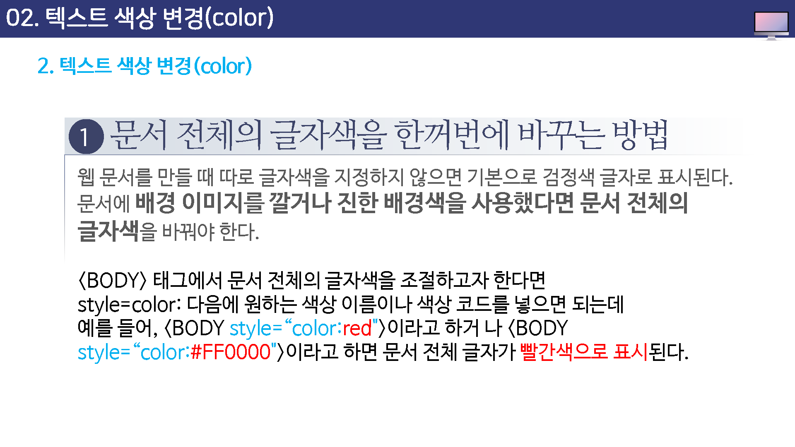
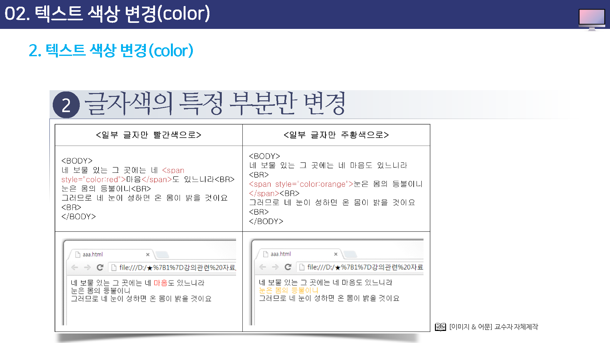

# 텍스트 색상 변경

웹 문서 안에서의 색상은 문서 전체의 글자색을 한꺼번에 바꾸는 방법과 특정 부분의 텍스트만 바꾸는 방법, 이렇게 두가지가 있다.

CSS가 등장한 후로는  CSS를 사용해서 문서 전체의 텍스트를 한꺼번에 조절하는 것을 권장하고 있다.

CSS를 사용한 텍스트 조절 방법에 대해서는 이후에 배우게 될 것이고 여기에서는 font 속성을 사용하여 간단하게 텍스트를 조절하는 방법을 알아 본다.


## 문서 천제의 글자색을 한꺼번에 바꾸는 방법

웹 문서를 만들 때 따로 글자색을 지정하지 않으면 기본으로 검정색 글자로 표시된다.

문서에 배경이미지를 깔거나 진행 배경색을 사용했다면 문서 전체의 `글자색`을 바꿔야 한다.





## 글자색의 특정 부분만 변경

원하는 부분의 색상만 바꿀때는 `<span>`태그의 style 속성을 이용한다.

글자색을 바꿀 글자앞부분에 `<span style='color:색상'>을 넣고 색을 바꿀 글자 마지막에 `</span>`를 넣어 어디서부터 어디까지 글자색을 바꾸는 표시해야 한다.


예)

```
<span style="color:색상명 or 색상코드">텍스트</span>
```


