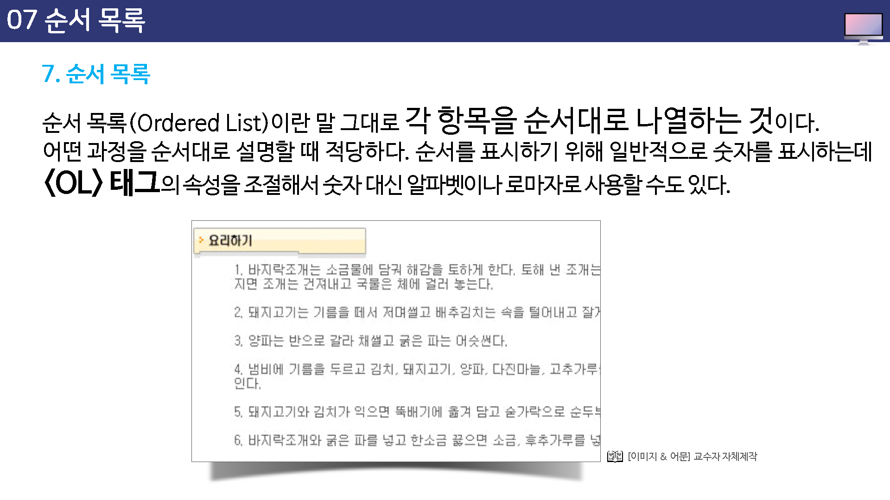
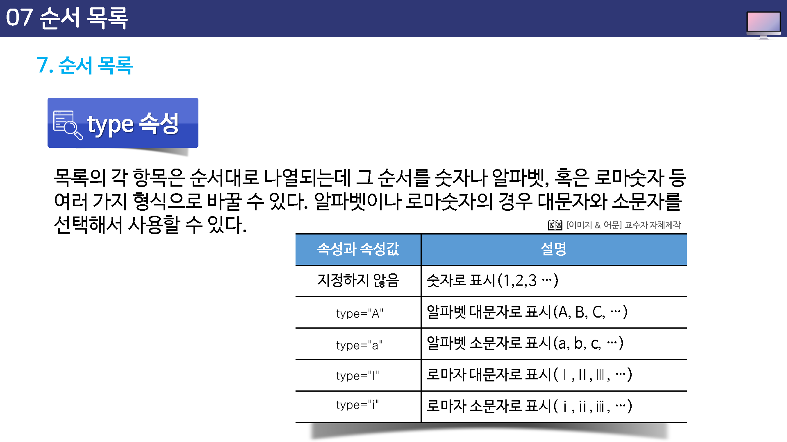
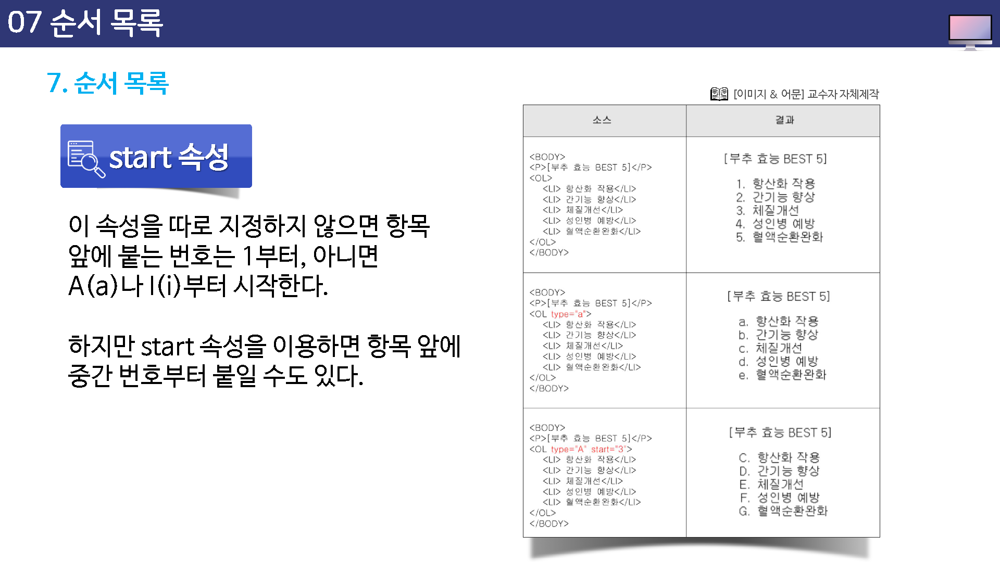

---

layout: home
---

# 순서 목록

순서 목록 (ordered list)이란 말 그대로 각 항목을 순서대로 나열하는 것이다.

어떤 과정을 순서대로 설명할 때 적당하다.


순서를 표시하기 위해 일반적으로 숫자를 표시하는데, `<ol>`태그의 속성을 조절해서 숫자 대신 알파벳이나 로마자로 사용할 수도 있다.





## ol테그와 li테그

순서 목록을 만들때 사용하는 태그는 `<ol>`과 `<li>`이다.

목록으로 표시할 내용의 앞 뒤에 `<ol>` 태그를  적고 각 항목 앞에 `<li>`를 생략할 경우 `<li>`뒤부터 다음 `<li>`이전까지가 하나의 항목이 된다.


```
<ol>
	<li>항목1</li>
	<li>항목2</li>
	<li>항목3</li>
</ol>
```


순서 목록에서는 `<ol>`태그의 type 속성과 start 속성을 이용해서 각 항목 앞에 붙는 번호나 시작 번호를 조절할 수 있다.


## type

각 항목 앞에 붙이는 숫자를 영문자나 로마자, 또는 아라비아 숫자로 표시한다.

사용할 수 있는 속성값은 A,a,I,i이다.

따로 이 속성을 지정하지 않으면 숫자로 표시된다.




## start

각 항목 앞에 붙는 숫자의 시작 번호를 지정한다.





