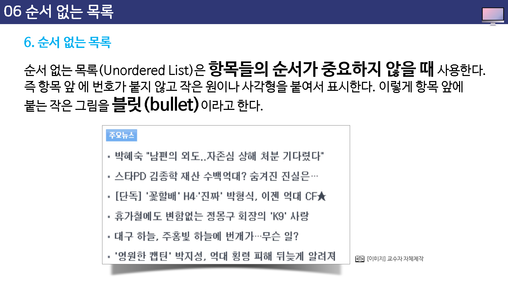
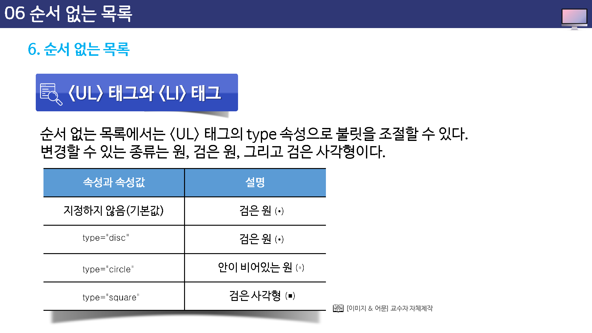

# 순서 없는 목록

순서 없는 목록(Unordered List)은 항목들의 순서가 중요하지 않을 때 사용한다.

즉, 항목 앞에 번호가 붙지 않고 작은 원이나 사격형을 붙여서 표시한다. 이렇게 항목 앞에 붙는 작은 그림을 블릿(bullet)이라고 한다.





## UL테그와 LI태그

순서 없는 목록을 만들 때 사용하는 태그는 `<ul>`과 `<li>`이다.

목록으로 표시할 내용의 앞 뒤에 `<ul>`과 `</ul>`태그를 적고 각 항목 앞에 `<li>`태그를 붙이면 된다.


`<li>`태그의 닫는 태그, 즉 `</li>`는 생략할 수 있는데 이를 생략할 경우 `<li>`뒤부터 다음 `<li>`이전 까지가 하나의 항목이 된다.


```
<ul>
	<li>항목1</li>
	<li>항목2</li>
	<li>항목3</li>
</ul>
```


순서 없는 목록에서는 `<ul>`태그의 type 속성으로 불릿을 조절할 수 있다.

변경할 수 있는 종류는 원, 검은 원, 그리고 검은 사각형이다.


지정하지 않는 경우 검은 원이 표시됩니다.

* type="disc"
* type="circle"
* type="square"




