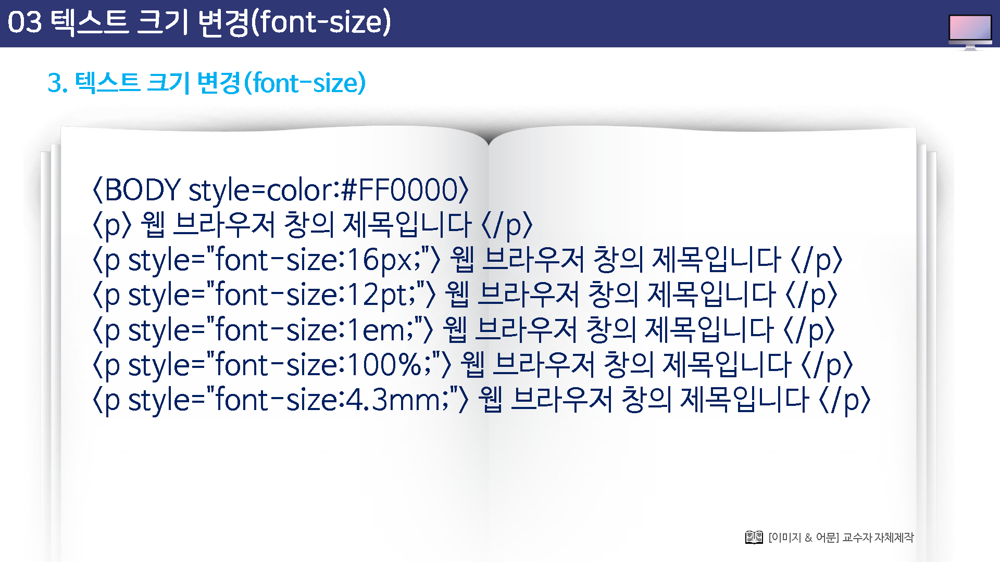

# 텍스트 크기 변경


## 폰트사이트

웹 문서에서 텍스트의 크기를 조절하기 위해서 사용하는 단위는 다음과 같다.

* 픽셀(px)
* 포인토(pt)
* 엠(em)
* 퍼센티지(%)


```html
<p style="font-size:크기단위;">내용</p>
```


## 픽셀(pixel)

화면 스크린의 화소를 단위로 하는 방식이다.

그런데 이 방식은 각 화면의 해상도, 큭히 ppi에 따라서 크기가 달라지는 문제가 있기  때문에 문제가 있다.

텍스트의 크기를 지정하지 않는다면 서체의 기본 크기인 16픽셀로 나타나게 된다.


## 포인트(point)

전통적인 서체의 크기 단위이다.

1인티가 72pt이고, 통상의 pc 화면 해상도가 96dpi 이므로 12pt이면 16px에 해당한다.

우리가 가장 많이 사용하는 대부분의 브라우저의 표준 서체 크기가 18px이다.

텍스트의 크기를 지정하지 않는다면 서체의 기본 크기인 12포인트로 나타나게 된다.


## EM

브라우저의 기준 서체 크기를 1em으로 정의하고, 이 크기에 상대적으로 지정하는 방식이다.

따라서 이용자가 브라우저의 환경설정에서 기준 서체의 크기를 변경하면 서체 크기가 이에 따라서 가변적으로 변경된다.

서체의 기본 크기는 1em으로 나타나게 된다.


## 퍼센트(percent)

em과 동일하지만, 표준 서체의 크기를 100%로 지정하는 것이 다르다.

텍스트의 크기를 지정하지 않는다면 서체의 기본 크기인 100%로 나타나게 된다.




