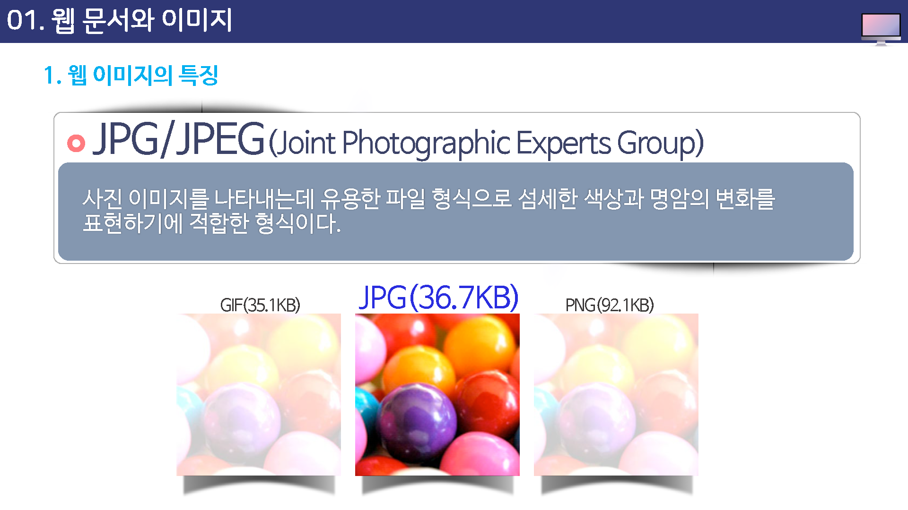
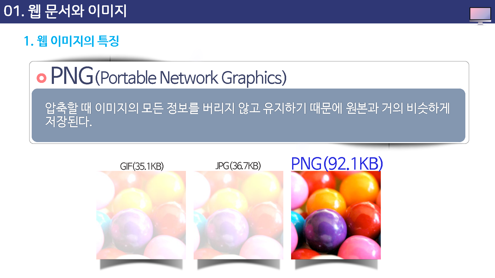

# 웹 문서와 이미지

## 웹 이미지의 특징

### 화질보다는 전송 속도가 중요

웹사이트의 수많은 이미지들은 네트워크를 통해 전송되기 때문에 뛰어난 화질 보다는 빠른 전송을 위주로 제작하게 된다.

어느 정도의 선명도를 유지하면서 파일 용량은 작게 만들어 브라우저 화면에 바로 보이도록 해야 한다.

### 사용 가능한 파일 형식

웹사이트에서 사용 가능한 파일 형식은 GIF와 JPG, PNG로 파일 형식이 제한되어 있다.

이 파일 형식들은 용량이 작으면서도 상대적으로 화질이 우수하다.

## GIF(Graphic interchange format)

다른 이미지 파일 형식과 비교하여 상대적으로 크기가 작다.

또한, GIF는 배경이 투명한 이미지나 애니메이션(Animated GIF) 같은 효과를 나타낼 수 있는 장점이 있다.

단점으로는 최대 256색만을 표현할 수 있기 때문에 색감이 약하다.

## JPG/JPEG (Joint Photographic Experts Group)

사진 이미지를 나타내는데 유용한 파일 형식으로 섬세한 색상과 명암의 변화를 표현하기에 적합한 형식이다.

## PNG(Portable Network Graphics)

압축할 때 이미지의 모든 정보를 버리지 않고 유지하기 때문에 원본과 거의 비슷하게 저장된다.

