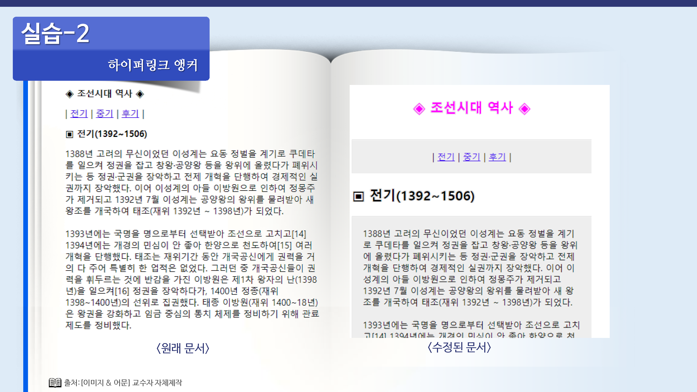

# 하이퍼링크 스타일 변경

## 링크 스타일 바꾸기

### 밑줄 없애기

텍스트에 링크 를 만들면 텍스트가 파란색으로 바뀌면서 밑줄이 생긴다.

이렇게 밑줄이 있으면 쉽게 링크임을 확인할 수 있지만 링크 텍스트가 많을 경우 문서에 밑줄이 많아지기 때문에 자칫 지저분해 보일 수 있다.

이럴 경우에는 스타일 시트를 이용해서 밑줄을 없앨 수 있는데, 밑줄이 없더라도 마우스 커서가 손 모양으로 바뀌는 것으로도 링크를 확인할 수 있다.

이것은 스타일 시트의 text-decoration 속성을 이용해서 수정한다.

### 마우스 커서 올려 놓았을 때 스타일 바꾸기

텍스트 링크 위로 마우스 커서를 올려 놓았을 때 색상이 바뀌거나 없던 밑줄이 생기면 좀 더 확실하게 링크임을 표시할 수 있다.

스타일 시트를 이용하면 텍스트 위로 마우스 커서를 올려 놓았을 때의 스타일도 바꿀 수 있다.

